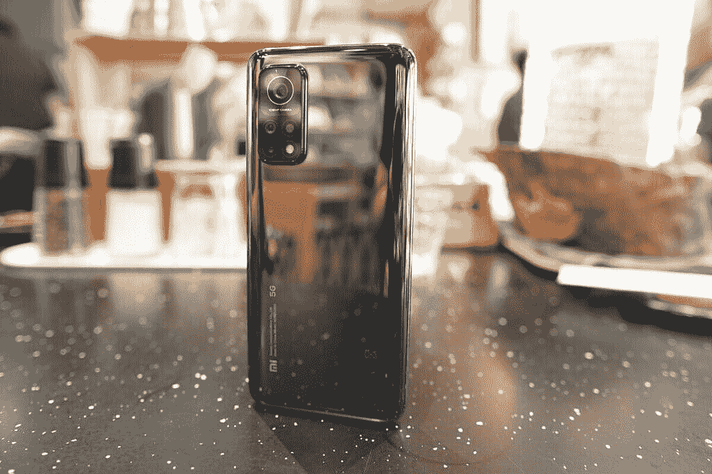
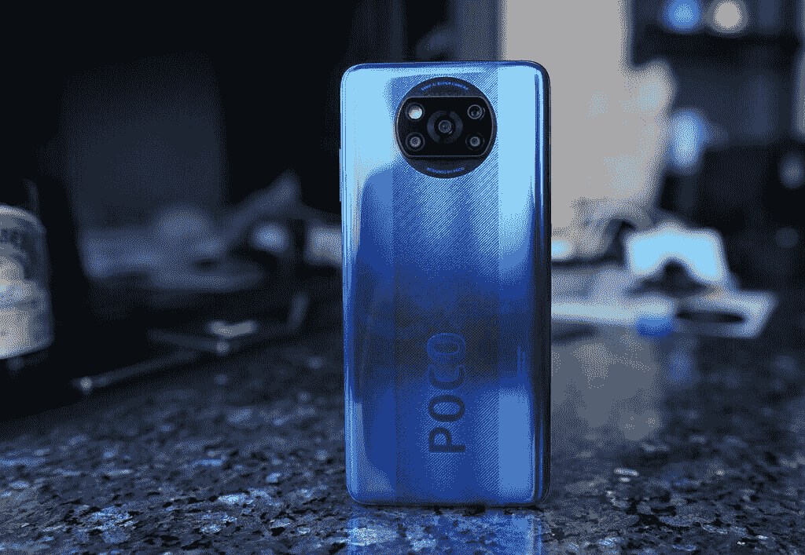
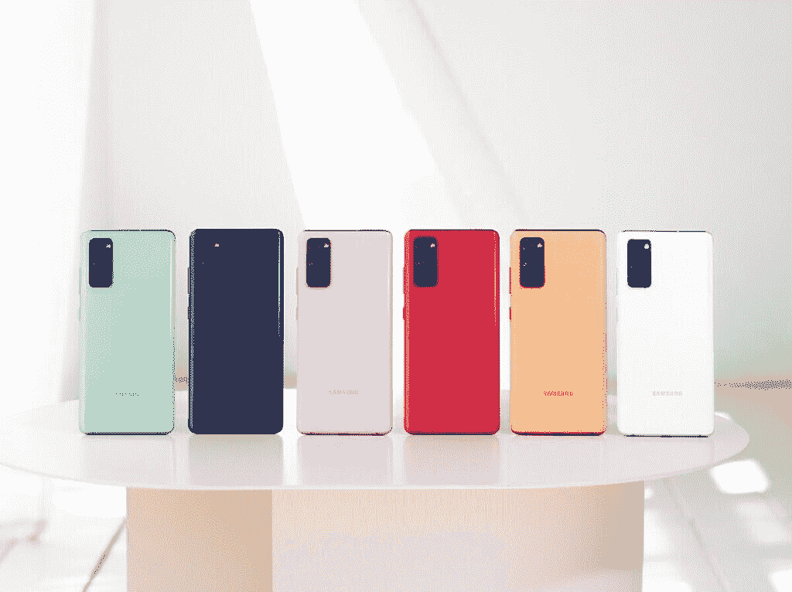

# 如果你住在美国，Pixel 4a 5G 和 Pixel 5 才是物有所值的

> 原文：<https://www.xda-developers.com/google-pixel-4a-5g-pixel-5-great-value-in-us/>

谷歌 Pixel 5 正式发布。我还没有机会测试它，但我相信人们喜欢以前的 Pixel 的所有东西——由一流的计算摄影技术和最真实、最新版本的 Android 驱动的相机——也将适用于 Pixel 5，这意味着这些都不是新的或值得注意的功能。相反，Pixel 5 的新特点和新闻价值在于它有了一个新的身份，即一个物超所值的中端产品。

最佳谷歌 Pixel 5 交易:在哪里预购谷歌的新智能手机！

通过采用更少的骁龙芯片、更少的优质构建材料、省略变焦相机的硬件以及其他一些硬件妥协，谷歌能够以 699 美元的价格提供 Pixel 5，比 Pixel 4 的起价低 100 美元，因此基本上承认它目前正在退出高端旗舰产品领域。Pixel 系列不再追求 iPhones 和三星 Galaxy Notes 的世界，而是转向更低的层次。

即使在 Pixel 5 的 699 美元价格成为官方价格之前，已经有足够多的暗示、[传言和泄露](https://www.xda-developers.com/google-pixel-5-may-cost-629-come-black-green/)让科技媒体为 Pixel 5 的新价值意识定价鼓掌。今年早些时候，Pixel 4a 也获得了同样的“超值”好评，当然，更新后的 Pixel 4a 5G 及其 499 美元的价格标签也将获得同样的好评。

这些手机确实非常超值——如果你生活在美国，如果你像我一样生活在亚洲，密切关注 Android 智能手机，那么你可能已经和我一样认为:与亚洲的手机相比，在美国被认为非常超值的中端或廉价手机通常充其量只是不错的价值，或者最糟糕的是山寨货。

## 为什么会这样呢？

大多数阅读这篇文章的人应该已经知道答案，但对于不熟悉安卓系统的潜在新读者来说，有必要解释一下:中国手机品牌一直提供性价比最高的智能手机，但除了一加和联想(Lenovo)旗下的摩托罗拉，它们没有在美国市场正式销售自己的设备。

这实际上使美国的 Android 场景成为一个非常有限的场景，不仅仅是一些，而是 T2 的大多数顶级选项。想想这个:根据市场分析公司 *Counterpoint Research* 最近发布的数据，全球最畅销的五个安卓智能手机品牌中有四个在美国本土买不到。这份排名前五的榜单由三星、华为、小米、OPPO 和 Vivo 按一定顺序组成，并不是最近才出现的——这五家公司已经存在五年了。

美国消费者的安卓选择包括头把交椅三星，以及在全球范围内排名第六、第八和第九的安卓品牌。难怪美国手机市场基本上是苹果和三星的双头垄断。

那么为什么中国手机提供更好的价值呢？这是一个综合因素，包括亚洲的制造、营销和分销成本比美国低，但主要原因是因为中国品牌之间存在激烈和残酷的竞争，不仅在中国，在整个亚洲和欧洲也是如此。他们总是觉得有必要通过提供更多规格或更低价格来超越对方。例如，小米的 Redmi 子品牌和 OPPO 的 Realme 陷入了试图赢得印度市场的激烈竞争中，因此它们一直在规格表上参与一场胜人一筹的游戏。品牌竞争，消费者赢。

相反，美国缺乏竞争也让传统品牌——如果我们直言不讳的话——没有在他们的中端或预算产品上投入太多努力。他们必须在旗舰级别上努力工作，试图与 iPhone 竞争，但如果这是一款低于 500 美元的中档产品呢？他们没有给消费者更多的紧迫感。

## 传统品牌认为中端手机应该更便宜；中国品牌不同意

多年来，苹果、三星、LG 和索尼等传统手机品牌规定，中端手机应该有明显的妥协，通常是在处理能力、显示屏和制造材料等关键领域。这是一个合理的商业策略——为什么一家公司要通过给中档手机提供相同的处理器和制造质量来削弱自己的旗舰产品？这解释了为什么三星在今年之前的中端产品明显不如其旗舰产品，比如去年的 Galaxy A50，它的特点是 U 形凹槽，到处都是塑料，还有 Exynos 9610，或者为什么苹果的 iPhone SE 2020 看起来像是属于 2016 年的——因为它实际上重复使用了 iPhone 7 的机身。

Pixel 5 也是如此:它比 Pixel 4 发布时更便宜，但 Pixel 5 的规格明显低于被接受的 2020 年旗舰标准，而 Pixel 4 至少试图跟上 2019 年旗舰预期。Pixel 4 配备了当时的高刷新显示器、最强大的高通 SoC 和雄心勃勃的高科技 3D 面部扫描系统。Pixel 5 在 2020 年的屏幕刷新率适中，运行在中端高通芯片上，并在 2016 年回归到电容式指纹扫描仪。很明显，谷歌在硬件方面偷工减料，以满足更低的价格。

中国手机的中端选择没有走这么多捷径。事实上，他们的商业战略几乎没有意义，因为他们的中端选项通常都非常有价值，以至于他们的旗舰产品看起来价格过高。例如，小米刚刚发布了一款€599(～703 美元) [Mi 10T Pro](https://www.xda-developers.com/xiaomi-mi-10t-pro-preview/) ，它由骁龙 865 驱动，具有 108MP 摄像头和 144Hz 屏幕。这立即使该公司自己刚刚成立六个月的 [Mi 10 Pro](https://www.xda-developers.com/xiaomi-mi-10-pro-review/) 拥有相同的处理器和摄像头，但 90Hz 屏幕更低。看起来价格过高。几个月前，Honor 推出了其 [30 Pro Plus](https://www.xda-developers.com/honor-30-pro-plus-china-launch/) ，它拥有与[华为 P40 Pro](https://www.xda-developers.com/huawei-p40-pro-specifications-features-pricing-availability/) 相同的令人惊叹的 50MP RYYB 摄像头和麒麟 990，价格低了近 300 美元。每个中国品牌都这样做:OPPO 的旗舰产品很棒，但其子品牌 Realme 也推出了 90%好、价格只有一半的手机。

 <picture></picture> 

The Xiaomi Mi 10T Pro.

## 如果我们只是比较规格，那就差远了

如果我们只是将你在亚洲或欧洲能买到的东西的规格表与你在美国能买到的相同价位的东西进行比较，那就有失偏颇了。

目前最超值的智能手机可能是 X3 POCO NFC 手机。它在欧洲的起价为€199 英镑(约 232 美元)，在中国内地和香港甚至更便宜(约相当于 190 美元)，为此，你可以获得一个 120 赫兹 1080 x 2400 的显示器，覆盖着大猩猩玻璃 5，骁龙 732G，玻璃和铝夹层结构，以及一个由 64MP 主摄像头和 13MP 超广角摄像头组成的四摄像头系统。

 <picture></picture> 

POCO X3 NFC

在美国，如果你只有两块钱可以花，你最好的选择可能是 [Moto G7 Power](https://forum.xda-developers.com/g7-power) 或三星 Galaxy A11。Moto G7 Power 包了一个 60Hz 720 x 1560 显示屏，覆盖着大猩猩玻璃 3，骁龙 665，塑料背面和框架，以及一个 1200 万像素的摄像头。三星的 Galaxy A11 提供 60Hz 720 x 1560 显示屏，也采用大猩猩玻璃 3，骁龙 450，塑料背面和框架，以及一个微不足道的 500 万像素超广角摄像头。这两款手机都运行在令人尴尬的 3GB 内存上。

我们可以在任何价格区间玩这个游戏，结果都是一样的。在 300-400 美元的范围内，你可以买到带有 120 赫兹 OLED 面板、骁龙 855+和潜望镜变焦镜头的 Realme X3 SuperZoom。将你的预算提高到 500 美元，你就可以买到 120 赫兹有机发光二极管屏幕、陶瓷结构和骁龙 865 的魅族 17。如果你在美国支付不到 500 美元，你就不会得到高刷新率屏幕、Snapdragon 800 系列芯片或花哨的陶瓷建筑材料。

## 但由于三星需要在美国以外竞争，情况正在好转

对美国 Android 粉丝来说，好消息是三星最近不得不加强其中端游戏，这不是因为在美国的竞争——它在 Android 领域几乎没有竞争——而是因为小米、一加、Vivo 和 Realme 等中国品牌一直在蚕食三星在印度、T2、泰国、越南和欧洲部分地区的市场份额。

 <picture></picture> 

Galaxy S20 Fan Edition.

这解释了三星 [Galaxy S20 粉丝版](https://www.xda-developers.com/samsung-galaxy-s20-fe-launch/)的存在，它提供 120Hz 屏幕和骁龙 865——Galaxy S20 系列的两个突出特征——售价 700 美元。毫不奇怪，对 S20 FE 的一致反应是它如何抢了即将到来的[一加 8T](https://www.xda-developers.com/tag/oneplus-8tpro/) 的风头，因为这正是三星的目标。

几年前，三星不可能将旗舰级别的屏幕和处理器放在中档车上。中国手机促使三星提出更好的价值主张来参与竞争。

## 也许价值不高，但也不差

购买 Pixel 5 有非常充分的理由——它提供了最真实的 Android 版本，谷歌的相机软件算法可以说是业内最好的。但在以美国为中心的视角之外，称这些价值巨大可能有些牵强。但至少我们可以自信地说，今年配备适当大小的电池、RAM 和存储配置的 Pixel 5，不像 Pixel 4 那样是一个糟糕的值。如果你同意这一点，并且想在美国买一台，你可以现在就从各个零售商那里预订。

**[谷歌 Pixel 4a 5G 论坛](https://forum.xda-developers.com/pixel-4a-5g)**| |**|[谷歌 Pixel 5 论坛](https://forum.xda-developers.com/pixel-5)**