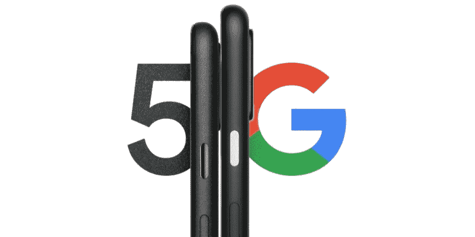

# 谷歌在秋季推出 Pixel 4a 5G 和 Pixel 5

> 原文：<https://www.xda-developers.com/google-pixel-4a-5g-pixel-5-teaser-fall-launch/>

今天，谷歌[发布了 Pixel 4a](https://www.xda-developers.com/google-pixel-4a-specs-features-pricing-availability/) ，这是该公司继去年的 Pixel 3a 之后的第二款中端 Pixel 智能手机。谷歌原本预计在 5 月份推出 Pixel 4a，但由于新冠肺炎及其供应链中断，该公司被迫在[将这款手机的发布时间推迟了](https://www.xda-developers.com/google-io-2020-canceled/)两个多月。因此，本应在年中发布的智能手机已经离谷歌的秋季发布时间更近了。如果谷歌保持其典型的秋季硬件发布时间表，那么我们应该会看到该公司在短短两个月内推出其下一代 Pixel 智能手机。在发布之前，谷歌现在正在研究他们预计将在今年秋天展示的两款智能手机:谷歌 Pixel 4a 5G 和谷歌 Pixel 5。

如果这些名字对你来说很陌生，那么让我简单回顾一下我们目前所知道的。在今天之前，谷歌总是在每次发布会上发布两款 Pixel 设备:普通型号和更大的 XL 型号。常规型号和 XL 型号之间的差异通常可以归结为屏幕尺寸、屏幕分辨率、显示器供应商和电池容量，而 SOC、摄像头和软件保持不变。该公司今天打破了这一趋势，宣布推出 Pixel 4a，而不是 Pixel 4a“XL”然而，Pixel 4a *5G* 型号似乎会比今天宣布的 Pixel 4a 略大。事实上，根据泄密者 Ishan Agarwal 的说法，在下图中，左边较小的手机是 Pixel 5，而右边较大的手机是 Pixel 4a 5G，[。](https://twitter.com/ishanagarwal24/status/1289981795778215936)但像素 4a 5G 可能不仅仅是更大的像素 4a——最近的泄露都指向硬件方面更接近像素 5 的设备。

 <picture></picture> 

Source: Google

早在一月份，我们[发现了新 Pixel 智能手机的 3 个代号](https://www.xda-developers.com/google-pixel-2020-code-names-snapdragon-765-snapdragon-730/):sunfish、bramble 和 redfin。我们很快确认了[太阳鱼是 Pixel 4a](https://www.xda-developers.com/google-pixel-4a-sunfish-qualcomm-snapdragon-730/) 的代号，但是直到上个月我们才确认了 bramble 和 redfin 的市场名称。三个不同的代码发现证实了 bramble 是谷歌 Pixel 4a 5G，而 redfin 是谷歌 Pixel 5:[谷歌应用](https://www.xda-developers.com/pixel-4a-5g-pixel-5-leak/)、[谷歌摄像头 7.5](https://www.xda-developers.com/google-camera-7-5-pixel-4a-5g-pixel-5-audio-zoom-expanded-social-share/) 和[AOSP 评论](https://www.xda-developers.com/google-pixel-5a-aosp-pixel-4a-5g-pixel-5/)。1 月份的代号发现，以及 5 月份更多的代码挖掘，证实了 [Pixel 4a 5G 和 Pixel 5 将由高通的“sm 7250”](https://www.xda-developers.com/google-pixel-5-snapdragon-765/)移动平台提供支持，这意味着这两款设备将要么拥有[高通骁龙 765，要么拥有](https://www.xda-developers.com/qualcomm-snapdragon-765-processor-specifications-features/)高通骁龙 765G，要么拥有[高通骁龙 768G 处理器](https://www.xda-developers.com/qualcomm-announces-snapdragon-768g-mobile-platform/)。由于集成了骁龙 X52 调制解调器，这三种 SOC 都支持 5G 连接，但新的谷歌 Pixel 4a 及其[高通骁龙 730](https://www.xda-developers.com/qualcomm-snapdragon-665-snapdragon-730g/) 不支持 5G。这是三种设备之间的巨大差异，更不用说它们之间的性能会有很大差异。

除了处理器上的区别，我们对 Pixel 4a 5G 或者 Pixel 5 的其他了解不多。从上面的图像中，似乎 Pixel 5 有一个拉丝金属框架，而 Pixel 4a 5G 有一个彩色的电源按钮，至少在这个假定的“纯黑色”颜色中是这样的。谷歌表示，Pixel 4a 5G 将售价 499 美元，但他们尚未透露 Pixel 5 的定价。然而，谷歌早些时候的一项调查显示，Pixel 5 的潜在价格为 699 美元。这两款设备将在美国、加拿大、英国、爱尔兰、法国、德国、日本、台湾和澳大利亚上市。我们预计只有 redfin，又名 Pixel 5，[将支持反向无线充电](https://www.xda-developers.com/android-11-battery-share-reverse-wireless-charging-pixel-5/)，但可能有其他差异来证明这种价格差异。谷歌正在谷歌相机应用中开发一系列[新功能，其中一些可能是 Pixel 5 独有的。一旦我们更接近谷歌的秋季硬件活动，我们可能会了解更多关于 Pixel 4a 5G 和 Pixel 5 的信息。毕竟，谷歌设备有一种不可思议的能力，可以在意想不到的地方出现。](https://www.xda-developers.com/google-camera-7-5-pixel-4a-5g-pixel-5-audio-zoom-expanded-social-share/)