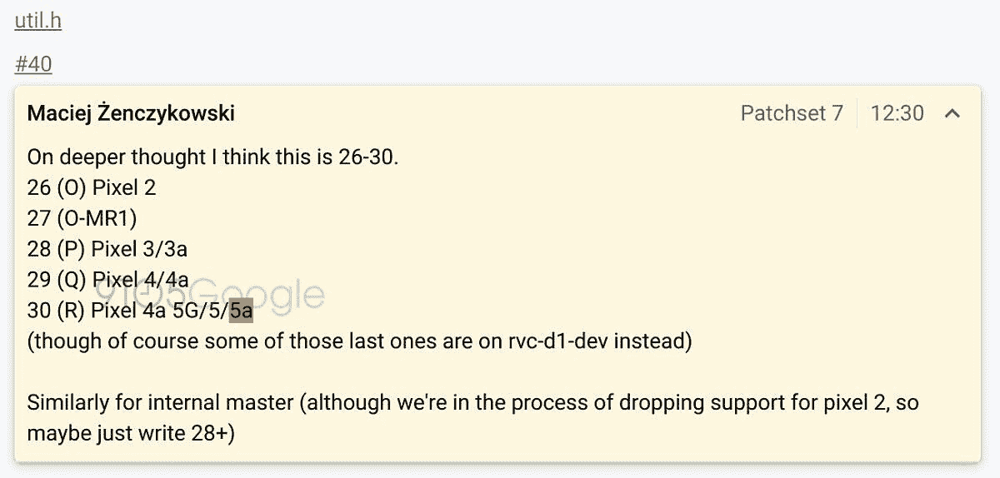

# 谷歌 Pixel 5a 和 Pixel 4a 5G/Pixel 5 一起出现在 AOSP

> 原文：<https://www.xda-developers.com/google-pixel-5a-aosp-pixel-4a-5g-pixel-5/>

就在昨天，谷歌[开始调侃](https://www.xda-developers.com/google-teases-august-3rd-pixel-4a-launch-date/)预计将于 8 月 3 日发布的 [Pixel 4a](https://forum.xda-developers.com/pixel-4a) 。现在，由于一位谷歌人对 Android 开源项目的评论，我们已经获得了下周以后的参考资料。即将到来的 2020 年像素 4a 5G 和像素 5 [再次亮相](https://www.xda-developers.com/google-camera-7-5-pixel-4a-5g-pixel-5-audio-zoom-expanded-social-share/)，但也提到了明年的像素 5a。

[由](https://android-review.googlesource.com/c/platform/packages/modules/DnsResolver/+/1381536/7/util.h#40)[首先发现的 AOSP 代码更改中的一个注释](https://9to5google.com/2020/07/31/google-pixel-5a-makes-first-appearance-in-aosp-days-before-pixel-4a-launch/)9 to 5 Google引用了像素 4a、像素 4a 5G、像素 5 和像素 5a。第一个对我们来说没什么惊喜，因为[它已经被广泛泄露](https://www.xda-developers.com/tag/pixel4a/)，而接下来的两个也不奇怪，因为这是我们第三次看到它们的名字。然而，这是我们第一次听说 Pixel 5a，而且是在 Pixel 4a 推出之前。

 <picture></picture> 

[Source](https://android-review.googlesource.com/c/platform/packages/modules/DnsResolver/+/1381536/7/util.h#40). Via: 9to5Google

谷歌已经开始着眼于明年的发展，这一点并不令人惊讶。公司通常会提前几年规划产品路线图，随着中端像素系列的[成功，更实惠的 Pixel 5a 是不可避免的。](https://www.xda-developers.com/pixel-3a-xl-google-double-sales/)

根据评论和上下文中的代码，Pixel 5a 可能会与 Android 11 一起推出，而不是明年秋天的 Android 12。此外，Pixel 4a 5G 似乎不会在下周与 Pixel 4a 一起推出，因为评论提到它的第一个 API 级别为 30，这意味着它将运行尚未稳定的 Android 11 版本。更多有趣的信息，比如 Pixel 5a 将在什么硬件上运行，目前还不清楚。

评论中提到的最后一件事是，谷歌正准备放弃对 Pixel 2 的支持。Pixel 2 和 Pixel 2 XL 是在 2017 年与 Android 8.0 Oreo 一起宣布的。两款设备都将收到 Android 11 的官方更新，但 Android 11 将是两款设备的最终 OS 升级。[谷歌承诺为每台 Pixel 设备提供 3 年的 Android 操作系统和安全补丁更新，所以这个消息并不令人惊讶。随着谷歌继续其模块化 Android 的工作，未来的 Pixel 手机有望获得更长的支持期。](https://support.google.com/pixelphone/answer/4457705?hl=en)

* * *

*特色图片:谷歌 Pixel 4*