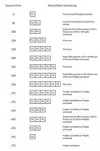

# EAS 如何帮助谷歌 Pixel 成为最快的安卓手机

> 原文：<https://www.xda-developers.com/google-pixel-fastest-android-phone-eas/>

很久以前，当 Linux 只是 Linus Torvalds 头脑中的一个想法时，CPU 是单核实体，它需要大量的能量，而功率却很小。第一款商用处理器 Intel 4004 在单核上运行的时钟频率为 740kHz。当时，不需要加载调度程序。负载调度是为双核“庞然大物”保留的，比如几十年后出现的 IBM Power 4。这些内核的运行速度只有 1.1GHz 到 1.9GHz，需要程序和系统来正确利用这些内核。我们如何从这些机器发展到利用多核的软件算法？您可能以前在我们的论坛上听说过节能调度(EAS)。这也是谷歌 Pixel 智能手机表现如此出色的部分原因。EAS 有什么了不起的，我们是如何走到这一步的？在解释这一点之前，我们需要谈谈 Linux 负载调度程序。

* * *

## Linux 负载调度程序的发展

### 循环调度

 <picture></picture> 

Round Robin Processing. Source: Wikipedia

循环处理是一个易于解释和理解的简单概念，更易于理解其缺点。循环调度使用时间片为每个进程分配时间。假设我们的计算机上运行着四个进程。

*   过程
*   过程
*   过程
*   处理过的

现在，让我们做循环调度程序的工作。在进入下一个进程之前，我们将为每个进程分配 100 毫秒(时间片)。这意味着进程 A 可能需要 100 毫秒来完成它的处理，然后它转到进程 B，依此类推。如果一个应用程序的工作需要 250 毫秒来完成，它将需要经历这个过程 3 次才能完成它的工作！现在，在不同的内核之间进行扩展，以便将进程 A 和进程 B 分配给内核 1，将进程 C 和进程 D 分配给内核 2。取而代之的是 O(n)调度(类似于循环调度，但使用历元并允许动态分配时间)，然后是 O(1)调度(最小化开销，无限制的进程支持)，最后是完全公平调度(CFS)。CFS 在 2007 年 10 月被合并到 Linux 内核版本 2.6.23 中。自那以后，它已经被彻底改造过，并且仍然是 Linux 系统中的默认调度程序。

### 完全公平调度程序

完全公平调度器从 Android 诞生之初就存在了，并且在非 big 上使用。小装置。它使用智能算法来确定处理顺序、时间分配等。这是一个被称为“加权公平排队”的调度算法的工作实现的例子这主要集中在为系统进程和机器上运行的其他高优先级进程提供优先级。如果它运行在一个大的。小设备，所有内核将被视为平等的。这很糟糕，因为低功耗内核可能被迫运行密集型应用，甚至更糟的是，可能会出现相反的情况。用于听音乐的解码可能在大核上完成，例如，增加了不必要的功耗。这就是为什么我们需要一个新的调度程序。LITTLE 是一款能够有效识别和利用内核差异的处理器。这就是异构多处理(HMP)的用武之地，它是大多数 Android 手机现在运行的标准负载调度程序。

### 异构多处理

这是任何大型应用程序的标准负载调度程序。除了谷歌 Pixel，近年来发布的设备很少。HMP 利用大。小架构，将低优先级、不太密集的工作分配给功耗较低的小内核。HMP 是“安全的”,它知道什么应该去大核，什么应该去小核，不会出错。它工作正常，并且在开发端设置起来比 EAS 之类的东西需要的精力少得多，我们稍后会谈到 EAS。HMP 只是 CFS 的一个扩展，使其具有功耗意识。

HMP 既不猜测，也不预测未来的进程。这很好，但这也是为什么该设备不能像运行 e as 的设备一样流畅，也是为什么它消耗更多的电池。最后，这让我们想到了节能调度(EAS ),我坚信随着越来越多的 OEM 厂商采用它，这是 ROM 和内核开发的未来。

### 节能调度

节能调度(EAS)是用户在我们的论坛上谈论的下一件大事。如果你使用 OnePlus 3(或者显然是谷歌 Pixel ),你肯定在论坛上听说过它。它随着高通骁龙 845 进入主流，所以如果你有一台这样的设备，你就已经有了一部支持 EAS 的智能手机。内核形式的 ea 如 [RenderZenith](https://forum.xda-developers.com/oneplus-3/oneplus-3--3t-cross-device-development/renderzenith-op3-t3803706) 和 rom 如 [VertexOS](https://forum.xda-developers.com/oneplus-3/oneplus-3--3t-cross-device-development/rom-kernel-vertexos-blazar-zenith-kernel-t3571781) 和 [PureFusion](https://forum.xda-developers.com/oneplus-3/oneplus-3--3t-cross-device-development/rom-pure-fusion-os-t3654996) 在 OnePlus 3 的全盛时期席卷了论坛。当然，谷歌 Pixel 也配有 EAS。有了延长电池寿命和更好性能的承诺，还有什么问题呢？

节能调度并不简单，因为它不能通用于 CFS 或 HMP 等所有设备。EAS 需要了解运行它的处理器，基于能量模型。这些能源模型是由工程师团队不断测试和工作，以提供最佳性能。由于骁龙 820 和 821 基本相同，OnePlus 3 上的定制内核使用了谷歌像素能量模型。配备骁龙 845 的设备可以使用 EAS，OnePlus 6 在某种程度上也是如此。它不像谷歌 Pixel 设备那样经过调整，但它完成了任务。以下是一个例子，说明尽管 OnePlus 6 拥有更好的 EAS 处理器，但 Pixel 2 XL 仍然在流畅度上击败了它。这两张图片都来自我们对 OnePlus 6 的[速度导向评测](https://www.xda-developers.com/oneplus-6-speed-gaming-review/)。

如果你理解这些图表有困难，你可以看看下面的图片作为指导。超过绿线的任何东西都表示丢帧，在最糟糕的情况下，会出现明显的口吃。

OnePlus 6 的 EAS 实现很有趣，因为它似乎不是一个完全成熟的实现，不像你在具有相同 SoC 的 Google Pixel 上看到的那样。调度器可调参数也没有多大意义，所以这可能解释了为什么它不如您预期的那样高效。它在功耗方面非常保守，系统优先考虑低功耗内核来完成大部分工作。

可调参数只是传递给 CPU 调控器的一组参数，它改变调控器在频率方面对某些情况的反应。然后，调度程序决定将任务放在不同处理器的什么位置。OnePlus 6 的可调参数设置为优先处理低功耗核心上的工作。谷歌 Pixel 2 拥有巨大的输入提升能力，使所有 8 个内核始终保持在线，这也于事无补。谷歌还使用了一个[中断平衡器](https://source.android.com/devices/tech/debug/jank_jitter#interrupt)，它有助于消除丢帧并提高性能。

那么 EAS 是如何工作的呢？为什么只有在特定条件下才如此高效？

能量感知调度引入了使用能量模型的需要，并且如上所述，需要大量的测试和工作来使其完美。EAS 试图统一内核的三个不同的核心部分，它们都独立地起作用，而能量模型有助于统一它们。

*   Linux 调度程序(CFS，如上所述)
*   Linux 指南
*   Linux cpufreq

将所有 3 个部分统一在调度程序下，并一起计算它们，有可能节省能量，因为一起计算它们可以使它们尽可能高效。CPUIdle 试图决定何时 CPU 应该进入空闲模式，而 CPUFreq 试图决定何时提升或降低 CPU。这两个模块的主要目标都是节能。不仅如此，它还将进程分为四个组，顶层应用、系统后台、前台和后台。要处理的任务被放入这些类别中的一个，然后该类别被赋予 CPU 能力，工作被委托给不同的 CPU 核心。top-app 是完成优先级最高的，其次是前台，后台，然后是系统后台。从技术上讲，后台与系统后台具有相同的优先级，但是系统后台通常也可以访问更多的小内核。实际上，节能调度是将 Linux 内核的核心部分整合到一个进程中。

当唤醒设备时，EAS 将选择处于最浅空闲状态的内核，从而将唤醒设备所需的能量降至最低。这有助于降低使用设备时所需的功率，因为如果不需要，它不会唤醒大型集群。负载跟踪也是 EAS 的一个极其重要的部分，有两个选项。“逐实体负载跟踪”(PELT)通常用于负载跟踪，该信息然后用于决定频率以及如何在 CPU 上分配任务。“窗口辅助负载跟踪”(WALT)也可以使用，这就是谷歌像素上使用的。我们论坛上的很多 EAS ROMs，比如 VertexOS，都选择使用 WALT。很多 rom 会发布两个版本的内核，分别是 WALT 或者 PELT，所以由用户自己决定。WALT 更具突发性，CPU 频率达到高峰，而 PELT 则试图保持更高的一致性。负载跟踪器实际上并不影响 CPU 频率，它只是告诉系统 CPU 的使用情况。更高的 CPU 使用率需要更高的频率，因此 PELT 的一个一贯特征是它会导致 CPU 频率缓慢上升或下降。PELT 确实倾向于更高的 CPU 负载报告，因此它可能以更高的电池成本提供更高的性能。然而，现在没有人能真正说出哪个负载跟踪系统更好，因为两种负载跟踪方法都在不断地修补和改进。

无论哪种方式，很明显，不管使用哪种负载跟踪方法，效率都会提高。不是在任何处理器上处理任务，而是分析任务并估计运行任务所需的能量。这种巧妙的任务放置意味着任务以更高效的方式完成，同时也使系统整体更快。EAS 旨在以最小的功耗获得最流畅的用户界面。这就是 schedtune 等其他外部组件发挥作用的地方。

Schedtune 在每个 cgroup 中由两个可调参数定义，这两个可调参数确保对要完成的任务进行更精细的控制。它不仅控制任务在多个 CPU 上的分布，还控制感知的负载是否应该增加，以确保时间敏感的任务更快地完成。这样，用户使用的前台应用程序和服务就不会变慢，也不会导致不必要的性能问题。

虽然节能调度是下一件大事，但也可以说它已经到来，而且已经有一段时间了。随着越来越多的设备采用节能调度成为主流，移动处理效率的新时代已经到来。

## 循环赛、CFS、HMP 和 EAS 的利弊

虽然我的图形技能很一般，但我还是拼凑了一张图片，它应该总结了这些调度程序的优缺点。

* * *

*我要特别感谢 XDA 公认的贡献者 [Mostafa Wael](https://forum.xda-developers.com/member.php?u=5060769) ，他对 EAS 各个方面的解释极大地帮助了这篇文章的完成。我也要感谢 XDA 认可的开发者[乔舒斯](https://forum.xda-developers.com/member.php?u=6745491)，XDA 认可的开发者 [RenderBroken](https://forum.xda-developers.com/member.php?u=5438598) 和[穆斯塔法·瓦尔对 EAS](https://forum.xda-developers.com/u11/development/kernel-kirisakura-eas-0-7-energy-aware-t3647471/post73189268) 的评论。对于那些对 EAS 相关器件感兴趣的人来说，Linaro 有很多关于 EAS 的文档可以阅读。*