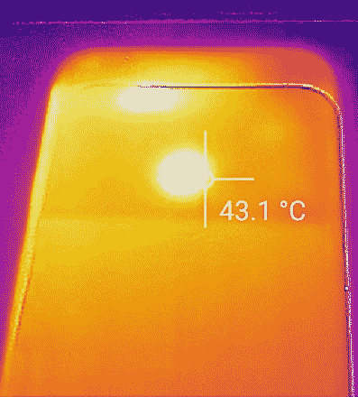
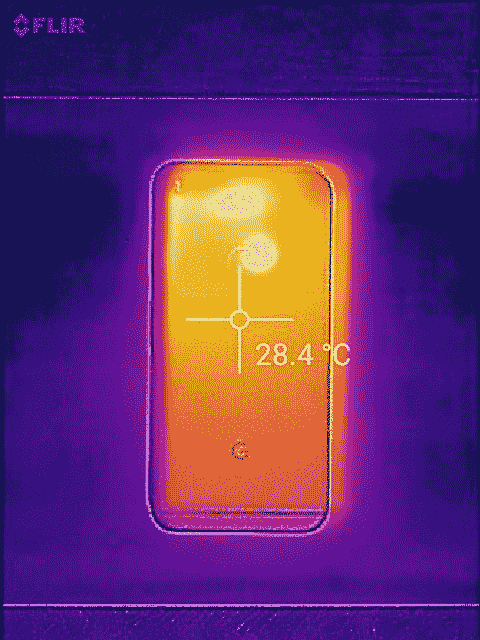

# Pixel XL 性能压力测试、节流和散热

> 原文：<https://www.xda-developers.com/google-pixel-xl-performance-over-time-throttling-and-thermals-analysis-a-remarkable-consistent-performer/>

谷歌的新 [Pixel 手机](http://forum.xda-developers.com/pixel-xl)继承了过去 Nexus 设备的衣钵，Nexus 设备一直是最快的手机之一。但是，尽管用户体验很少在 Nexus 上受到影响，但在该系列生命周期的末期还是出现了一些问题。

[Nexus 6P](http://forum.xda-developers.com/nexus-6p)和 [Nexus 5X](http://forum.xda-developers.com/nexus-5x) 都装载了一组特别有缺陷的处理器——臭名昭著的 [Snapdragon 810](http://www.xda-developers.com/opinion-the-810-held-back-a-generation-with-deliberate-apologism-damage-control/) 和它的兄弟 808——它们最终被驯服用于现实世界中的日常用户体验(特别是 Nexus 系列)，但仍然在重压下表现出严重的节流和温度。一年后，Nexus 系列不复存在，Pixel 设备安装了高通最新的处理器[，尽管是骁龙 821“Pro-AB”](http://www.xda-developers.com/a-look-at-what-has-changed-from-the-snapdragon-820-to-the-snapdragon-821-in-the-google-pixel-phones/)变种，其时钟速度与 Snapdragon 820 完全相同。这未必是一件坏事，我不认为消费者应该感到受骗——新的芯片组 *比* 节能 5%([根据高通告诉我们的](http://www.xda-developers.com/a-look-at-what-has-changed-from-the-snapdragon-820-to-the-snapdragon-821-in-the-google-pixel-phones/)，这一增益是在与 820 相同的时钟速度下实现的，这也意味着超频的呼吸空间略有增加。

但是，只有在其他变量允许的情况下，超频才真正可行，即热效率和节流。Nexus 6P,[是我们为《T2》的一篇性能随时间变化的文章测试的，它在严重节流和高温下表现出相当差的耐用性。这并不仅限于 6P，因为其他 810 设备也遭受了同样的命运，但对于 Snapdragon 820 系列，尽管设备之间的差异令人惊讶，但我们发现结果要好得多。OnePlus 3 是最好的例子(无论如何，这是我们测试过的)，因为](http://www.xda-developers.com/s7-edge-throttling-thermals-benchmark-stress-tests-of-sd820-810-808-exynos-7420/)[它在我们的任何测试](http://www.xda-developers.com/oneplus-3-performance-throttling-and-thermals-analysis-redeeming-the-oneplus-2/)中都很少减速，在 GFXBench Manhattan 会话的多个 30 测试集中保持性能的能力令人惊讶(即使在这个过程中它必须达到 45°C | 113°F)。Pixel 手机理论上有一个稍好(但不是更快)的处理器，那么它能达到同样的耐力水平吗？

我们开始寻找 Pixel XL 是否表现出任何类型的节流，无论是小的还是显著的，并找出它在 2016 年其他设备中的相对地位。需要记住的几点是:这些测试仅代表像素 XL，它与常规像素具有不同的主体，因此具有不同的热属性。最重要的是， **这些测试并不代表真实世界的使用**(除了“最坏情况”)，而是代表处理器的强度和手机在压力下的行为。为了尽量减少无关变量，我们禁用了几乎所有可能干扰测试的应用程序。我们试图控制的其他变量是温度(所有测试和设备的起始温度相同)、室温和表面吸热，方法是在几乎相同的起始条件下对所有设备进行所有测试。我们使用由红外温度计支持的 SEEK 和 FLIR 热感相机测量设备表面温度，因此考虑温度可能会有 1°C 的误差。

* * *

Pixel XL 的机身既有玻璃也有金属，这实际上使测量压力下的设备温度变得复杂，因为我们不得不调整我们的测量工具，以考虑光滑和哑光纹理。第一个问题是，在哪里测量温度？这两种材料具有不同的传热系数，铝加热和冷却的速度比玻璃窗快几倍。玻璃不像金属那样是良好的热导体，它确实充当绝缘体，这一结果清楚地反映在我们的热成像中。值得注意的是，玻璃位于机箱顶部，不与内部直接接触，如 [iFixit 的拆卸](https://www.ifixit.com/Teardown/Google+Pixel+XL+Teardown/71237)所示。

最后，指纹扫描仪似乎位于一些屏蔽的顶部，它最终收集了设备的大部分热量，即使你不会经常感觉到它。鉴于它总是出现在设备的最热点，这是我们决定进行测量的地方。因此，尽管如此，我必须指出，这些测试中列出的温度实际上比你在身体其他部位用手感觉到的温度要高，这使得结果 *对 Pixel XL 更加有利* 。这种行为类似于其他背面带有指纹扫描仪的设备，所以这不是什么新鲜事。

由于 Geekbench 4 的长运行时间加上[几次暂停以推迟节流](http://www.xda-developers.com/geekbench-ceo-fireside-chat-pt-1-64-bit-mobile-throttling-scores-design-a-benchmark-and-more/)，该基准不适合耐久性和性能的长期测试，因为它给了处理器喘息的空间。我们将像往常一样使用 Geekbench 3 来查看随着时间的推移性能下降的情况——请记住，我们将重点关注差异，而不是比较的峰值分数的大小，以评估节流对设备性能的影响。Geekbench 3 的运行时间更短，没有真正的暂停，因此更适合对处理器施加压力。下面你可以找到在 Pixel XL 上连续 10 次 Geekbench 3 运行的 3 个不同的数据集。

这些测试显示 Pixel XL 的结果非常好，因为在 10 轮测试中性能没有明显下降，分数的差异很容易归因于测试中的固有差异。温度也几乎没有随着时间的推移而上升，在指纹扫描仪上达到 33.4 摄氏度| 92.1 华氏度的峰值——这不仅低于我们在其他设备上发现的温度，而且也是设备中最热的温度。所有这些都标志着 821 相对于 810 以及 Pixel XL 相对于 Nexus 6P 的巨大同比改进，如下图所示。

此外，不同数据集的趋势相似，这表明在这一轮基准测试中发现的调节不足是一致的。值得注意的是，虽然这款设备在 Geekbench 3 中的峰值分数确实比我们在 OnePlus 3 测试中发现的要低，但分数的下降(或者说没有下降)在比例上是相似的，但在我们的测试中，Pixel 在其最热的点上保持稍冷。

其他 Snapdragon 820 设备，如 HTC 10，在 10 次测试标记后，表现出更多[显著的性能下降](http://www.xda-developers.com/the-htc-10-xda-review/#CPU)，Snapdragon 820 Galaxy Note 7 [也表现出类似的行为](http://www.xda-developers.com/exynos-8890-vs-snapdragon-820-note-7-performance-analysis-peaks-throttling-thermals/)，在单核中的最大得分下降了 6.1%，在多核中的最大得分下降了 3.5%，而 Pixel 在多核中的最高得分和最低得分之间的差异不到 4%，在单核中的最大得分下降了约 5.2%。总之，我们在 Geekbench 3 的 Pixel 测试中没有发现明显的节流，尽管 10 次运行的测试集之间的差异似乎在每次运行中都略有增加。总的来说，从这些结果中我们可以推断，Pixel XL 随着时间的推移显示出非凡的 CPU 性能，没有热量限制，其最热点仍然没有热到足以损害用户体验，也没有大到足以让你真正注意到。

* * *

随着时间的推移，我们继续关注 GPU 和图形性能，我们运行了一组图形密集型基准测试，以查看在使用 ES 3.1 对 3DMark Sling Shot 进行 7 次测试以及 GFXBench 的曼哈顿测试(在电池基准测试范围内)进行 30 次(连续)迭代后，分数的成比例下降。从下面的一组 3DMark 测试开始，你会看到 Pixel XL 在保持其性能方面确实做了一项令人惊讶的工作，我们观察到的节流实际上是我们发现的最不严重的问题之一:它没有达到 10%的分数下降。作为参考， [OnePlus 3 在第五次测试](http://www.xda-developers.com/oneplus-3-performance-throttling-and-thermals-analysis-redeeming-the-oneplus-2/)中损失了 8%的分数，而[骁龙 Note 7 在最终的 3DMark 分数](http://www.xda-developers.com/exynos-8890-vs-snapdragon-820-note-7-performance-analysis-peaks-throttling-thermals/)中损失了 18%，Exynos Note 7 损失高达 27%。

虽然 Pixel XL 的温度明显低于 Galaxy 设备，但其最终温度大致相同，从 43.1°C | 109.6°F 到 43.6°C | 110.5°F。对于这种测试来说，这并不是非常热，但我们必须再次强调这是指纹扫描仪上的温度，身体的其他部分摸起来更凉。与去年的 Nexus 6P 的 3DMark 性能相比，持续的分数并没有太大的改善，尽管其中有 Snapdragon 810，但实际上表现令人惊讶。也就是说，并非所有 Snapdragon 810 设备都是平等的，OnePlus 2 的得分下降了约 21%。

纵观不同测试集的趋势，我们可以看到温度曲线的显著一致性，以及一旦节流开始，分数的类似比例下降。唯一的差异是，在两组中，分数下降在第 5 次测试中出现，而奇数组在第 6 次测试中出现油门。如果你看一下图表，你还会发现它的温度在整个过程中略低，直到那一点，表明它可能还没有达到一个断点，节流发挥作用。

 但是，尽管有细微差别，这些测试最终显示，在图形性能方面，像素的节流非常微弱。然而，我们也对 Pixel XL 进行了 GFXBench 测试，以了解它在 30 分钟的密集基准测试中是否表现良好，在这一过程中，许多设备都失败了，如 HTC 10，但其他设备如 OnePlus 3 则表现出色。虽然 3DMark 在 1440p 下渲染 Sling Shot ES 3.1 基准测试而不考虑分辨率(然后缩放)，但 GFXBench 的 Manhattan 确实考虑了手机的原生分辨率，因此我们在 1440p 和 1080p 上进行了测试，以了解它如何与所有类型的 820 设备相叠加。下面你可以找到我们从不同组中获得的结果，以及整个测试过程中身体上热量分布的短暂时间推移。

当在 1440p 下运行 GFXBench 时，Pixel XL 摆脱了之前测试的一致性，给出了略有变化的结果，没有清晰可辨的节流模式。那些阅读我们的 [Snapdragon 820 与 Exynos 8890 Note 7 对比](http://www.xda-developers.com/exynos-8890-vs-snapdragon-820-note-7-performance-analysis-peaks-throttling-thermals/)的人可能会记得，这些设备的节流模式在各种测试中非常容易复制，但即使在控制启动条件时，Pixel XL 也显示出截然不同的结果——我确保运行这个 30 分钟的测试 *很多次。* 即使我无法获得清晰和满意的模式，我的所有结果都在平均水平以上。事实上，Pixel XL 实际上击败了 Snapdragon 820 Note 7 和 HTC 10，前者 [减少了一半的分数](http://www.xda-developers.com/exynos-8890-vs-snapdragon-820-note-7-performance-analysis-peaks-throttling-thermals/) ，后者减少了近三分之一的分数。相比之下，Pixel XL 的性能下降了 5%到 20%，大多数结果最多下降 10%左右。温度从未超过 44 摄氏度| 111.2 华氏度，与 3DMark 非常相似。

为了比较 Pixel XL 和 1080p Snapdragon 820 设备，我们不得不使用简单的 adb shell 命令(`wm size 1080x1920`)降低手机的分辨率，然后重新调整 DPI。从我们的测试来看，OnePlus 3 一直是 GFXBench 中的绝对冠军，因为它根本没有节流，也没有在受控环境中看到超过 5%的下降。虽然 OnePlus 3 在 1080p 下运行，但值得指出的是，Note 7 和 HTC 10等设备在 1080p 下测试时也有类似的性能损失，因为处理器仍然被推到了极限，它仍然受到相同的物理散热限制。也就是说，Pixel XL 在 1080p 下运行时，实际上为我们提供了更一致的结果，在我们的一系列测试中，最多下降约 11%。正如预测的那样，指纹扫描仪的最高温度几乎保持不变，达到 43°C | 109.4°F 至 44°C | 111.2°F(作为对比，OnePlus 3 的机身更大区域可能达到 45°C | 113°F)。和往常一样，当降低分辨率时，看到接近两倍的帧速率是一个很好的提醒，提醒我们 1440p 屏幕的性能水平。

游戏呢？不幸的是，随着 Pixel 运行 Android 7.1，我们已经习惯于测试的所有帧率测量工具似乎都需要更新。我们的大部分方法也是如此，直到昨天，我们还没有根来获得我们审查的许多领域的深入结果。然而，我们已经开始为 Pixel 和新的 Android 版本更新一些工具。一个有趣的例子是我们的内部电池记录器工具，它可以跟踪电池电压/电流和温度，以便我们可以获得更好的数据，漂亮的充电曲线，并了解机箱背后的情况。Android 7.1 的变化使得 root 似乎需要获取这些统计数据，但现在 [Chainfire 已经发布了他为 Pixel 和 Pixel XL](http://www.xda-developers.com/root-is-now-available-for-the-google-pixel-and-pixel-xl/) 设计的聪明的 root 方法，我们可以更新它了。顺便提一下，这款设备在充电时外部保持相当凉爽，所以这很好(更多内容将在我们的完整电池寿命文章或评论部分解释)。我们将努力更新我们的方法(甚至扩展它！)来为即将到来的全面深入审查解决这样的变化。

* * *

这些测试告诉了我们什么？我想再次强调，我们没有使用这些性能指标评测来比较设备的理论最大值和/或实际峰值性能，而是比较它随着时间推移的表现。虽然有许多设备共享同一个处理器，但它们从来没有真正平等，我们已经看到迄今为止我们测试的 Snapdragon 820 设备的耐用性和行为有很大的差异。Pixel XL 中的骁龙 821 与这些设备的[没有太大的区别](http://www.xda-developers.com/a-look-at-what-has-changed-from-the-snapdragon-820-to-the-snapdragon-821-in-the-google-pixel-phones/)，所以如果我们要将其与该类别进行比较，它显然与 OnePlus 3 并列第一。即使被推到极限，Pixel XL 也做得非常出色，即使在最热的时候，它也能保持相对较低的性能水平和输出的一致性。

对我们来说，随着时间的推移测量性能和设备产生的热量与处理器的峰值速度一样重要。去年提醒我们所有人，一个酷且一致的处理器最终会赢得比赛，我们很高兴看到高通为原始设备制造商提供了一个解决方案，在很大程度上弥补了去年的失败。到目前为止，谷歌在骁龙 821 的各个方面都做得非常出色，这是我们所钦佩的:这款手机是最敏捷的手机之一，触摸起来很酷，在提供流畅的用户界面体验方面非常一致。在这里，软件和硬件一样重要，因为谷歌对 Android Nougat 和 7.1 的优化特别带来了更快、更舒适的用户界面体验——我们最喜欢的改进是与触摸延迟有关的变化，我们将在另一篇文章和我们的评论中用适当的数据和解释来涵盖这些变化。

还有什么可说的？不多，因为 Pixel 是我们开始测试的那种设备之一——半期待我们将得到的那种结果——当你实际上每天使用这种设备并体验它的流动性和一致性时，这是你无法逃避的推断。正如我们所料，这款设备并不差:它是我们在这些测试中表现更稳定、更好的设备之一，我不认为谷歌手机在日常使用中会出现过热或节流的问题。

**敬请关注更多谷歌 Pixel 和 Pixel XL 测试和我们的评论！**

[**查看 XDA 的 Pixel XL 论坛！>>>**](forum.xda-developers.com/pixel-xl)

特别感谢 Aamir 和 Mishaal 对本文的贡献！