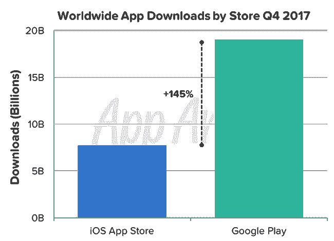

# 报告:Google Play 应用下载量领先 iOS 应用商店 145%

> 原文：<https://www.xda-developers.com/google-play-app-downloads-ios-app-store-145/>

根据 *Sensor Tower* ，的数据，2017 年，Android 和 iOS 的智能手机应用收入增长了 35%，用户在苹果应用商店的支出为 385 亿美元，而谷歌 Play 商店为 201 亿美元。本周，来自 [*App Annie*](https://www.xda-developers.com/xda-external-link/google-play-store-overall-app-installs-are-twice-that-of-ios-app-store-but-overall-revenue-is-nearly-half/) 的一份报告显示，尽管 2017 年 iOS 应用商店的应用销售额大幅领先于谷歌 Play 商店的销售额，但就整体下载率而言，情况就不同了。谷歌 Play Store 的应用下载量比苹果 App Store 高出 145%。

事实上，谷歌 Play 商店在 2017 年创下了有史以来最高的下载率，在 2017 年第四季度的假期达到了 190 亿次下载的峰值。(注意，该数字仅包括新下载，不包括重新安装或应用程序更新。)很大一部分下载来自发展中市场，如印度、印度尼西亚和巴西；新兴市场推动 Google Play 的下载量同比增长 10%。实际上，在 iOS 和 Android 应用下载方面，印度已经超过了美国。

 <picture></picture> 

Souce: App Annie

在 2017 年消费者支出市场份额方面，美国在 App Store 和 Play Store 中排名第一，同比增长最强劲。在谷歌 Play 商店，南韩位居第二，而苹果应用商店也将台湾列在同一位置。德国是这两个应用商店的第三大国家。

2017 年第四季度，移动用户在 Android 和 iOS 上的应用程序上总共花费了 170 亿美元，App Store 和 Play Store 的收入同比增长超过 20%。但 iOS 继续保持其巨大的销售收入领先优势，占全球应用程序总销售收入的 115 亿美元。

据 App Annie 称，收入增长的最大来源是视频应用中应用内订阅的引入。生产力应用也是 Google Play 的领头羊，这在一定程度上要归功于 Google Drive 存储应用订阅的推出。

你可以通过链接阅读完整的报告。

* * *

[**来源:App Annie**](https://www.appannie.com/en/insights/market-data/app-downloads-consumer-spend-q4-2017/)