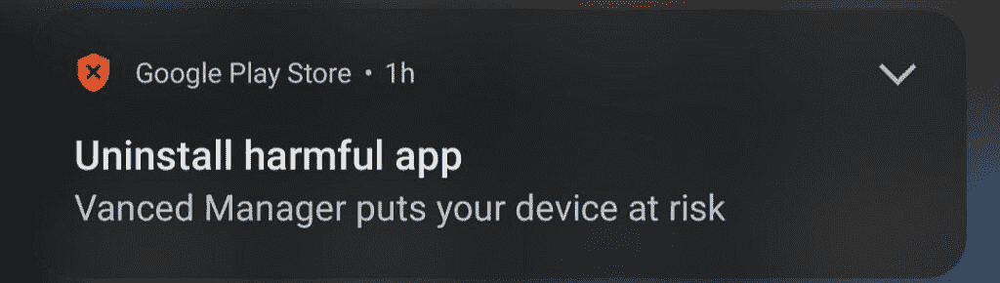
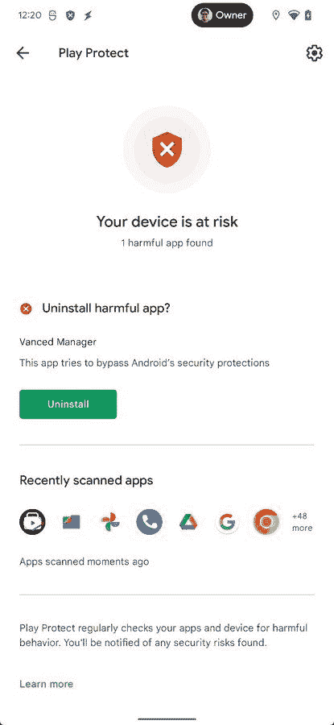

# Google Play Protect 正在标记某些版本的高级管理器

> 原文：<https://www.xda-developers.com/google-play-protect-flagging-vanced-manager/>

谷歌最近打击了 Vanced，这是 Android 最受欢迎的 YouTube 应用程序替代品之一，并向其开发者发出了停止令。结果，开发者们将 Vanced 下线，迫使用户寻找其他的 YouTube Vanced 替代品。但这似乎并不是先进传奇的结束。

由于当前版本的 Vanced 继续工作，一些用户仍然在他们的设备上安装了该应用程序。除了主要的 Vanced 应用程序，用户还可以在手机上安装配套的 Vanced Manager 应用程序。最近关于 Reddit 和 T2 Twitter 的报道显示，Google Play Protect 已经开始将这款高级管理器应用标记为“有害”，并提示用户将其卸载。这引发了对 Play Protect 警告合法性的质疑，因为该服务之前没有标记高级经理应用程序。

 <picture></picture> 

Credit: u/tedd235

虽然谷歌没有提供官方声明说明为什么 Play Protect 突然针对 Vanced Manager 应用程序，*斯珀* *的*米沙·拉赫曼推测这可能是因为 Vanced Manager 可以使用 root 权限安装应用程序。

正如你在附上的截图中看到的，卸载提示指定 Vanced Manager“试图绕过 Android 的安全保护。”该警告消息对应于谷歌官方 Play Protect 恶意软件和移动有害软件(MUwS)文档中定义的[“特权滥用”和“根源”类别](https://developers.google.com/android/play-protect/warning-strings)。

 <picture></picture> 

Credit: Mishaal Rahman

但这并不能解释为什么 Play Protect 只针对某些版本的高级管理器应用程序。测试表明，只有 advanced Manager v 2 . 6 . 0(较旧版本)才会弹出播放保护警告。在其设备上安装了最新版本(v2.6.2)的用户不会收到同样的警告。Vanced 的开发者也评论说，他们不知道为什么只有一个版本的应用程序受到影响，我们也很困惑。

值得一提的是，虽然你不能再从其官方网站下载 Vanced Manager，但你仍然可以从 APKMirror 等可信来源获得它，然后从内部安装其他高级应用程序。此外，Play Protect 似乎没有为所有用户标记 advanced Manager v 2 . 6 . 0。我在我的两台设备上安装了 APK，虽然我在 Pixel 4a 上收到了警告，但即使在手动扫描后，我在 Galaxy S22 Ultra 上也没有收到警告。

* * *

**来源:** Reddit [ [1](https://www.reddit.com/r/Android/comments/tqyrqb/phone_says_vanced_manager_puts_my_device_at_risk/) ，[ [2](https://www.reddit.com/r/assholedesign/comments/tqx6de/getting_a_notification_from_play_store_every_30/) ]