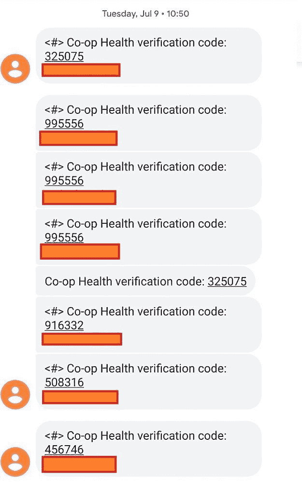

# Google Play 服务 18.7.13 测试短信代码自动填充

> 原文：<https://www.xda-developers.com/google-play-services-sms-code-auto-fill/>

如果你关心你的数据的安全，为你的网上账户设置双重认证是必要的。大多数启用了 2FA 的用户使用设备上的提示、验证器应用程序或通过短信发送的验证码。虽然前两者被认为比短信代码验证更安全，但[谷歌的研究](https://security.googleblog.com/2019/05/new-research-how-effective-is-basic.html)显示，谷歌账户的短信验证“帮助阻止了 100%的自动僵尸程序、96%的批量网络钓鱼攻击和 76%的有针对性的攻击。”好处是显而易见的，但许多人仍然不使用 2FA 的原因，即使是通过短信，是因为他们觉得不方便。今天，谷歌推出了 Google Play 服务 18.7.13 测试版，它暗示了一种从短信中自动检索验证码的新方法:通过 Android 内置的自动填充服务。

APK 拆卸通常可以预测应用程序未来更新中可能出现的功能，但我们在这里提到的任何功能都可能不会出现在未来的版本中。这是因为这些功能目前还没有在 live build 中实现，可能会在未来的版本中随时被 Google 拉出来。

## Google Play 服务 18.7.13 测试版变更

目前有几种方法可以跳过手动打开你的消息应用程序来复制验证码。首先，消息应用程序(像谷歌的[消息](https://play.google.com/store/apps/details?id=com.google.android.apps.messaging))可能会自动检测并在新文本消息的通知中显示代码。第二，需要代码的应用程序可以使用[短信检索器 API](https://developers.google.com/identity/sms-retriever/) ，这是 Google Play 服务的一部分，可以自动读取短信代码。第三，需要代码的应用程序可以[创建 createAppSpecificSmsToken](https://www.xda-developers.com/android-o-will-improve-sms-authentication-for-apps/) 类型的 PendingIntent，从 Android 8.0 Oreo 开始就可以使用。最后，该应用程序可以请求 READ_SMS 权限来读取验证码的传入短信，然而，谷歌[最近打击了像这样使用短信权限的应用程序](https://www.xda-developers.com/google-play-developer-policy-call-log-sms/)。

在上一段提到的 4 种方法中，推荐的检索 SMS 代码的方法是 SMS 检索 API，因为 Google Play 服务几乎无处不在。可悲的是，许多应用程序开发人员仍然没有利用这个 API。根据 XDA 公认的开发人员 quinny 899 T1 的说法，这是因为发送给用户的文本信息的格式不理想。短信正文必须以< # >开头，以基于应用程序签名的散列结尾。这个散列可能会使用户误以为它实际上是有问题的 SMS 代码。

 <picture></picture> 

Take a guess which one is the iOS verification format. I blurred out the hash per Quinny899's request.

谷歌希望用户采用更好的安全实践，这意味着他们希望让双因素认证更容易被用户接受。为了做到这一点，他们似乎将更新谷歌自动填充服务，以自动从短信中检索验证码。这将为用户带来自动短信代码检索，这些用户的默认消息应用程序还没有自动检索代码，并且他们的应用程序没有使用短信检索器 API。

```
 <string name="sms_code_autofill_consent_message">You can change the settings in Settings → Google → Verification code autofill.</string>
<string name="sms_code_autofill_consent_title">Allow %s to automatically enter verification codes from text messages?</string>
<string name="sms_code_autofill_settings_title">SMS Code Autofill</string>
<string name="sms_code_autofill_settings_toggle_description">Autofill must be enabled to automatically fill SMS codes. You can enable autofill in Settings → System → Languages &amp; Input → Advanced → Autofill service.</string>
<string name="sms_code_autofill_settings_toggle_primary">Autofill SMS Codes</string>
<string name="sms_code_autofill_settings_toggle_secondary">Allow autofill service to access SMS messages to retrieve verification code</string>
<string name="sms_code_pref_key_autofill_permission_state">autofill_permission_state</string>
<string name="sms_code_pref_key_dummy_for_description">dummy_for_description</string> 
```

启用谷歌自动填充服务后，[可在任何安装了谷歌 Play 服务的安卓 8.0+设备](https://www.xda-developers.com/android-os-autofill-framework-will-finally-resolve-a-long-standing-lag-issue-with-password-managers/)上使用，用户将能够启用“短信代码自动填充”，如下图所示。该活动目前未导出，但可以通过手动启动`com.google.android.gms.auth.api.phone.ui.AutofillSettingsActivity`活动来访问。

我没有在我的任何账户上使用基于短信的 2FA，也没有使用谷歌的自动填充服务([我是 KeePass 的粉丝](https://www.xda-developers.com/host-your-own-cross-platform-password-manager-with-keepass/))，所以我自己无法测试它。然而，该功能似乎非常简单:当你通过短信收到一个代码时，自动填充服务会自动输入代码，就像你保存的任何密码一样。虽然目前这是一个很好的功能，但由于 Android 最近的 FIDO2 认证，在不久的将来我们将能够访问网站和应用程序[而不需要密码](https://www.xda-developers.com/android-fido2-certified-passwordless-access/)。

你可以在 [APKMirror](https://www.apkmirror.com/apk/google-inc/google-play-services/google-play-services-18-7-13-release/) 上下载最新版本的 Play 服务，或者你可以等待它在未来几周内逐步推出。

* * *

*感谢 PNF 软件为我们提供了使用许可 [JEB Decompiler](https://www.pnfsoftware.com/?aid=xdadev) ，这是一款针对 Android 应用的专业级逆向工程工具。*