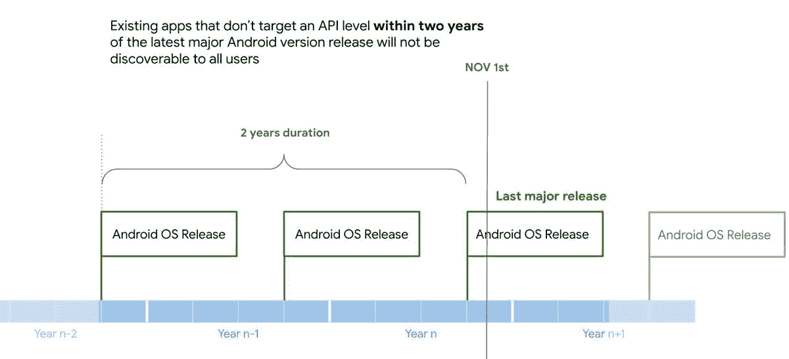

# 谷歌 Play 商店将很快阻止你下载过时的应用程序

> 原文：<https://www.xda-developers.com/google-play-store-outdated-apps-policy/>

苹果多次从 App Store 中清除不是为最新 iPhone 机型或新版 iOS 开发的应用程序，这通常有利于整体软件体验，但却使旧应用程序和游戏的保存变得更加困难。谷歌一直犹豫是否要对谷歌 Play 商店采取同样的举措，但这种情况很快就会改变。

谷歌在一篇博客文章中宣布，*“从 2022 年 11 月 1 日开始，在最新主要 Android 发布版本的两年内没有以 API 级别为目标的现有应用程序将无法供运行 Android OS 版本高于应用程序目标 API 级别的设备的新用户发现或安装。随着未来新的 Android 操作系统版本的推出，需求窗口将会相应调整。"*

 <picture></picture> 

Timeline for new target API requirements (Source: Google)

Android 应用程序和游戏是基于两种不同的 Android 版本构建的:最低 API 级别和“目标”API 级别。前者是应用程序打算使用的最老版本的 Android，而后者是应用程序构建的最新 Android 版本。开发者应该保持目标 API 水平接近最新的 Android 版本，这允许应用程序使用最新的 API 和开发功能。然而，新的 API 级别通常也会引入更多的权限限制，这就是为什么一些应用程序尽可能长时间地停留在旧的 API 级别上。Snapchat 可能是这里最著名的例子，它[多年来一直坚持 API 级别 22(Android 5.1)](https://arstechnica.com/gadgets/2017/12/google-fights-fragmentation-new-android-features-to-be-forced-on-apps-in-2018/#:~:text=Snapchat%20uses%20API%20level%2022,Android's%20%C3%A0%20la%20carte%20permissions.)以避免 Android 6.0 中引入的运行时权限模型。

谷歌已经要求新应用和现有应用的更新[以最近的 Android 版本](https://developer.android.com/google/play/requirements/target-sdk)为目标，目前设定为 Android 11 (API 级别 30)，将于 2022 年 8 月提高到 Android 12 (API 级别 31)。然而，这一要求仅适用于仍在开发中的应用程序——旧的和废弃的应用程序和游戏被搁置，只要它们仍符合其他 Play Store 政策。

这一举措可能会提高隐私和安全性，因为如果应用程序希望在 Play Store 上保持可访问性，它们必须跟上 Android 不断发展的权限和安全变化。然而，这将导致许多旧应用程序变得更加难以(或不可能)访问，尤其是在 11 月 1 日第一次清理之后。值得庆幸的是，在 Android 上备份和保存旧应用和游戏比在 iOS 上更容易。

* * *

**来源:** [安卓开发者](https://android-developers.googleblog.com/2022/04/expanding-plays-target-level-api-requirements-to-strengthen-user-security.html)