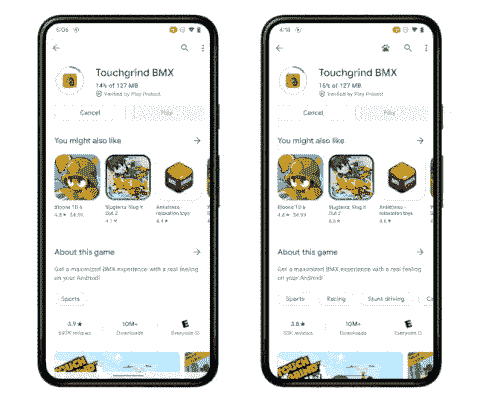

# Play Store 的“边下载边播放”即将在所有 Android 12 设备上推出

> 原文：<https://www.xda-developers.com/google-play-store-play-as-you-download-android-12-rollout/>

# Play Store 的“边下载边播放”即将在所有 Android 12 设备上推出

“边下载边玩”( Play as you download)将很快在 Android 12 设备上推出，它允许一些游戏在下载的同时播放。

去年 7 月，谷歌推出了“下载即玩”(Play as your download)，这将允许 Play Store 中的一些游戏和应用程序在下载时被打开。经过漫长的等待，谷歌表示，该功能将很快推广到所有 Android 12 设备。

这或多或少与其他游戏平台多年来的功能相同，如 PlayStation、Xbox、EA Origin、动视暴雪的 Battle.net 等。开发者已经支持 Google Play 签名和 Play Assset 交付，但一旦发生这种情况，你将能够在 Play Store 仍在下载的情况下打开给定的应用程序或游戏。

 <picture></picture> 

Left: Without “play as you download. Right: With “play as you download.”

谷歌之前向 XDA 开发者透露，当你下载时播放 T1 使用的是 T2 安卓的增量文件系统 T3，这是一个“特殊用途的 Linux 虚拟文件系统，当程序的二进制文件和资源文件仍在网络上被缓慢下载时，它允许程序的执行。”增量文件系统只在 Android 12 上可用，因此 Android 12 的要求是边下载边播放。

谷歌现在表示，下载即玩将“很快”适用于所有 Android 12 设备。不幸的是没有具体的时间表，但即使当谷歌翻转开关时，你可能只能在开始的几个游戏中使用它。一些游戏也可能选择完全不支持该功能，特别是如果下载量已经很小，在互联网连接相当快的情况下，它可以在几秒钟内下载完毕。这也是这个功能主要用于游戏而不是其他类型的应用程序的原因。

最近几个月，谷歌一直在测试 Android 游戏的其他改进，如 Android 12 中的[游戏仪表盘和新的](https://www.xda-developers.com/google-play-games-integration-android-12-game-dashboard/)[PC 桌面模拟器](https://www.xda-developers.com/google-android-games-windows-limited-beta/)游戏。