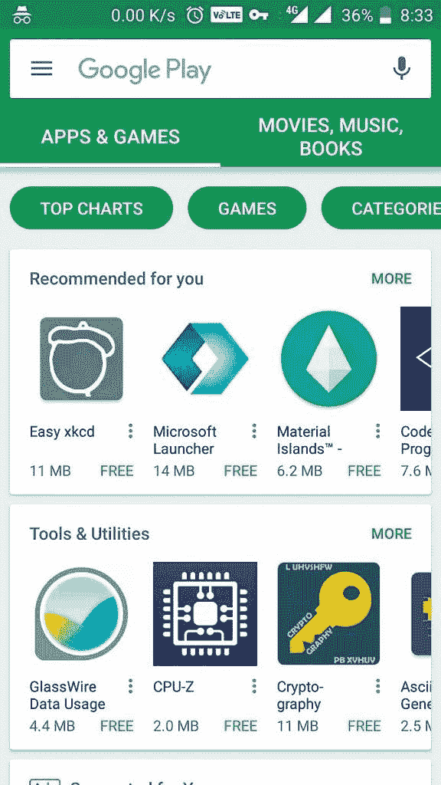

# 谷歌 Play 商店现在在主屏幕上向印度用户显示应用尺寸

> 原文：<https://www.xda-developers.com/google-play-store-shows-app-sizes-on-home-screen/>

自 2012 年作为安卓市场的革新而推出以来，谷歌 Play 商店已经走过了漫长的道路。这款应用现在已经有了 8.x 版本，采用了用户直观的设计，大部分都遵循了谷歌的材料设计指南。尽管在几乎任何安卓设备上使用 [Play Store](https://www.xda-developers.com/google-play-store-android-instant-apps/) 时，在流畅度方面仍然存在显著的性能问题，[谷歌在其他领域已经取得了进展](https://www.xda-developers.com/google-editors-choice/)。就用户友好性而言，谷歌在过去几年中对用户界面进行了多项修改，使其更容易发现和安装应用程序。然而，仍有很大的改进空间。

现在，Play Store 已经开始在 Play Store 的主屏幕上显示所有应用的应用大小。这可以在应用程序图标的左下角看到。这个空间以前用于显示应用程序的用户评级。目前，这只是向印度用户展示，现在在我们所有的设备上都可以看到。

 <picture></picture> 

App sizes are now shown on the Play Store home screen for Indian users

为什么谷歌只为印度用户改变了 Play Store 的主屏幕？目前，确实只有印度用户看到了应用程序大小，但以后可能会有更多的国家加入到列表中。至于为什么首先做出改变，谷歌在做出改变时可能已经考虑到了印度的数据连接状况。

尽管自 2016 年以来，随着 Reliance Jio、VoLTE 和 4G LTE 的兴起，印度在经济实惠的数据方面取得了巨大进步，但在该国的许多地区，数据仍然很昂贵，而且很有限。让用户直接在主屏幕上知道应用程序的大小，是为了在数据连接不是最佳的市场上增加便利性。

根据谷歌收到的反馈，用户可以期待这项功能在未来进入其他发展中市场。

* * *

[**来源:/u/ILikeMultis (Reddit)**](https://www.reddit.com/r/Android/comments/7aomj8/google_play_store_now_shows_app_size_below_the/)