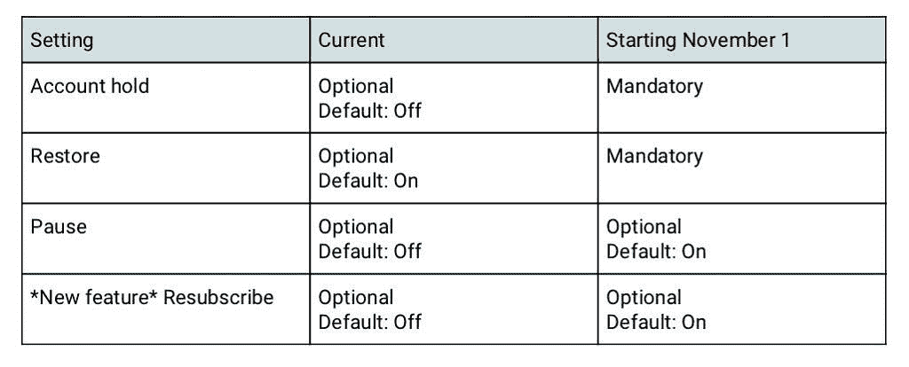
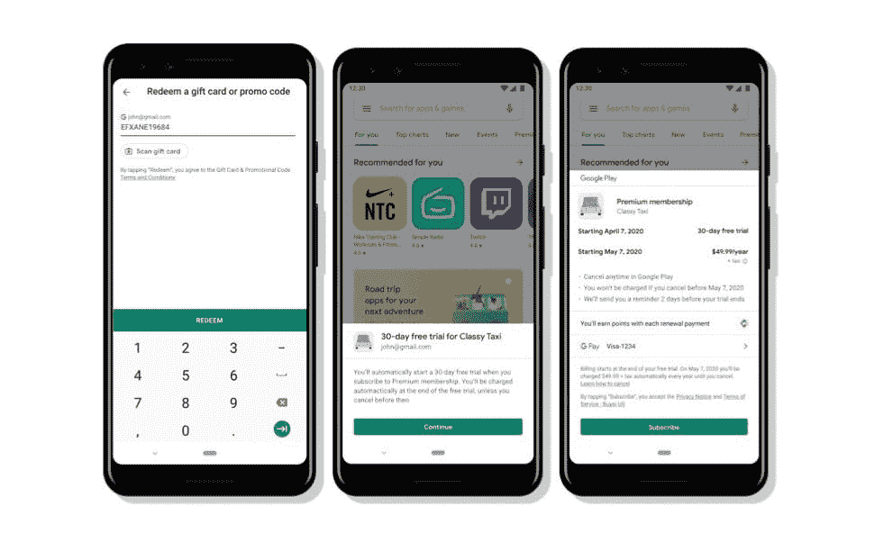

# Google Play 现在支持虚拟代码进行订阅等

> 原文：<https://www.xda-developers.com/google-play-supports-vanity-codes-subscriptions-features-decrease-user-churn/>

上周，谷歌宣布推出第三版 Play Billing Library，增加了新的功能，使支付更容易，兑换促销代码更容易，并更好地跟踪谁购买了什么商品。除了这可能对非 Play 商店应用程序产生的影响之外，新的改进旨在改善和简化通过 Google Play 支付的体验。作为新 Play 计费库的一部分，谷歌正在对其订阅政策进行修改，并添加新功能，通过对订阅和推广代码进行一系列改进来帮助开发者获得并留住用户。

从 2020 年 11 月 1 日开始，谷歌将强制保留和恢复账户，并在默认情况下为所有使用订阅的应用程序启用账户暂停和重新订阅(新功能)。如果用户的支付方式失败，帐户持有人会暂时阻止对内容的访问，而当他们在订阅失效之前输入有效的支付方式时，恢复功能会让他们立即返回。暂停允许用户最多暂停订阅 3 个月。重新订阅是一项新功能，允许用户通过前往谷歌 Play 商店的订阅中心重新订阅在过去 12 个月内到期的订阅。

 <picture></picture> 

Google Play Subscription Changes

谷歌还增加了一个“无摩擦”的兑换流程，让用户更容易利用一次性促销代码进行订阅。这使得用户可以在几个步骤内从 Play Store 赎回代码、购买订阅和安装应用程序。该功能要求开发者使用 Play 计费库 v2.0 或更高版本。

 <picture></picture> 

Google Play Frictionless Subscription

在谷歌增加的其他事情中，当用户试图取消订阅时，开发者现在可以显示多达 4 个订户利益的列表，告诉他们取消会失去什么。

开发者现在可以发布自定义代码(称为虚荣心代码)，多个用户可以兑换。购买套餐时，用户可以通过在付款方式中输入自定义代码来兑换。最后但同样重要的是，如果开发者选择降低订阅价格，用户将不再需要选择加入来保留他们的订阅。相反，用户将被简单地通知订阅即将降价，并可以在谷歌 Play 商店的订阅中心看到变化。

这些变化将显著改善整个谷歌 Play 商店订购和兑换促销代码的方式。你觉得这些变化怎么样？

* * *

**来源:[安卓开发者](https://android-developers.googleblog.com/2020/06/new-features-to-acquire-and-retain-subscribers.html)**