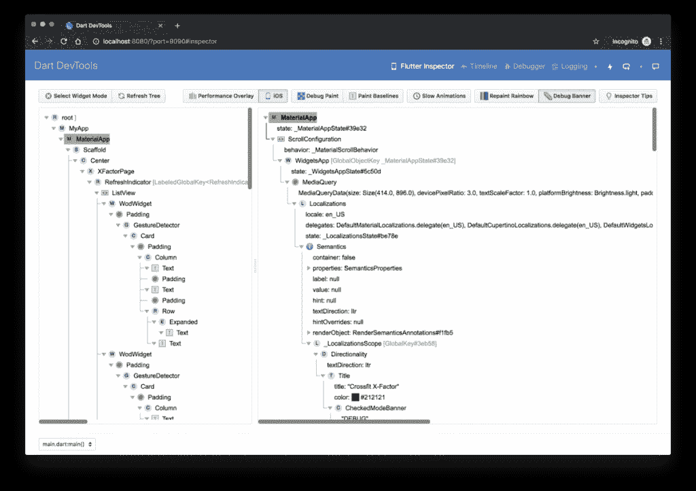
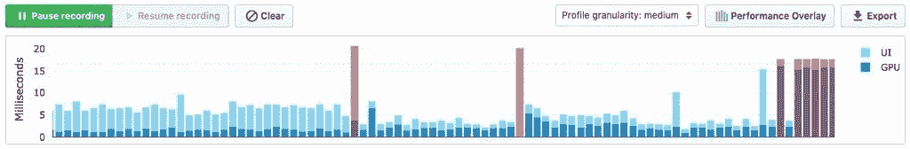
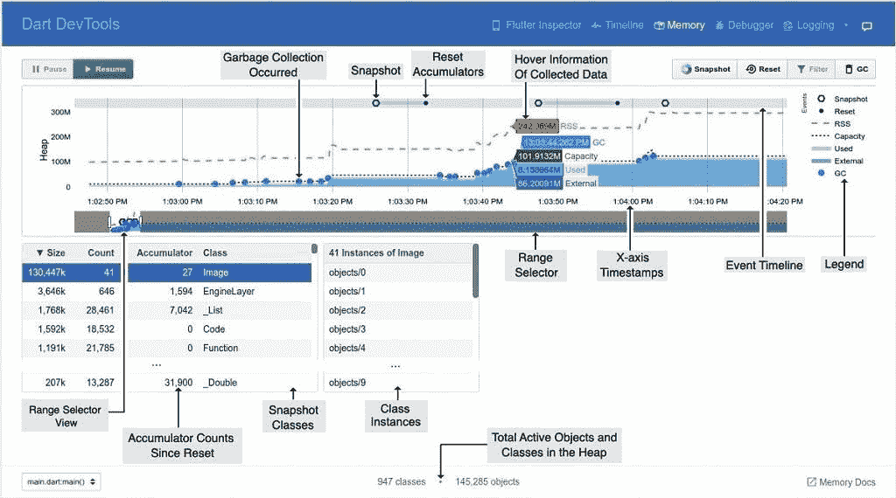
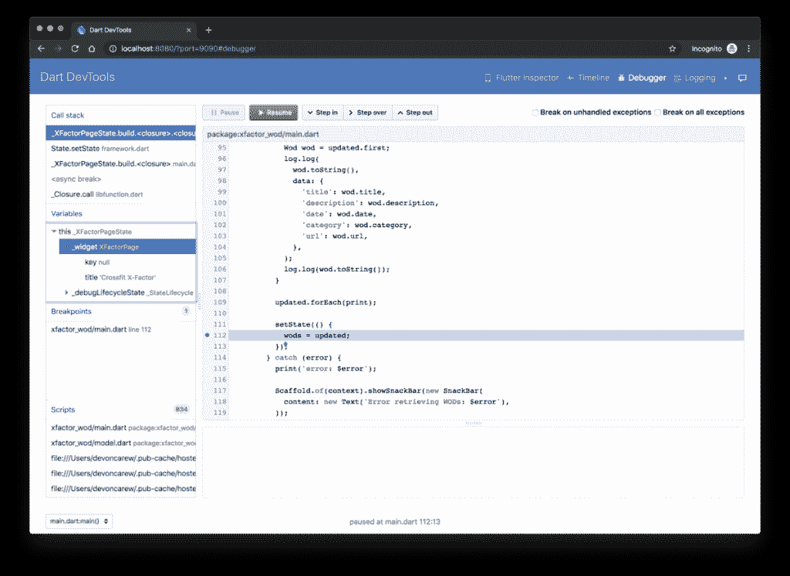

# Google 在 Flutter 中从头开始重建 Dart DevTools

> 原文：<https://www.xda-developers.com/google-rebuilds-flutter-dart-devtools/>

Flutter 是一个[跨平台编程框架](https://www.xda-developers.com/flutter-1-0-is-now-available-stable-native-cross-platform-development/)，旨在解决开发跨平台应用而没有非本机代码混乱的困境。有了 Dart 编程语言的知识，开发人员可以使用统一的 UI 为 Android、iOS、web 和桌面构建应用程序。 [Flutter 1.9](https://www.xda-developers.com/flutter-19-web-repo-ios-13-macos-catalina-support-ml-code-completion-dart-25/) 将 macOS 和 Catalina 的支持带到了 alpha 状态，而 [v1.12 版本使他们的支持成熟，超过了前 alpha 状态](https://www.xda-developers.com/google-flutter-112-support-web-macos-more/)，Flutter 的 [v1.17 和 Dart 的 v 2.8](https://www.xda-developers.com/google-flutter-117-dart-2-8-stable-sdk-app-development/)标志着他们在 2020 年的第一个稳定版本。今天，Google 为 Dart 和 Flutter 代码发布了一个新版本的 DevTools，该版本是在 Flutter 中从头开始重建的，并有一些改进。

在之前的声明中，谷歌曾提到它打算用一个新的 Flutter 版本替换当前版本的 Dart DevTools。现在这已经发生了，因为新的 DevTools 已经在 Flutter 中从头开始重建。DevTools 的这个新版本增加了一些改进，比如对性能和内存页面的更改，以及一个全新的网络页面。

但是当它还能工作的时候为什么要重建呢？Flutter 背后的团队声称，在构建高性能 ui 时，生产率的好处是非常重要的，证明对这些说法有信心的最佳方式是为自己采用完全相同的工具。在 Flutter 中进行重建也使得开发人员能够在编写代码之后选择一个分布模型，这与当前的决策流程图不同，在当前的决策流程图中，分布模型将决定代码。

DevTools 作为一个 web 应用程序发布，使得跨所有目标平台和 ide 将工具集成到现有的工具体验中变得更加容易。DevTools 是一套运行在浏览器中的独立工具，适用于移动应用、桌面应用和网络应用。

DevTools 包含以下特性:

*   [Flutter Inspector](https://flutter.dev/docs/development/tools/devtools/inspector) :可视化和探索窗口小部件树的工具。您可以在运行的应用程序中选择 widgets，减慢所有动画的速度，查看文本基线，等等。
    *   其中一个新特性是布局浏览器，你可以在细节树旁边的 Flutter Inspector 标签中找到它。布局资源管理器允许您检查 Flutter 的 flex 布局模型。该团队给出了一个例子，说明这个工具如何帮助调试为什么一行小部件看起来不像开发人员预期的那样。

 <picture></picture> 

Flutter Inspector

*   [时间线视图](https://flutter.dev/docs/development/tools/devtools/timeline):显示每一帧的构建时间和一个火焰图。这使得在上下文中识别有问题的帧变得容易。
    *   此面板现在整合了新的“追踪微件构建”按钮，该按钮可将应用程序中所有微件的构建时间添加到时间线中(以牺牲您的配置文件构建的性能为代价，因此默认情况下不会打开)。当你试图找出哪个窗口小部件在慢帧后面时，这是很方便的。

 <picture></picture> 

Frame Rendering Chart

*   [内存视图](https://flutter.dev/docs/development/tools/devtools/memory):向你展示你的应用在给定时刻是如何使用内存的。
    *   这个视图现在显示了已分配内存的热图，并允许跟踪平台内存。

 <picture></picture> 

Memory Anatomy

*   [性能视图](https://flutter.dev/docs/development/tools/devtools/performance):这是一个传统的 CPU 剖析器。它可以让你记录应用程序的一个会话，并查看 CPU 在哪些功能上花费了大部分时间。你可以用这个来决定在哪里花时间优化。
*   DevTools 甚至包括自己的[调试器](https://flutter.dev/docs/development/tools/devtools/debugger)。如果您没有使用 IDE，但仍然希望使用该选项来添加断点、逐句通过代码、查看变量值等，这将非常有用。

 <picture></picture> 

Debugger

*   网络观点:这是全新的。
    *   顾名思义，它允许您检查网络流量。您可以查看应用程序自启动以来发出的所有请求的历史记录，并获得每个请求的详细信息。这使您在调试网络问题时不必自己记录这些事件。
    *   “网络”选项卡当前显示 HTTP 流量；未来的改进包括显示[通用套接字 I/O 流量](https://github.com/flutter/devtools/issues/2044)。
    *   网络请求也显示在时间线视图中，因此您可以在上下文中查看它们。
*   [日志视图](https://flutter.dev/docs/development/tools/devtools/logging):显示来自你的应用和框架的事件。有了它，您可以轻松地过滤消息(例如，您可以指定“-gc”来过滤掉垃圾收集器事件，或者指定“flutter.frame”来只显示帧事件)。在 Dart 中，日志消息[可以被结构化](https://api.dart.dev/stable/dart-developer/log.html)，日志视图利用了这一点。

要完全利用 DevTools，可以阅读[文档](https://flutter.dev/docs/development/tools/devtools/overview)。如果你发现任何错误，或者如果你想对新功能投票，你可以在 [GitHub](https://github.com/flutter/devtools/issues) 上投票。