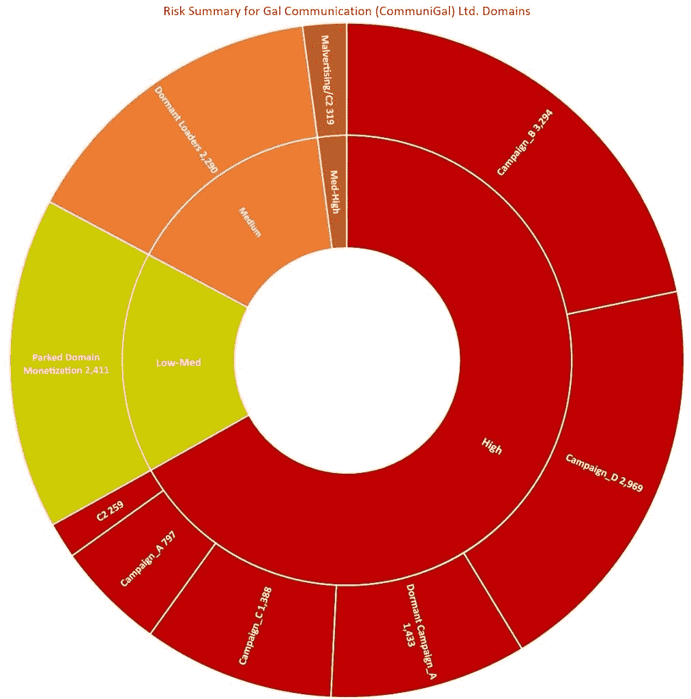

# 谷歌删除了 70 个追踪用户数据的恶意 Chrome 扩展

> 原文：<https://www.xda-developers.com/google-removes-70-malicious-chrome-extensions/>

谷歌 Chrome 浏览器最大的优点之一就是有各种各样的扩展供你使用。这些扩展可以大大改善你的网络浏览体验。然而，正如我们在过去所看到的，[扩展可能是恶意的](https://www.xda-developers.com/google-chrome-web-store-security-changes/)，尤其是如果他们被授予广泛的访问权限来监控你在所有网站上的活动，而谷歌并不总是能迅速捕捉到他们。最近，谷歌删除了 70 个这样的扩展，但在此之前，截至 2020 年 5 月，它们已经从 Chrome 网上商店下载了 3200 万次*。*

据路透社报道，Awake Security 的研究人员通过 Chrome 扩展发现了一个大型间谍活动。111 恶意或虚假扩展的开发者用虚假信息伪装他们的身份，并且这些工具被设计来绕过防病毒软件。这些扩展能够通过超过 15，000 个恶意域名的网络发送用户数据和浏览历史，这些域名碰巧都是从以色列的一个注册商那里购买的。这家名为 Galcomm 的公司否认与恶意活动有任何关系。

 <picture></picture> 

Summary of malicious domains uncovered by Awake Security. Source: [Awake Security](https://awakesecurity.com/blog/the-internets-new-arms-dealers-malicious-domain-registrars/).

自从最初的报告以来，Awake Security 已经公布了被移除的 Chrome 扩展的完整列表。这里是[分机 id](https://awakesecurity.com/wp-content/uploads/2020/06/GalComm-Malicious-Chrome-Extensions-Appendix-B.txt)的完整列表。这些扩展中的大多数被宣传为警告用户有问题的网站或转换文件，但却是截图、读取剪贴板、从 cookies 或参数中获取凭据令牌、抓取用户击键等。研究人员称，这是迄今为止影响最深远的恶意 Chrome 商店活动。

一个安装恶意 Chrome 扩展的例子。来源:[唤醒安全](https://awakesecurity.com/blog/the-internets-new-arms-dealers-malicious-domain-registrars/)。

谷歌对这些情况给出了典型的回应，称它会进行例行的安全扫描，并在必要时删除恶意扩展。这不是开发者第一次出于恶意使用 Chrome 扩展，也不会是最后一次。谷歌已经表示将提高安全性，但正如前面提到的，这是迄今为止最大的一次活动。很明显，他们还有很多工作要做。

* * *

**来源:** [清醒安全](https://awakesecurity.com/blog/the-internets-new-arms-dealers-malicious-domain-registrars/) | **Via:** [路透社](https://www.reuters.com/article/us-alphabet-google-chrome-exclusive-idUSKBN23P0JO)