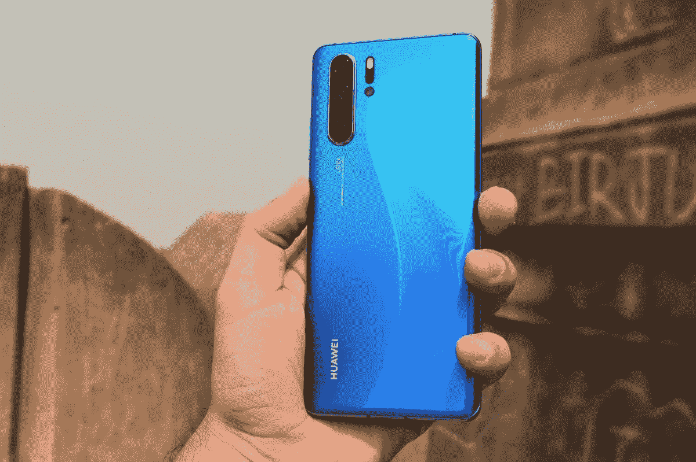

# 【更新 14:临时许可再次延期】谷歌撤销了华为的安卓许可

> 原文：<https://www.xda-developers.com/google-revoke-huawei-android-ban-blacklist/>

**更新 14(03/11/2020 @ 09:40AM ET):**Tump 管理局再次延长了华为的临时许可，但这次只延长了 45 天。

### 以前的更新

**更新 13(02/14/2020 @ 06:20am ET):**Tump 管理局再次延长了华为的临时许可，但这次只延长了 45 天。

**更新 12 (11/18/19 @美国东部时间下午 12:30):**特朗普政府再次将华为的临时通用许可再延长 90 天。

**更新 11(东部时间 8/19/19 @上午 10:00):**美国商务部将对华为的贸易禁令推迟 90 天，延长临时许可证。

**更新 10 (8/10/19 @美国东部时间上午 9:50):**华为和 Honor 设备已被添加回安卓企业推荐网站。

**更新 9(美国东部时间 2019 年 6 月 20 日下午 2 点):**华为就围绕这种情况的许多常见问题分享了一些回应(如下)。

**更新 8(美国东部时间 2019 年 5 月 24 日上午 11 点 33 分):**谷歌已经将所有华为设备从安卓企业推荐网站下架。

**更新 7(美国东部时间 2019 年 5 月 22 日上午 10:03):**英国运营商 EE 和沃达丰以及亚洲运营商正在与华为保持距离。

**更新 6(美国东部时间 2019 年 5 月 21 日 12:58 分):**谷歌证实，在美国商务部做出决定后，它将在未来 90 天内与华为合作。

**更新 5(美国东部时间 2019 年 5 月 21 日上午 8:30):**华为表示，它正在与谷歌合作，寻找解决禁令的办法。

**更新 4(美国东部时间 2019 年 5 月 20 日下午 5 点 58 分):**令人惊讶的是，美国商务部正在放松对华为的限制。下面将详细介绍这意味着什么。

**更新 3(美国东部时间 2019 年 5 月 20 日上午 8:30):**在惨败中，荣誉 20 的推出保持不变。

**更新 2(美国东部时间 2019 年 5 月 20 日上午 5:15):**华为回应吊销许可证。

**更新 1(美国东部时间 2019 年 5 月 20 日上午 5:10):**在谷歌、芯片制造商高通、英特尔、赛灵思和博通宣布将与华为断绝贸易关系之后。

华为是最有价值的中国公司之一，其帝国向四面八方扩张。除了声称在全球智能手机销量方面排名第二之外，华为还是电信设备的领先供应商之一，也是采用 5G 的[驱动力。但由于某些原因，该公司一直处于特朗普政府的枪口下](https://www.xda-developers.com/lawmakers-pushing-att-cut-ties-huawei-phones-5g/)[，特朗普政府一再声称华为的智能手机和电信设备可能被用于间谍活动。美国政府援引华为创始人任郑飞此前与中国军方的联系，禁止政府机构及其私人承包商使用任何华为产品，并要求盟友也这样做。](https://www.bloomberg.com/news/articles/2019-01-23/how-huawei-became-a-u-s-government-target-quicktake)

随着两国外交紧张局势升级，特朗普总统宣布国家进入紧急状态，并于上周通过了一项行政命令，限制美国公司向华为供应产品。虽然这个中国巨人声称有相当多的硬件库存，而且即使有这些限制，[似乎也很放心，但谷歌最近披露的一则消息使](https://www.cnbc.com/2019/05/17/huawei-us-supplier-shares-slide-but-it-says-it-can-survive-blacklist.html)[华为在市场上的突出地位](https://www.xda-developers.com/samsung-apple-decline-huawei/)岌岌可危。作为政府黑名单的一部分，谷歌已经将华为从安卓合作伙伴计划中移除，这表明后者将不再拥有对谷歌专有应用和服务的*访问权*， *[路透社](https://www.reuters.com/article/us-huawei-tech-alphabet-exclusive/exclusive-google-suspends-some-business-with-huawei-after-trump-blacklist-source-idUSKCN1SP0NB)* 报道。

谷歌目前正在"*审查白宫行政命令的含义*，但据报道，目前华为将无法在智能手机上安装 Google Play 服务。此次打击行动禁止华为申请兼容性测试套件(CTS)下的设备评估，任何 OEM 厂商都必须通过该套件才能在其设备上使用安卓品牌，并提供类似于[谷歌 Play 商店](https://www.xda-developers.com/google-play-store-app-rating-recent-reviews/)、 [YouTube](https://www.xda-developers.com/youtube-for-android-tv-long-press-video-menu/) 、[谷歌搜索](https://www.xda-developers.com/google-maps-google-search-incognito-mode/)、 [Chrome](https://www.xda-developers.com/chrome-os-75-big-performance-updates-pixel-slate-tablet-mode/) 等服务。开箱即用。

 <picture></picture> 

Huawei's latest flagship, the Huawei P30 Pro

由于谷歌禁止未经 CTS 验证的设备运行其应用程序，用户将无法直接加载这些服务的 apk。例如，除了谷歌应用程序之外，所有其他使用谷歌应用程序接口以方便登录的应用程序也将被华为及其子品牌 Honor 在智能手机上屏蔽。

对于现有的华为设备，谷歌已经[确认](https://twitter.com/Android/status/1130313848332988421)用户将继续能够通过谷歌 Play 商店更新应用。然而，黑名单还禁止华为和 Honor 向其智能手机发送更新，如果这样做，它将被迫从现有设备中删除 Google Play 服务和 Google apps。

由于这一禁令，华为将无法在公开发布之前获得每月谷歌安全补丁的代码。此外，从 Android 的下一个商业版本(即 Android R)开始，华为和 Honor 不再是 [Android beta 计划](https://www.xda-developers.com/everything-new-android-q-beta-3/)的成员。如果华为打算继续更新并让用户加入 Android R 的行列，它必须等到每年 8 月左右的公开发布。

从根本上说，华为现在可以继续在智能手机上使用 Android 的唯一方法是使用 AOSP(Android 开源项目)的代码构建自己的定制版 Android，这正是定制 rom 开发者的做法。然而，与定制 rom 不同的是，华为可能无法在不被谷歌察觉的情况下将[gapp](https://www.xda-developers.com/opengapps-hosting-future-google-apps/)与软件包捆绑在一起。

总而言之，形势确实对华为不利。目前唯一合理的选择是，要么最终开始推出据报道它一直在开发的自己的操作系统，以期待美国最终阻止其使用 Android 的那一天。这可能是一个具有挑战性的转变，因为大多数华为用户习惯于 Android 和谷歌生态系统。但是，只要操作系统在体验上类似于 Android，并且允许安装谷歌应用程序，它应该是有用的。然而，我们还没有看到任何预览，这意味着它可能还没有准备好使用。

或者，华为可以继续修补 Android，并使用 AOSP 版本继续提供 EMUI 更新。然而，在这种情况下，它将无法支持 Google Play 服务和其他谷歌应用程序。这将限制用户依赖华为的 AppGallery，该公司的应用数量相对较少，尽管这不会解决谷歌应用程序的问题。

总的来说，这个条件对华为来说是非常有限的，基本上是把它限制在中国，谷歌的服务在中国已经被法律禁止了。这项行政命令摧毁了华为和 Honor 的存在，不仅是在美国，而且基本上摧毁了所有预装谷歌服务的设备所在的市场。鉴于美国政府已经对该公司有了严格的看法，我们预计未来几个月不会有任何缓解。早些时候，华为也分享了其起诉美国政府的计划，但一个有利的决定可能需要几个月甚至几年的时间。

目前，这一步预示着另一个智能手机巨头的死亡。

* * *

在谷歌限制与华为软件交换的报告发布后，美国芯片制造商高通、博通、赛灵思和英特尔宣布，他们将服从美国政府的行政命令，限制对华为的供应。分析师 Ryan Koontz 告诉，华为"*严重依赖美国半导体产品，如果没有美国关键部件的供应*将会严重受损。如上所述，华为似乎已经储备了足够的芯片来维持未来三个月的生产。然而，禁令可能需要更长时间才能解除。

在四家芯片制造商中，英特尔华为是其数据中心所用芯片的主要供应商。此外，英特尔还为华为的 Matebook 系列笔记本电脑提供处理器。高通向其出售骁龙 SOC，用于 Honor 8C 等各种入门级设备以及一些网络芯片。高通还将蓝牙音频的 aptX 编解码器授权给华为。同时，Xilinx 为网络提供可编程芯片，而 Broadcom 为电信设备提供分组交换芯片。

总的来说，美国有 30 多家公司被该公司视为“核心供应商”，所有这些公司都可能遵循相同的路线。

* * *

## 更新 2:官方回应

失败之后，这家中国公司正式分享了对此事的回应。事情是这样的:

*“华为为 Android 在全球的发展和增长做出了巨大贡献。作为 Android 的主要全球合作伙伴之一，我们与他们的开源平台密切合作，开发了一个让用户和行业都受益的生态系统。*

*华为将继续为所有现有的华为和 Honor 智能手机和平板电脑产品提供安全更新和售后服务，涵盖全球已销售或仍有库存的产品。*

我们将继续构建一个安全、可持续的软件生态系统，为全球所有用户提供最佳体验。"

**来源:[WinFuture](https://winfuture.de/news,109020.html)**

* * *

## 更新 3:荣誉 20 发射不受影响

华为 Honor 宣布，尽管美国政府与谷歌和其他合作公司的废除法案之间仍存在争议，但明天在伦敦举行的 [Honor 20 系列](https://www.xda-developers.com/everything-about-honor-20-series/)的[发布会](https://www.xda-developers.com/win-honor-20-launch-trip/)仍然不受影响。

* * *

## 更新 4:华为获得临时许可

在谷歌撤销华为安卓许可的消息传出后不到 24 小时，科技领域陷入混乱，美国商务部告诉路透社 华为将被授予“临时通用许可”这份有效期至 8 月 19 日的许可证允许华为“维护现有网络，并为现有的华为手机提供软件更新。”然而，该许可证不允许美国公司与华为合作开发新产品。

需要说明的是，这一临时许可只是让华为暂时免受美国的贸易禁令。我们尚未看到谷歌是否暂时恢复了华为的安卓许可证，尽管鉴于全球数亿安卓用户的混乱和不确定性，这种情况很可能会发生。如果华为再次被允许成为 GMS 合作伙伴，那么该公司可以继续按计划发布其计划的更新。

虽然华为可能已经完成了基于 Android Q 的下一个 EMUI 版本的大部分工作，但如果该公司不能随版本发布 Google Play 应用和服务，它不太可能会发布更新。华为在 8 月 19 日之后会发生什么，我们不得不拭目以待。

*更新:临时通用许可证全文见[此处](https://s3.amazonaws.com/public-inspection.federalregister.gov/2019-10829.pdf)。感谢[罗兰·昆特](https://twitter.com/rquandt)！*

* * *

## 更新 5:与谷歌“密切”合作

在美国商务部给了中国制造商一些暂时的缓解后，它回击了美国的偏见。华为称这是特朗普领导的美国政府的" T0 "欺凌行为，华为告诉*路透社*它正在与*谷歌*密切合作，以了解禁令的影响，并制定出解决方案，以减轻对消费者的影响。

华为驻欧盟机构首席代表兼欧洲区副总裁亚伯拉罕·刘(Abraham Liu)对媒体表示，谷歌没有封锁我们的动机。他评论道，“*这是对自由主义、基于规则的秩序的攻击。*

这一集在不到两天的时间里发生了有趣的转变，我们保证会让你了解每一步的最新进展。

**来源:** [**路透社**](https://www.reuters.com/article/us-huawei-tech-usa-eu/huawei-senior-executive-working-with-google-to-counter-u-s-ban-idUSKCN1SR11N)

* * *

## 更新 6:谷歌改变决定

在美国商务部决定授予手机公司与华为合作 90 天的许可后，谷歌改变了决定。该公司现在将向华为手机发送软件更新，直到 8 月 19 日。

“让手机保持最新和安全符合每个人的最佳利益，这一临时许可证允许我们在未来 90 天内继续为现有机型提供软件更新和安全补丁。” -谷歌发言人

90 天的许可证到期后，商务部将重新评估形势。到那时，谷歌很可能会做出同样的评估，并决定如何前进。至少就目前而言，华为的安卓手机是安全的。

**来源:[美国消费者新闻与商业频道](https://www.cnbc.com/2019/05/21/google-will-work-with-huawei-for-next-90-days-after-restrictions-eased.html?__source=twitter%7Cmain)**

* * *

## 更新 7:运营商放弃华为

英国运营商 EE 和沃达丰已经将华为手机从 5G 发布计划中删除。两家运营商都计划在 5G 网络部署中推出华为 Mate X 5G。运营商将客户的长期可用性作为推出该设备的一个原因。

除了英国运营商，日本软银和台湾中华电信也放弃了华为设备，包括华为 P30 Lite 和华为 P20 Lite。韩国的 KT 也在考虑停止销售，日本的 NTT Docomo 也停止了华为 P30 Pro 的预购。

**来源: [The Verge](https://www.theverge.com/2019/5/22/18635313/huawei-phones-dropped-uk-carrier-ee-5g-mate-20-launch) /来源:[日经亚洲评论](https://asia.nikkei.com/Economy/Trade-war/Asian-carriers-step-away-from-new-Huawei-smartphones)**

* * *

## 更新 8:从 Android Enterprise 中移除推荐

Android Enterprise Recommended 是 Google 的一项计划，用于认证被认为对企业安全可靠的设备。谷歌现在已经从网站上移除了所有华为设备，包括旧的 Nexus 6P。其他上榜设备包括华为 Mate 10、华为 P10、华为 Mate 20 和 MediaPad M5 平板电脑。

**来源:[9 to 5 Google](https://9to5google.com/2019/05/24/huawei-android-enterprise-list-nexus-6p/)**

* * *

## 更新 9:华为回答问题

华为在[华为回答](https://consumer.huawei.com/uk/campaign/huawei-answers/)页面回应了一些常见的谣言。你可以在下面阅读它们。

### 华为智能手机和平板电脑将不再获得软件或安全更新。

将继续提供持续的安全和软件更新，以保持所有华为智能手机和平板电脑的安全和最新。

### Android 将从华为智能手机和平板电脑上自动卸载。

Android 不会从华为智能手机和平板电脑上自动卸载。我们将继续与合作伙伴紧密合作，确保我们的消费者能够始终享受最佳体验。

### 华为用户将无法下载或使用 WhatsApp、脸书或 Instagram 等应用。

对于所有华为智能手机和平板电脑，WhatsApp、脸书和 Instagram 应用程序都可以正常下载和使用。

### 如果您重置您的华为智能手机或平板电脑，您将永久无法访问 Android 服务和谷歌应用。

如果将华为智能手机或平板电脑重置为出厂设置，Android 服务和 Google Apps 仍然可以正常下载和使用。

### 目前的情况影响了华为智能手机和平板电脑的保修。

什么都没有改变。华为按照现有保修政策，一如既往地提供售后服务。

### 华为智能手机和平板电脑将提供更少的功能。

所有华为智能手机和平板电脑将继续像目前一样工作。

### 华为将不再销售智能手机。

华为将继续销售智能手机。此外，我们将继续投资研发，以提供领先的创新和最佳的智能手机体验。

### P30 和 P30 Pro 将无法访问 Android Q。

我们相信我们最受欢迎的设备，包括 P30 系列，将能够访问 Android Q。我们已经与第三方合作了许多个月，以确保设备能够接收 Android Q 更新。超过 17 种设备的技术准备和测试已经开始。事实上，我们的 Mate 20 Pro 已经获准在谷歌发布 Android Q 时接收。

以下是我们提交的升级到 Android Q 的产品列表

P30 专业版

P30

Mate 20

Mate 20 Pro

保时捷设计伴侣 20 RS

P30 型号的

P smart 2019

P smart+ 2019

p 智能 Z

Mate 20 X

Mate 20 X (5G)

P20 专业版

P20

Mate 10 Pro

保时捷设计伴侣 10

Mate 10

Mate 20 Lite

* * *

## 更新 10:华为设备已被添加回 Android 企业推荐网站

奇怪的是，华为设备已经被添加回安卓企业推荐网站。到目前为止重新添加的设备包括华为 Mate 20 X 和 Honor 20 Pro 这样的 Honor 设备。

让这一进展变得奇怪的是，美国政府仍未对美国公司恢复与华为业务的未决许可申请做出决定。谷歌对企业网站的增删也相当不透明，所以我们不完全清楚这里发生了什么。如果贸易禁令已经解除，或者谷歌已经获得进一步的许可，我们将随时更新我们的读者。

**来源:[安卓企业推荐](https://androidenterprisepartners.withgoogle.com/devices/#!?search=huawei)**

* * *

## 更新 11:临时许可证延期

最初由路透社 上周报道，现在证实美国商务部将对华为的贸易禁令延期 90 天。允许美国公司继续与华为合作的临时许可证将于今天到期。

*“随着我们继续敦促消费者不再使用华为的产品，我们认识到需要更多的时间来防止任何中断。与此同时，我们一直在该部门工作，以确保向华为及其附属公司的任何出口都不违反实体清单或临时通用许可证的条款。”*

-威尔伯·罗斯，商务部长

据称，另外 46 家华为附属公司也被添加到实体名单中，尽管这尚未得到证实。华为尚未就这一情况发表声明。

**来源:[CNET](https://www.cnet.com/news/us-commerce-department-extends-reprieve-allowing-companies-to-sell-to-huawei/)**

* * *

## 更新 12:临时通用许可证延期(再次)

不出所料，据路透社 报道，川普政府将华为的临时通用许可再延长 90 天。这将允许中国科技巨头继续以有限的能力与美国公司合作。最初临时通用许可证延期的目标是将对美国农村网络运营商的伤害降至最低，因为许多运营商依赖华为提供电信设备。据*路透社*报道，这一新的延期原本只打算持续 2 周，但由于未指明的“官僚问题”而被延长至 90 天然而，特朗普政府仍未决定是否授予个别美国公司向华为销售零部件的许可。禁令现在被推迟到 2020 年 2 月 16 日，但我们不会对明年再次延期感到惊讶。

就华为的智能手机业务而言，TGL 的延期意味着他们可以继续支持现有设备，但不能推出获得谷歌认证的新设备。

* * *

## 更新 13:临时通用许可证延期(再次)

不出所料，特朗普政府再次延长了华为的临时通用许可。然而，根据 CNetT3*的报道，此次延期仅[45 天，是之前延期时间的一半。](https://www.cnet.com/news/huawei-gets-another-45-day-reprieve-from-commerce-department/)*

该许可证将被延长，以防止美国农村地区现有网络通信系统的中断，并允许全球网络安全措施。45 天的延期是必要的，以使现有的电信提供商-特别是美国农村社区的电信提供商-能够继续临时安全地运营现有网络，同时他们为未来的运营确定华为的替代品。

禁令现在被推迟到 2020 年 3 月 31 日，但我们不会惊讶地看到又一次延长，尽管持续时间较短。

* * *

## 更新 14:临时通用许可证延期(再次)

商务部再次延长了临时通用许可证。在前一次延期于 2020 年 3 月 31 日到期之前，该延期已经生效。新的延期再次延长了 45 天。

[block quote author = " u . s . Commerce Department "]美国商务部工业与安全局(BIS)今天宣布，将于 2020 年 3 月 10 日至 25 日就华为技术有限公司及其非美国关联公司(华为)在实体名单上的临时通用许可(TGL)的持续需求和未来可能延期的范围征求公众意见。同时，该部门将 TGL 延长至 2020 年 5 月 15 日，以提供公众意见征询的机会。

从 2019 年 5 月开始的最初 TGL 和随后的三次延期旨在为公司和个人提供时间，以转向替代的设备、软件和技术来源(例如，不是由华为或其上市关联公司之一生产的)。当前延期将于到期

2020 年 4 月 1 日，并在 2020 年 3 月 25 日之前征求公众意见，表明该部门正在努力找到一个永久的解决方案。[/blockquote]

**来源:[商务部](https://www.commerce.gov/news/press-releases/2020/03/department-commerce-asks-public-input-huawei-temporary-general-license)**