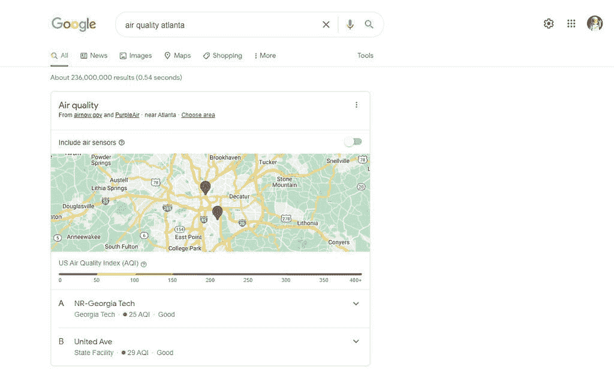

# 谷歌搜索推出美国空气质量报告

> 原文：<https://www.xda-developers.com/google-search-air-quality-united-states/>

谷歌在网络搜索和其他产品中测试空气质量报告已经有一段时间了。尽管该公司似乎没有发布官方声明，但美国的空气质量报告现在可以在谷歌搜索中找到。

正如谷歌所发现的那样，搜索“空气质量”,然后是一个城市或其他地点，现在会显示一个带有空气质量传感器所在位置的地图。地图下方是所有周围空气传感器及其空气质量指数(AQI)的列表。

 <picture></picture> 

Google Search results for "air quality atlanta"

谷歌的空气质量信息基于两个来源，分别是 [AirNow](https://www.airnow.gov/) 和 [PurpleAir](https://www2.purpleair.com/) 。AirNow 由美国环境保护署(EPA)、国家海洋和大气管理局(NOAA)、国家公园管理局(National Park Service)、美国国家航空航天局(NASA)、疾病控制中心(Centers for Disease Control)以及各种部落、州和地方空气质量机构共同运营。PurpleAir 使用该公司开发和销售的空气传感器，从世界各地的“公民科学家社区”收集数据。

早在去年 11 月，谷歌就首次在印度发布了空气质量结果，但该公司也早在 10 月就在美国智能显示器上对这些结果进行了测试。

目前还不清楚该功能何时会出现在其他带有天气报告的谷歌产品中，如[谷歌天气应用/界面](https://9to5google.com/2022/04/20/google-search-air-quality/)、Wear OS 上的天气磁贴、“一览”谷歌小工具和其他服务。空气质量报告在美国变得越来越重要，气候变化导致[更长更恶劣的野火季节](https://www.cbsnews.com/news/wildfires-california-air-quality-pollution-nationwide/)，这经常导致烟雾和其他颗粒在全国移动。

谷歌搜索在过去几个月里推出了其他新功能，比如[一个快速删除过去 15 分钟搜索历史的选项](https://www.xda-developers.com/delete-15-minutes-search-history-android/)，以及[精选医疗诊所预约时间列表](https://www.xda-developers.com/google-search-medical-appointments/)。谷歌也在调整搜索算法，以[突出更高质量的产品评论](https://www.xda-developers.com/google-search-product-reviews-improvements/)。

**来源:** [9to5Google](https://9to5google.com/2022/04/20/google-search-air-quality/)