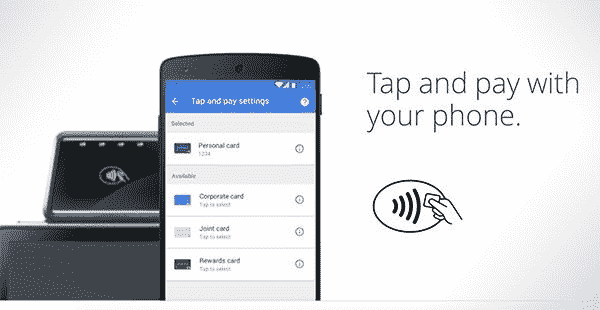

# 谷歌安全工程师在 XDA 论坛上解释 Root 和 Android Pay 的问题

> 原文：<https://www.xda-developers.com/google-security-engineer-explains-issues-with-root-and-android-pay-in-the-xda-forums/>

一名论坛成员已被确认为谷歌山景城外的安全工程师，他加入了 XDA，以讨论 Android Pay 在扎根设备上的问题，为什么它不会工作，并确认谷歌正在听取您的反馈。关于 root 访问和 Android 支付[他是这样说的:](http://forum.xda-developers.com/google-nexus-5/general/android-pay-custom-rom-t3199843/post62981452#post62981452)

> “使用 Android 设备的用户是我们最热情的粉丝，当这个群体发言时，我们会倾听。我们谷歌的一些人一直在听这样的帖子，我们知道你对我们很失望。我是一名从事 Android Pay 工作的安全工程师，所以这个帖子给我留下了特别深刻的印象。我想联系你们所有人，告诉你们我们听到了你们的声音。
> 
> 谷歌绝对致力于保持 Android 的开放性，这意味着鼓励开发者开发。虽然该平台能够并且应该继续作为一个开发人员友好的环境蓬勃发展，但有少数应用程序(不属于该平台的一部分)我们必须确保 Android 的安全模型完好无损。
> 
> “确保”是由 Android Pay 甚至第三方应用程序通过 SafetyNet API 完成的。正如大家可能想象的那样，当涉及到支付凭证和——通过代理——真实的钱时，像我这样的安全人员会变得格外紧张。我和我在支付行业的同行花了很长时间，努力研究如何确保 Android Pay 在一个设备上运行，该设备有一套记录良好的 API 和一个很好的安全模型。
> 
> 我们的结论是，Android Pay 做到这一点的唯一方法是确保 Android 设备通过兼容性测试套件，其中包括对安全模式的检查。早期的谷歌钱包点击支付服务结构不同，让钱包能够在支付授权前独立评估每笔交易的风险。相比之下，在 Android Pay 中，我们与支付网络和银行合作，对您的实际卡信息进行令牌化，并仅将此令牌信息传递给商家。然后，商家像传统的卡购买一样清算这些交易。我知道你们中的许多人都是专家和超级用户，但需要注意的是，我们没有一个好的方法来向整个支付生态系统阐明特定开发人员设备的安全细微差别，或者确定您个人是否可能采取了特定的攻击对策——实际上许多人都没有。"-[jasondclinton _ Google](http://forum.xda-developers.com/member.php?u=6957306)
> 
> 

在回答这意味着有一天对根设备的支持可能会到来的可能性时，Jason 说*“我不知道目前或在不久的将来有任何方法可以断言特定应用的*数据存储*在非 CTS 兼容设备上是安全的。因此，就目前而言，答案是“不”*“在回答一位用户的陈述时，如果他必须在 root 和 Android Pay 之间做出选择，他们会选择 root，Jason 表达了他的同情，并声称他希望在不实际 root 的情况下实现 root 功能。他还听取了关于在 play store 上放置警告的反馈，警告称该应用程序将无法在根设备上运行。

不幸的是，已经确认任何非官方版本都将无法通过 SafetyNet，因为系统映像不是预期的。他接着说。*“对此的一种思考方式是，签名可以用作先前 CTS 通过状态的代理。(如果我们要扫描内核列举的每一个文件和手机设备来推断我们正在什么环境下运行，我们会让你的设备停滞几十分钟。)* *因此，我们从通过生产映像签名推断的 CTS 状态开始，然后着手寻找看起来不正确的东西。这个群体已经确定了我们正在关注的相当多的东西:例如“苏”的存在。”-[jasond Clinton _ Google](http://forum.xda-developers.com/member.php?u=6957306)*

他将继续关注 Android Pay 的相关话题，但不能承诺回复所有评论，但肯定会倾听。要了解他在帖子中的最新评论，请点击此处的。然而，这是朝着正确方向迈出的一步，现在我们知道他们正在听取并采纳建设性的反馈，我们希望看到谷歌员工和论坛成员之间的更多讨论。

### 这就是你要说的，唉，Android Pay 不会很快在设备中普及，但是谷歌正在听取你的反馈并做出回应。