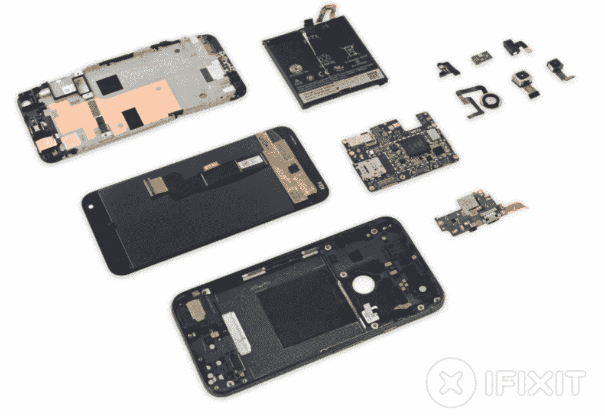

# 谷歌悄悄地从 Pixel XL 源代码中删除了“HTC Cerberus”的字样[更新:更多证据]

> 原文：<https://www.xda-developers.com/google-silently-removed-mentions-of-an-htc-cerberus-from-pixel-xl-source-code/>

**更新下午 5:00 CST:我们注意到，有更多的证据表明 HTC 参与了 Pixel 设备的软件开发，参见本文末尾的附录。**

* * *

“[由谷歌](https://madeby.google.com/)制造”这句格言代表了谷歌对 Android 态度的巨大转变。谷歌[决定对设计和开发智能手机的整个过程进行更严格的控制，而不是通过其各种 OEM 合作伙伴来共同生产 Nexus 设备。](https://www.theinformation.com/google-signals-apple-like-direction-for-nexus-phones?shared=42f9ce)

> 这些努力导致了谷歌 [Pixel](http://forum.xda-developers.com/pixel) 和 [Pixel XL](http://forum.xda-developers.com/pixel-xl) 被[作为第一对“真正的”谷歌手机大力推广](https://www.youtube.com/watch?v=Rykmwn0SMWU)。

但是在任何 Pixel 营销材料中没有提到的是，这些手机实际上是由 HTC 制造的。谷歌相当坚定地表示，他们保留了对新 Pixel 设备硬件和软件的控制权，甚至在两款智能手机的背面贴上了一个巨大的谷歌标志。HTC 已经被降级为[原始设计制造商](https://en.wikipedia.org/wiki/Original_design_manufacturer) (ODM)的角色，而不是与谷歌合作设计设备。事实上，谷歌和 HTC 之间的工作关系似乎类似于苹果和富士康。因此，许多业内人士称之为 Android 世界的“iPhone”在很多方面都很相似，而不仅仅是价格。

> #### 虽然谷歌已经与 HTC 签订了组装 Pixel 手机的合同，Osterloh 说这种方式与苹果和 iPhone 制造商富士康的合作没有什么不同。翻转像素，你会看到“谷歌制造”，这是对苹果的另一个致敬，苹果一直强调其手机是“苹果在加州设计的”。奥斯特洛说，谷歌永远不会说 Pixel 是与其他任何人合作开发的。他自豪地宣称，“这是我们的。”——谷歌硬件愿景主管里克·奥斯特洛(Rick Osterloh)对彭博说

这种工作关系对任何一方来说都不陌生。谷歌的 Pixel C 是第一个“由谷歌制造”的设备——你会发现在任何新闻稿中绝对没有提到任何 OEM 合作伙伴，也不会在它的[源代码](https://android.googlesource.com/device/google/dragon/)中找到任何 OEM 工程师的承诺。另一方面，HTC 拥有 ODM 的丰富经验，之前曾为 T2 索尼爱立信 T3 等公司工作。然而，对于*HTC 到底在多大程度上参与了两款 Pixel 手机的开发，仍有一些挥之不去的疑问。一名 HTC 工程师提交了一份之前未被注意到的[提交，删除了所有提到的未知**“HTC _ Cerberus”**代码名称(加上资深公认开发人员](https://android.googlesource.com/device/google/marlin/+/492fa12291fe4e9cdd2fabe6e810ff9d42986f92%5E%21/#F0) [Jcase](http://forum.xda-developers.com/member.php?u=2376614) 对 Pixels 启动链的观察)，这表明 **HTC** **以某种方式为两个 Google Pixels 的软件开发做出了贡献。***

* * *

**埋下怀疑的种子**

 <picture></picture> 

Pixel XL Teardown by iFixit

自这款手机发布之前，人们就开始怀疑谷歌对像素范围的控制程度。Pixel 的第一张[不太像样的泄露照片](http://www.androidpolice.com/2016/08/14/exclusive-photos-of-the-2016-nexus-sailfish-in-the-metallic-flesh/)导致一些 Android 记者猜测 Pixel 看似很大的边框是因为[借鉴了 HTC One A9 的设计](https://twitter.com/RonAmadeo/status/765210452930404354)。然而，谷歌声明像素的设计[不是基于任何当前的 HTC 设备](http://www.theverge.com/a/google-pixel-phone-new-hardware-interview-2016)得到了 iFixit 拆卸的支持，iFixit 拆卸显示[没有手机制造来源的证据](https://www.ifixit.com/Teardown/Google+Pixel+XL+Teardown/71237)。因此，真的没有证据否认谷歌为 Pixel 设备创造了原创设计。

但是早在九月初，AndroidPolice 的 David Ruddock 推测 HTC 和 Google 之间的关系将会比他们未来的营销所表现出来的更加紧密。[福布斯](http://www.forbes.com/sites/jeanbaptiste/2016/10/05/the-pixel-smartphone-is-actually-made-by-htc-not-google/#15892f974ac9)的 Jean Baptiste Su 在 Pixel 发布后证实了这一说法，他指出，以前的 Nexus 设备和当前的 Pixel 手机之间唯一真正的根本区别是缺乏任何 OEM 品牌。如果我们要将谷歌独自负责设计硬件的想法与福布斯撰稿人声称 HTC 的参与类似于以前谷歌-OEM 安排的说法相协调，那么我们不得不得出结论 **HTC 将参与 Pixel 设备** **的早期软件开发过程。**

* * *

**‘地狱犬’**

如果你曾经闪现过谷歌 Nexus 设备的工厂图片，那么你可能已经看到了你的 Nexus 设备的代号。谷歌根据一种海洋动物给每款 Nexus 设备取了一个代号，作为开发团队的内部绰号，直到公司最终确定名称。然而，对于像素设备来说，由于样本量如此之小，尚不清楚将采用何种命名规则。例如，Pixel C 在 AOSP 的代号为“龙”(如果你在工厂图片页面上看到的话，就是“Ryu”)，而谷歌 Pixel 和 Pixel XL 的代号分别为“[旗鱼](https://en.wikipedia.org/wiki/Sailfish)和“[马林](https://en.wikipedia.org/wiki/Marlin)”。

这两款 Pixel 智能手机遵循谷歌 Nexus 设备的内部命名惯例，考虑到报道的时间线 [Nexus 程序已经死亡](http://www.androidcentral.com/end-nexus-2016-google-phones-forge-new-path)，这是有道理的。尽管我们不知道谷歌决定将 HTC Nexus 设备重新命名为谷歌 Pixel 设备的确切时间，但鉴于本轮泄露的可靠性以及符合 Nexus 命名惯例的 Pixel 代码名称，人们强烈支持 Pixel 手机以 Nexus 手机开始其生命的观点。因此，我们假设，或许在 Pixel 手机开发周期的相当长一段时间里，HTC 参与了 Nexus 设备的开发，就像[任何其他 OEM 厂商参与了](https://android.googlesource.com/device/)一样。软件中没有留下多少直接证据，但是来自两位著名开发者的间接证据支持了我们的说法。

首先，XDA 认可的开发者[大黄蜂](http://forum.xda-developers.com/member.php?u=1588190)从八月初开始在马林的源代码中发现了一个[有趣的提交](https://android.googlesource.com/device/google/marlin/+/492fa12291fe4e9cdd2fabe6e810ff9d42986f92%5E%21/#F0)。该提交是由 HTC 软件工程师提交的，它做了一个看似无关紧要的更改——从*策略*下的*文件 _ 上下文*文件中删除了“**HTC _ Cerberus”**标签。*[file _ contexts](https://source.android.com/security/selinux/implement.html)*用于将标签绑定到文件/目录，可由用户空间应用使用。在马林的 [*file_contexts* 文件](https://android.googlesource.com/device/google/marlin/+/c449a4a4198a4f345f620f1d237bbab04c088a24/sepolicy/file_contexts)中，我们可以看到“HTC Cerberus”是设备上一个 A/B 分区的标签。省略标签似乎不会影响设备上的任何东西，因为马林的源代码[的首次公开发布显示 *file_contexts*](https://android.googlesource.com/device/google/marlin/+/nougat-dr1-release/sepolicy/file_contexts) 没有标签。这是我们的猜测，但也许这种对“地狱犬”的引用与我们尚不知道的 HTC 内部代号有关，也许是计划使用的设备的一个组件，甚至是一个未知的设备。至少，HTC 工程师提交的存在表明 HTC 和谷歌在软件方面有某种程度的牵连。

当我们第一次收到这个信息时，我们不确定它可能代表什么。但是回顾一下[@ jcase](https://twitter.com/jcase/status/784096833148588032)([阳光 S-Off/Unlock](http://theroot.ninja/) 背后的开发者之一)的一条推文，我们开始对我们的论点感到更加自信。

@jcase 能够查看 bootchain，即智能手机用于启动的过程，并确定它与 HTC 设备的 bootchain 非常相似。更准确地说，他说“这是一个标准的 HTC bootchain，有一些强化/改变。”虽然这种说法主要是猜测，但@jcase 在 HTC 设备上使用引导程序的经历给了他的案例一定的可信度。此外，bootchain 似乎是 HTC 创造的事实符合之前提出的想法，即 Pixel 设备最初是作为 Nexus 手机开发的。

* * *

**“谷歌制造”**

谷歌旨在通过与三星和苹果等公司直接竞争来占领智能手机市场。他们选择了一个完美的时间来接过 Android 智能手机代表的衣钵，而三星正在从其 [Note 7](http://forum.xda-developers.com/note-7) 的惨败中恢复。但我们必须等待，看看他们对付 iPhone 的计划是否会成功。根据 Pixel 和 Pixel XL 的成功，谷歌会全力以赴采用他们最近才承诺的自上而下的方法吗？或者，他们的合作伙伴是否仍将扮演比公司透露的更为密切的角色？

*[地狱犬图片来源](https://www.pinterest.com/pin/375487687661174512)*

* * *

**附录 1:更多证据浮出水面**

在发表这篇文章后，HTC 工程师通知我们存在对 Marlin 和 Sailfish 内核的 363 个附加提交。 Linux 内核开发者 [Scott Bauer](https://twitter.com/scottybauer1) ，他因在他的博客 [plsdonthack.me](https://plzdonthack.me/) 上发现并编目零日漏洞而闻名，他搜索了这两款设备的源代码，发现了大量来自 HTC 工程师的电子邮件地址的提交。

```
scotty@scotty:~/android/

内核/git_msm/msm$ git 分支

*(头部脱离原点/android-msm-marlin-3。<wbr>

18-牛轧糖-dr1)

scotty@scotty:~/android/ <wbr>

kernels/git _ MSM/MSM $ git log | grep " HTC " | grep Author | WC-l

363
```

如果谷歌确实独自负责 Pixel 设备的软件开发，那么这些行为的存在令人费解。但如果谷歌最初是将这些设备开发为 Nexus 设备，那么看到 HTC 工程师如此多的承诺就一点也不奇怪了。当然，这些爆料对 Pixel 设备本身的质量没有任何影响，但听到关于两款 Pixel 手机开发过程的相互矛盾的报告很有趣。