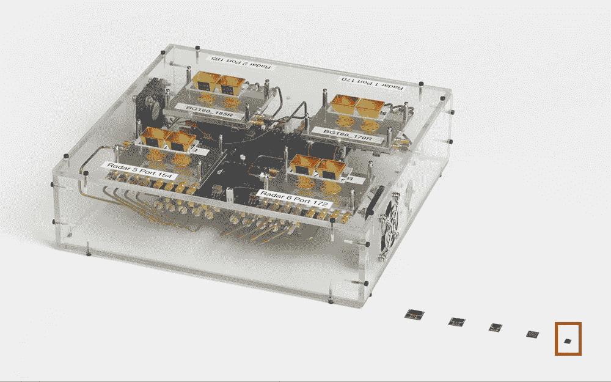

# 以下是谷歌 Pixel 4 的 Soli 雷达手势背后的技术

> 原文：<https://www.xda-developers.com/google-soli-radar-gestures-pixel-4/>

谷歌在谷歌 Pixel 4 设备上引入了革命性的[“运动感应”技术。这项功能使用了一个微小的 Soli 雷达芯片，它可以检测手势，并在不接触手机的情况下使用手势与手机进行交互。Pixel 4 的](https://www.xda-developers.com/google-pixel-4-face-unlock-soli-gestures/) [Soli 动作手势](https://www.xda-developers.com/google-pixel-4-aware-music-control-gestures-android-q/)可以用来[在一长串音乐应用](https://www.xda-developers.com/google-pixel-4-motion-sense-list-countries-supported-apps/)上换曲目，静音来电和闹钟，或者在你伸手拿手机时激活屏幕。雷达技术是由谷歌的 ATAP 团队概念化的，虽然我们早在 2014 年就看到了最初的原型，但对于运动感应技术的实际工作方式仍有一些不确定性。为了详细说明这一点，谷歌发布了一个关于 Soli 手势工作的详细博客。

**[像素 4 XDA 论坛](https://forum.xda-developers.com/pixel-4) || [像素 4 XL XDA 论坛](https://forum.xda-developers.com/pixel-4-xl)**

与典型的雷达系统不同，Soli 检测运动，而不是检测固体物体的空间部分。Soli 雷达芯片的尺寸仅为 5 毫米 x 6.5 毫米 x 0.873 毫米，可发射频率调制(FM)的 60GHz 信号。当信号到达手的表面时，会被反射回接收器。Soli 芯片根据反射信号检测用户手中小于一毫米的位移，并在考虑到[多普勒效应](https://en.wikipedia.org/wiki/Doppler_effect)后确定手的手势和运动速度。

Google ATAP 的早期 Soli 原型

Soli 接收器错综复杂地映射反射信号中接收到的能量，并根据物体的速度绘制该信息，使用不同的指标来确定物体是靠近信号还是远离信号。它还可以测量物体与传感器之间的距离。运动的身体部位或手的距离和速度可以用于估计其在 3D 中的空间位置。谷歌还优化了信号链，以提高信噪比和芯片的功效。

为了有效地处理大量的信号反射并从中得出有意义的模式，谷歌使用了机器学习。这些 ML 算法已经使用 TensorFlow 通过从数千名谷歌志愿者那里记录的数百万个手势进行了训练。“在 [Android 11 开发者预览版](https://www.xda-developers.com/android-11-developer-preview-new-development-features/)中，我们也见证了[在谷歌 Pixel 4 上对 Motion Sense 的准确性](https://www.xda-developers.com/android-11-new-motion-sense-gesture-pause-music-pixel-4/)的改进，同样可以期待未来的更新。

 <picture></picture> 

Early Soli prototype vs the final RADAR chip (rightmost)

谷歌 ATAP 与谷歌的 Pixel 和其他硬件设计团队密切合作，以确保其他信号不会干扰 Soli 的工作。这可以确保来自扬声器的音频等信号不会扭曲或妨碍 Pixel 4 的运动感应能力。不仅如此，更大的挑战是减小设备的尺寸，以便它可以适合 Pixel 4 和 4 XL 的前额。

虽然这是第一次在消费设备上使用雷达，但团队将努力在未来研究这项技术——尽管没有承诺在未来支持任何设备。

* * *

**来源:[谷歌 AI 博客](https://ai.googleblog.com/2020/03/soli-radar-based-perception-and.html)**