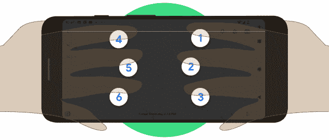

# Google TalkBack 为视障人士增加了盲文键盘

> 原文：<https://www.xda-developers.com/google-talkback-braille-keyboard/>

# 谷歌的 TalkBack 无障碍服务为有视觉障碍的人增加了一个盲文键盘

谷歌在 Android TalkBack 应用程序中引入了一个新的辅助功能:为有视觉障碍的人提供盲文键盘。

在过去的一年里，谷歌推出了一些有用的辅助功能，以帮助各种残疾的 Android 用户。该公司推出了[现场转录、声音放大器](https://www.xda-developers.com/live-transcribe-sound-amplifier-google-hearing-impaired/)和[现场字幕](https://www.xda-developers.com/google-accessibility-live-caption-android-q-live-relay-live-transcribe/)来帮助那些有听力障碍的人。今天，该公司宣布了其 TalkBack 服务的一项新功能，这是一项辅助服务，可以帮助有视觉障碍的用户导航他们的 Android 手机。谷歌推出了虚拟盲文键盘，这样用户就不必再为了在 Android 设备上打字而插入物理键盘。

谷歌表示，他们与盲文开发者和用户合作，创建了一个虚拟键盘，任何以前用盲文打字的人都会很熟悉。该键盘采用 6 键布局，每个键代表构成任何字母或符号的 6 个盲文点中的 1 个。例如，谷歌表示，输入“A”需要按下点 1，而输入“B”需要同时按下点 1 和点 2。用户还可以使用键盘删除字母和单词、添加行以及提交文本。键盘可以像在国际键盘之间切换一样轻松切换。这是一张演示使用新型盲文键盘打字的 GIF 图:

 <picture></picture> 

Source: Google

新的盲文键盘是“Android Accessibility Suite”应用程序中包含的 TalkBack Accessibility 服务的一部分。该功能今天推出，将适用于所有运行 Android 5.0 Lollipop 或更高版本的 Android 设备。该功能适用于所有应用程序，支持盲文 1 级和 2 级，目前有英文版本。若要启用它，请前往“设置”>“辅助功能”>“对讲”>“设置”,然后选择“盲文键盘”你可以在谷歌的支持页面上了解更多关于如何使用键盘[的信息。现在唯一的警告是，当盲文键盘打开时，对讲手势是不可用的。](https://support.google.com/accessibility/android/answer/9728765)

这是一个很好的功能，可以帮助视力障碍者扩大盲文扫盲。如果你或你爱的人在使用他们的 Android 设备时有困难，谷歌的新盲文键盘可以显著改善他们使用智能手机的方式。

**来源:** [谷歌](https://blog.google/products/android/braille-keyboard)