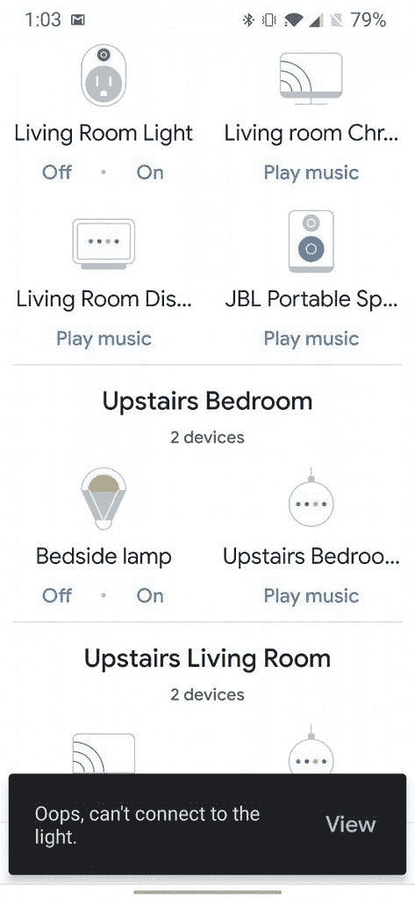

# 【更新 3:已解决】谷歌在令人毛骨悚然的小米安全摄像头 bug 之后，暂时杀死了小米家庭与助手的集成

> 原文：<https://www.xda-developers.com/google-temporarily-kills-xiaomi-mi-home-integration-security-camera-bug/>

**更新 3 (01/16/2020 @美国东部时间下午 3:50):**小米表示，它已经“完全解决”了米家庭摄像头和谷歌集成的问题。

**更新 2 (01/06/2020 @美国东部时间上午 10:15):**小米表示，大多数 Mi Home 产品应该再次与谷歌助手合作。

**更新 1 (01/03/2020 @美国东部时间凌晨 4:20):**小米已就该问题发表声明。滚动到底部了解更多信息。这篇发表于 2020 年 1 月 2 日的文章被保存如下。

智能手机的出现也给我们带来了智能，嗯，一切。智能灯泡、家中的智能摄像头，当然还有智能集线器，这样你就可以在家里的任何地方访问你选择的语音助手，并与所有这些东西进行交互。当然，还有一个大问题，那就是隐私因素。毕竟，不是每个人都喜欢在你睡觉或在家的时候有一个联网的、一直开着的摄像头监视你。在昨天发生的一起令人毛骨悚然的谷歌 Nest Hub 和小米米家智能安全摄像头事件之后，这些担忧很可能会变得更加强烈。

一个网名为/u/Dio-V 的 Redditor 拥有一个 Google Nest Hub 和一些小米相机，他要求 Google Assistant 显示他们相机的一个反馈。他们看到的不是来自自己相机的画面，而是似乎来自别人家的静止画面，包括一个婴儿睡觉和一个老人睡在椅子上的画面。更令人毛骨悚然的是，所有的剧照都是扭曲的，黑白的，就好像我们在看恐怖片一样。鉴于这是一个真实的问题，并假设这些确实是来自其他人家里的实时图像，这可能代表一个重大的安全漏洞。这可能意味着，你自己家的视频可能会出现在世界上任何一个人的智能显示屏上。

*演职员表: [/u/Dio-V 发帖于/r/小米](https://www.reddit.com/r/Xiaomi/comments/eioyyt/xiaomi_camera_is_showing_stills_from_other/fcskh7t/?utm_source=share&utm_medium=web2x)*

为了阻止这种情况的发生，并更好地进行调查，谷歌已经暂时杀死了用于 Mi Home 智能家居产品的谷歌助手集成，包括灯泡、摄像头等。我们试图通过 Google Home Mini 和 Google Home 应用程序连接到小米智能灯，但我们都没有成功，这表明集成已被立即取消。一位谷歌发言人向安卓权威人士表示，他们“*已经意识到了这个问题，并正在与小米联系解决这个问题。与此同时，我们正在禁用我们设备上的小米集成。*

 <picture></picture> 

Trying to control a Xiaomi smart lamp gives you an error in the Google Home app.

如果小米发布回应或这个问题得到解决，我们将更新这篇文章。

**Via: [安卓权威](https://www.androidauthority.com/google-nest-hub-security-bug-1070840/)**

* * *

## 更新 1:小米发布声明

小米就此事向我们发表了一份声明:

小米一直优先考虑我们用户的隐私和信息安全。我们意识到在 Google Home hub 上连接 Mi Home Security Camera Basic 1080p 时出现了接收静止图像的问题。对于由此给用户带来的不便，我们深表歉意。

我们的团队已经立即采取行动解决问题，现在问题已经解决。经调查，我们发现该问题是由 2019 年 12 月 26 日的缓存更新引起的，该更新旨在提高摄像头的流媒体质量。这种情况只在极其罕见的情况下发生。在这种情况下，它发生在 Mi Home Security Camera Basic 1080p 和 Google Home Hub 在恶劣的网络条件下集成显示屏的过程中。

*我们还发现有 1044 名用户进行了此类整合，只有少数网络条件极差的用户可能会受到影响。如果相机链接到小米的 Mi Home 应用程序，就不会出现这个问题。*

*小米已经与谷歌沟通并修复了这个问题，也已经暂停了这项服务，直到根本原因得到彻底解决，以确保此类问题不会再次发生。*

* * *

## 更新 2:整合回来了

小米表示，它与谷歌助理设备的集成现在支持所有非摄像头智能家居设备。在摄像头故障之后，谷歌迅速采取行动，阻止所有 Mi 家庭设备的集成。小米现在已经能够将集成返回到其他 Mi Home 设备，但他们仍在调查摄像头问题。小米和谷歌都应该严肃对待这一重大安全事故。

**来源:[安卓警察](https://www.androidpolice.com/2020/01/06/uh-oh-xiaomi-camera-feed-showing-random-homes-on-a-google-nest-hub-including-still-images-of-sleeping-people/#3)**

* * *

## 更新 3:已解决

小米表示，它已经解决了导致其他用户的小米家用相机的供稿出现在谷歌 Nest Hub 上的问题。问题出现后暂停的谷歌整合到今天已经恢复。该公司与我们分享了以下声明:

*“我们现在确认，我们已经完全解决了这个问题的根本原因，小米的谷歌集成服务已经从 1 月 16 日开始恢复。用户现在可以通过 Nest 设备使用小米的 mi 安全摄像头服务。在小米，我们把用户隐私和信息安全作为重中之重。对于由此给受影响用户带来的不便，我们深表歉意。我们将采取更强有力的措施来防止今后发生此类事件。”*