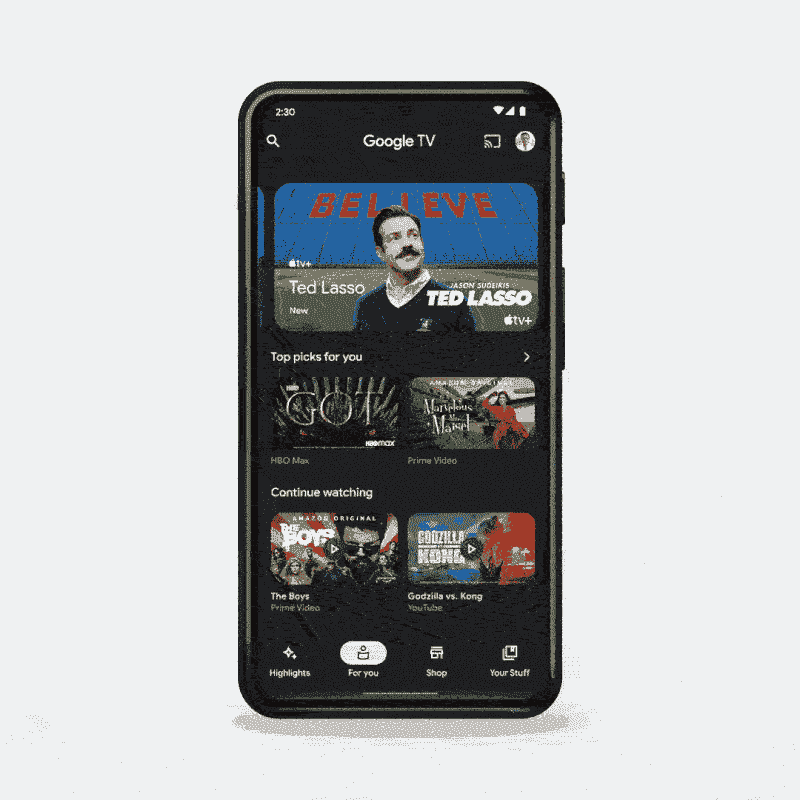

# 谷歌电视移动应用程序更新了你调整的材料和新的“亮点”标签

> 原文：<https://www.xda-developers.com/google-tv-material-you-highlights-tab/>

Google Home 应用过去只是 Chromecast 播放器的设置和远程控制工具，其中包括一个发现 Chromecast 上可播放的新节目和电影的标签。当这款应用慢慢演变成 Google Home 时，内容推荐页面最终消失了，但现在谷歌将它带回到另一个位置:谷歌电视移动应用。该应用程序还接受了一些其他设计调整。

谷歌周四在一篇博客文章中宣布，“谷歌电视上新的亮点标签提供了基于你感兴趣的电影和节目的个性化娱乐新闻、评论和更多内容。在一个地方就能看到关于你喜欢的娱乐的文章，或者追踪下一个轰动事件。”'

 <picture></picture> 

Source: Google

新标签看起来类似于谷歌和 Chrome 应用程序中已有的谷歌提要，但只包括关于娱乐的文章和内容。除了新标签，谷歌还更新了谷歌电视应用程序，以更紧密地遵循你设计语言的材料。标签栏看起来更大，有和谷歌 Play 商店一样的圆形按钮。

谷歌的低分辨率 GIF 没有展示整个应用程序，但应用程序的其余部分看起来基本没有变化。谷歌电视在 7 月份进行了重新设计，所以它并不需要这么快就进行另一次大修。这次更新似乎还改变或重命名了其他标签:“主页”现在是“你的”，一个名为“你的东西”的新屏幕似乎取代了当前的“观察列表”标签。

新功能反映了谷歌电视软件在电视上的体验的最新变化，与旧的安卓电视软件相比，谷歌电视软件更加强调内容推荐。并非所有这些变化都广受欢迎，比如六月份开始出现的自动播放视频广告。

**来源:** [谷歌](https://blog.google/products/android/new-android-features-March-2022/)