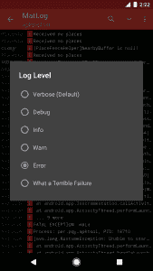
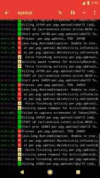

# 指南:发送 Logcat 来帮助调试您最喜欢的应用程序

> 原文：<https://www.xda-developers.com/guide-sending-a-logcat-to-help-debug-your-favorite-app/>

我们都曾经历过这样或那样的事情。承认这一点并不丢人。有时候，Android 应用会崩溃。无论你是使用一个完全普通的设备来运行谷歌地图，还是使用一个带有曝光模块的高度定制的 ROM 来增强谷歌视频聊天功能，应用程序崩溃和其他问题都可能发生，甚至会成为一个相当大的障碍。在开发小规模的调整和应用程序时尤其如此，比如我们网站上的许多应用程序。当问题出现时，用户可以借给开发人员的关于崩溃性质的最有建设性和最有帮助的见解之一是通过提供一个 [Logcat](https://developer.android.com/studio/debug/am-logcat.html) 。尽管对开发人员非常有帮助，但对于普通用户来说，获取这些信息似乎有些令人畏惧。

Logcat 通常通过 ADB 涉及到[命令行工具，对于许多很少或没有命令行经验的用户来说是遥不可及的。然而，某些应用程序的发布已经消除，或者至少大大减少了 ADB 命令在检索和发送 Logcat 中的参与，使得这样做只需轻敲几下屏幕。在我们帮助开发人员开发的永无止境的任务中，这里有一个初学者指南，教用户如何发送 Logcat。](https://developer.android.com/studio/command-line/logcat.html)

* * *

### 什么是 Logcat，我们如何拉它？

Logcat 是一个 ADB Shell 工具，用于获取所有系统事件的日志。这包括错误、警告、堆栈跟踪和一般系统事件。当出现错误时，指向故障源的关键信息通过该日志输出，这使它成为一个非常有用的故障排除工具。通常，这些是通过 ADB 命令提取和过滤的。然而，诸如 [aLogcat](https://play.google.com/store/apps/details?id=org.jtb.alogcat&hl=en) 、 [Catlog](https://play.google.com/store/apps/details?id=com.nolanlawson.logcat&hl=en) 和我们为本文选择的工具 [Matlog](https://forum.xda-developers.com/android/apps-games/app-matlog-1-0-0-beta-material-logcat-t3155566) 等应用程序，通过将这些命令工具编译到 Play-Store-download 应用程序的 GUI 中，节省了用户的努力。

如前所述，Matlog 是我们用来收集 Logcats 的工具。Matlog 因其简洁而友好的界面而被选中，它是由 XDA 的初级成员[pluscuded](https://forum.xda-developers.com/member.php?u=6820962)基于[诺兰·劳森的](https://nolanlawson.com/)开源应用 Catlog 制作的。和 Catlog *一样，* Matlog 可以从源码编译[，也可以从谷歌 Play 商店](https://github.com/plusCubed/matlog)免费下载[。虽然 root 用户允许您在设置过程中跳过一个步骤，但是收集 logcat 并不需要 **root 访问权限。如果您的设备不是根设备，一个简单的 ADB shell 命令将允许应用程序读取您设备的日志。还没有在你的机器上设置 ADB？没问题，只需按照这些步骤让它启动并运行。**](https://play.google.com/store/apps/details?id=com.pluscubed.matlog)

* * *

### 建立亚洲开发银行

首先，[直接从 Google](https://www.xda-developers.com/google-releases-separate-adb-and-fastboot-binary-downloads/) 为您的特定操作系统下载 ADB 二进制文件，并将其解压缩到您计算机上的一个单独目录中。接下来，[为你的手机安装合适的驱动](https://developer.android.com/studio/run/oem-usb.html)。然后，在设置- >开发者选项中启用“USB 调试”。如果你看不到开发者选项，那么你需要进入设置- >关于手机，然后点击 7 次内部版本号来启用它。最后，通过在与 ADB 二进制文件相同的目录中启动命令提示符(右键单击->“open command prompt here”)并运行以下命令，确保 ADB 正在工作:

```
 adb devices 
```

如果你看到你的设备的序列号(它没有说未经授权)，你是黄金。如果你在手机上看到一个弹出窗口，要求你授予你的计算机 ADB 访问权限，那么就说是。如果你看不到这两种情况，那么试着重启你的电脑/手机，并重新连接到你的电脑上。否则，请尝试重新安装驱动程序。

* * *

### 设置 Matlog

现在您已经启动并运行了 ADB(希望如此)，您需要做的就是在 ADB shell 中发出以下命令来启用 Matlog 捕获 Logcats 的能力。同样，如果您的设备已经根化，您不需要运行这个命令，因为这只是对非根化的电话是必要的。

```
 adb shell pm grant com.pluscubed.matlog android.permission.READ_LOGS 
```

 <picture></picture> 

Matlog Record Widget Alongside The Malfunctioning App

一旦启用并打开，Matlog 将实时显示系统事件。您可以点击暂停按钮来暂停此操作，然后点击省略号菜单并选择“清除”来清除字段中的无关数据。建议在准备记录故障应用程序时这样做，以减少日志大小。为了缩短步骤，从而进一步缩短日志长度，将 Matlog 小部件添加到您的主屏幕上，在有问题的崩溃应用程序旁边，如右图所示。在这种情况下， [*Apktool X*](https://www.xda-developers.com/decompile-and-modify-apks-on-the-go-with-apktool-for-android/) 是我们的故障应用。

轻按小工具可以让您命名并开始记录日志。然后，只需在开始记录后立即重现故障，这将为 Logcat 填充与您的问题相关的信息。问题重现后，只需再次点击小工具即可完成日志记录。

这样做后，Matlog 将打开捕获的日志。点击省略号，并选择“发送”,将日志作为附加文本文件连同一般设备信息一起通过电子邮件发送。就是这样！您的日志已被成功捕获并发送给奥克教授。

在我上面的例子中，我可以看出 Apktool X 崩溃的原因是因为我的设备没有启动。多。在尝试使用该应用程序之前，我应该已经完整地阅读了文章。

### **那太容易了**

当然，并非所有问题都那么容易捕捉。有时，处理启动的问题或持续时间较长的问题可能需要应用程序的不同功能来捕获。在这种情况下，您会希望让 Matlog 在后台运行(不要暂停或清除它)，并利用日志级别和过滤功能来解析数据。

虽然通常不是收集相关数据的唯一必要方法(某些情况下需要更多的上下文),但这些工具中的每一个都可以用于较长的日志，以便为开发人员排序和指定数据。当然，这取决于错误的性质和开发人员的要求。要使用这两种方法，只需运行 Matlog，重现您的问题，导航回 Matlog，点击点菜单，并选择这两种排序方法之一。

 <picture></picture> 

Log Level Selection Showing Errors Only

### **日志级别**

另一个由 Matlog 简化的 ADB 命令，Log Level 函数可用于查看特定类型的系统事件和消息。下面是各种消息类型的简要描述，由 Android 开发者网站描述，并用颜色编码以匹配 Matlog 的标签。

从最低到最高优先级:

*   V :详细(一般系统事件)
*   D :调试
*   I :信息
*   W :警告
*   E :错误
*   F :致命
*   S: Silent(最高优先级，不打印任何内容)

日志级别功能有这些消息的相应列表，可以过滤每个优先级的日志。选择一个日志级别将只显示其自身优先级和更高优先级的事件，便于轻松识别和分组错误，而不需要手动滚动许多行文本(有时可能有数千行)来完成。

 <picture></picture> 

Search Filter Set for “Apktool”

### **过滤器**

还可以使用过滤器对日志数据进行排序。通过启动关键字搜索，用户能够只看到明确引用该关键字的消息。有用的关键字可能涉及故障应用程序的名称，甚至是单词“error ”,因为它包含了所有优先级的术语实例，尽管它**没有**包含所有“日志级别”的错误。

如果您发现自己在帮助开发人员调试应用程序时经常搜索/过滤某些关键字(或者如果开发人员明确创建了一个您可以搜索的唯一日志事件)，那么您也可以保存一个过滤器，以便将来返回。当你事先知道你在找什么时，这是很有用的，如果你和一个开发者一起工作，这种情况会经常发生。

### **准备调试？**

虽然你现在可能不是调试 Android 应用程序的专家，但学习如何收集和发送日志可以让你成为你最喜欢的应用程序的开发者的重要资源。使用 Matlog 和上面概述的特性，收集、分类和发送关于故障应用程序的相关信息从未如此简单。

* * *

**你用过 Matlog 或其他 Logcat 应用吗？你觉得这个指南有帮助吗？请在下面的评论中告诉我们！**