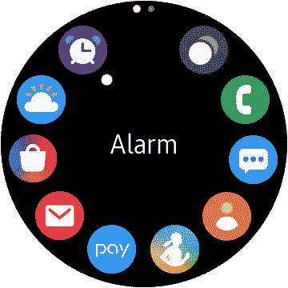

# 动手:三星 Galaxy Watch 上的 Tizen 4 在 One UI 1.2 之后活跃

> 原文：<https://www.xda-developers.com/hands-on-tizen-4-samsung-galaxy-watch-active/>

三星 Galaxy Watch Active 是所有安卓手机中最好的智能手表之一。它有很好的兼容性、设计、电池寿命，而且非常轻。根据你的观点，它最好的一点是它没有运行谷歌的 Wear OS。Galaxy Watch Active 运行 Tizen 4，在[最新更新](https://www.samsungmobilepress.com/stories/smarter-sportier-snazzier-the-galaxy-watch-actives-latest-updates)之后，它也有一个 UI 1.2。让我们来看看一些变化。

Galaxy Watch Active 的新更新调整了一些东西，以改善没有旋转边框的体验。应用抽屉现在对滑动稍微优化了一些。以前，顶部有一些小图标，可以让你在页面之间切换。现在，你所能做的就是滑动而不是按下图标。需要注意的是，在这次更新之前，你也可以滑动，但三星清理了动画，使其更好地工作。这是一个小变化，但总感觉三星只是把相同的软件扔在了不同硬件的手表上。

 <picture></picture> 

No more next page button

下一个重大变化实际上是 Bixby。我知道大多数人只是忽略了 Bixby 的存在，但它实际上可以在手表上有用。在新的更新之前，Bixby 感觉就像是有了新图标的 S Voice。手表上原来的 Bixby 和 S 的声音听起来甚至没有什么不同。更新后，Bixby 实际上听起来和感觉上都像来自三星手机的 Bixby。它甚至有一个类似于 Bixby 2.0 的设置面板和应用程序支持。(话说回来，你可以使用谷歌助手...)

晚安模式是另一个很酷的改变。它试图限制你对手表的使用，让你无法查看通知。这使得检查你的应用和通知变得更加困难。要继续这样做，你需要关闭晚安模式或点击 home 键。这并不是说不可能，但这只是增加了一点障碍，让这个过程变得更加困难，并希望让你远离。

玩了这个更新后，我注意到的另一个非常小的变化是图标。手表快速设置中的影院模式图标已经过重新设计。之前，它有一个看起来令人困惑的弯曲显示屏。除非你事先知道，否则很难说出它是什么。现在，新的图标更容易看到，而且实际上知道它的意思。

除了这些新特性和小改动，我们还有一些实际上有用的更新。Galaxy Watch Active 现在可以自动跟踪游泳，并将其输入三星健康。还有一个新的最低和最高心率警告。这些将警告你，如果你的心率高于或低于某一点，而不做运动。这项功能可能会与[手表 Active 2 中的](https://www.xda-developers.com/samsung-galaxy-watch-active-2-pictures-show-no-rotating-bezel/) [ECG 支持](https://www.xda-developers.com/samsungs-galaxy-watch-active-2-ecg-support/)相关联。

所有这些更新都非常好，只是加强了我对 Galaxy Watch Active 是 Android 最佳智能手表的看法。这些变化也将为下个月发布的 Galaxy Watch Active 2 铺平道路。作为一个平台，Wear OS 目前看不到太多的移动，但三星正在通过他们的智能手表和软件向前推进。