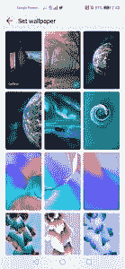
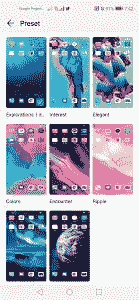
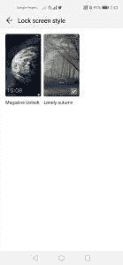
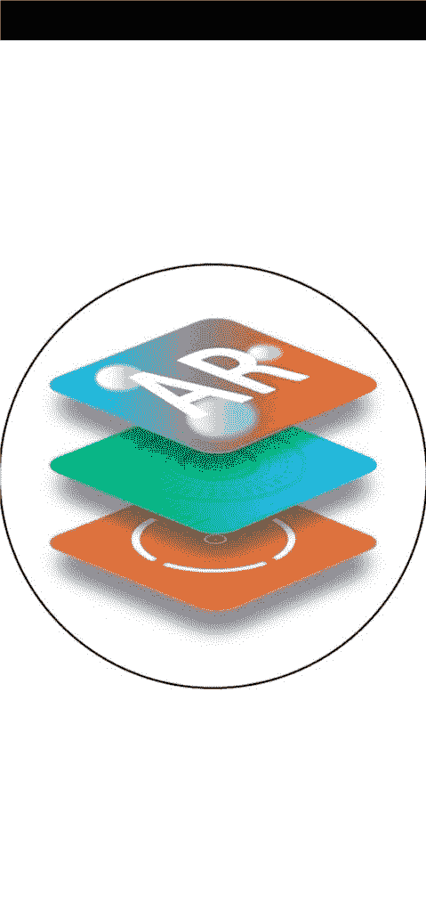
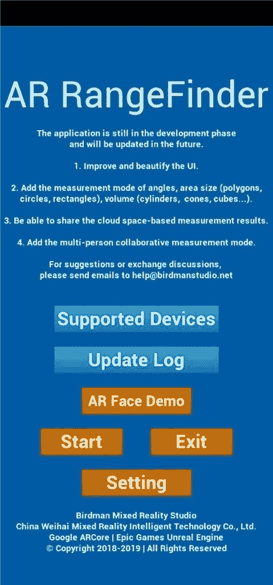
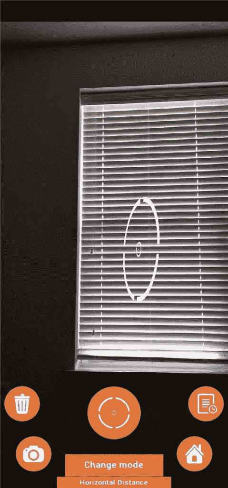

# Magic UI 2.1 的实际操作

> 原文：<https://www.xda-developers.com/hands-on-with-magic-ui-2-1/>

Magic UI 2.1 是许多较新的 Honor 和华为手机上发现的最新版本的软件。最值得注意的是，Magic UI 2.1 可以在 Honor 的 20 和 20 Pro 设备上找到。在这篇文章中，我将关注加载到 Honor 20 上的 Magic UI 2.1，并了解 Honor 在此次更新中包含的所有内容。下面是你可以期待在 Magic UI 2.1 最新更新中发现的所有新特性。

* * *

### 新功能

* * *

## 壁纸和图标

Honor 的 Magic UI 的最新更新提供了一个很好的壁纸预设选择。在 Magic UI 中，图标包的选择总是有很多不足之处，这次更新也不例外。幸运的是，有一个蓬勃发展的艺术家社区，他们为 Honor 和华为手机创造高质量的主题。你可以[下载一个与 Magic UI 2.1 兼容的主题](https://club.hihonor.com/in/themes/247/forums.htm)，让你的手机在默认主题的基础上有一个更好的外观。

[第四段]

 <picture></picture> 

Magic UI Wallpaper Options 1/2

[/第四段][第四段]

 <picture></picture> 

Magic UI Wallpaper Options 2/2

[/第四段][第四段]

 <picture></picture> 

Magic UI 2.1 Preloaded Icons Packs

[/第四段][第四段]

 <picture></picture> 

Magic UI 2.1 Lockscreen Style Options

[/第四段]

## GPU Turbo 3.0

GPU Turbo 的早期表现出了很大的前景。特定的游戏将被优化，以配合 GPU 加速，提高游戏的性能和帧率。借助 GPU Turbo 3.0，这一特性将继续改善游戏体验。该功能与 Play store 的 25 款游戏兼容，包括堡垒之夜、Real Racing 3、PES 2019、Fifa Mobile、《我的世界》等。这一更新带来了一些改进，比如降低了功耗。这将在游戏过程中节省高达 10%的电力，而不会影响图形质量。

GPU Turbo 3.0 将可用于以下设备:

## EROFS 文件系统

新的 Magic UI 更新中最大的更新之一是实现了 [EROFS 文件系统](https://www.xda-developers.com/huawei-erofs-linux-file-system-android/)。EROFS 代表“可扩展的只读文件系统”，它旨在提供一种改进的压缩模式，优先考虑性能和速度。据华为称，这一新的更新将随机读取性能平均提高 20%，应用启动速度提高 10%。新的文件系统还将改善低内存条件下的数据读取，以及提高系统文件的安全性。

## AR 度量

我们在新的更新中期待的功能之一是 AR Measure 应用程序。这是一个利用 ToF(飞行时间)传感器来测量表面和距离的应用程序。虽然这个应用程序与 honor 20 不兼容，但我在 Honor View 20 上测试了它，感觉它仍在进行中。我看到这个工具有很大的潜力，只要稍微润色一下这个应用程序。

 <picture></picture> 

AR Measure App Splash Screen

 <picture></picture> 

AR Measure App Menu

 <picture></picture> 

AR Measure App UI

## 智能视频编辑

许多媒体报道了一个新功能，包括为视频博客设计的人工智能编辑系统。这个系统应该可以接收你的视频剪辑，剪辑和整理，添加音乐等等。不幸的是，我找不到任何证据表明这个特性存在于 Magic UI 2.1 中。在未来的更新中，我们可能还会看到它。

* * *

### 如何更新到最新的 Magic UI

要确保您的 Honor 手机运行最新版本的 Magic UI，请使用以下选项之一。

*   **通过 OTA 更新:**要在 Android 系统中更新您的手机，您需要导航至更新菜单。进入设置>系统>软件更新>查看更新。这将为您的手机搜索可用的更新。如果有，请下载更新。更新下载完成后，重启手机进行安装。
*   **通过 HiSuite 更新:**华为做了一个桌面客户端软件，为 Honor 和华为手机提供了几种不同的功能。其中一个功能是检查手机更新的能力。在这里下载[最新的 HiSuite 版本](https://consumer.huawei.com/en/support/hisuite/)。用 USB 线把手机插到电脑上，启动 HiSuite 软件。您将在手机上看到一个提示，要求您允许 HiSuite 访问您的设备。批准此请求。在桌面软件上，选择“更新”。如果你的手机有更新，你可以下载并下载到你的手机上。

在 XDA 社区论坛上关注 Honor 20 和 Magic UI 的最新发展。

[**荣誉 20 论坛**](https://forum.xda-developers.com/honor-20)

###### 我们感谢 Honor 赞助了这篇文章。我们的赞助商帮助我们支付与运行 XDA 相关的许多费用，包括服务器成本、全职开发人员、新闻撰稿人等等。虽然您可能会在门户内容旁边看到赞助内容(这些内容将始终被标记为赞助内容),但门户团队对这些帖子不承担任何责任。赞助内容、广告和 XDA 仓库完全由一个独立的团队管理。XDA 绝不会通过接受金钱来赞扬一家公司，或以任何方式改变我们的观点或看法，从而损害其新闻诚信。我们的意见不能被收买。