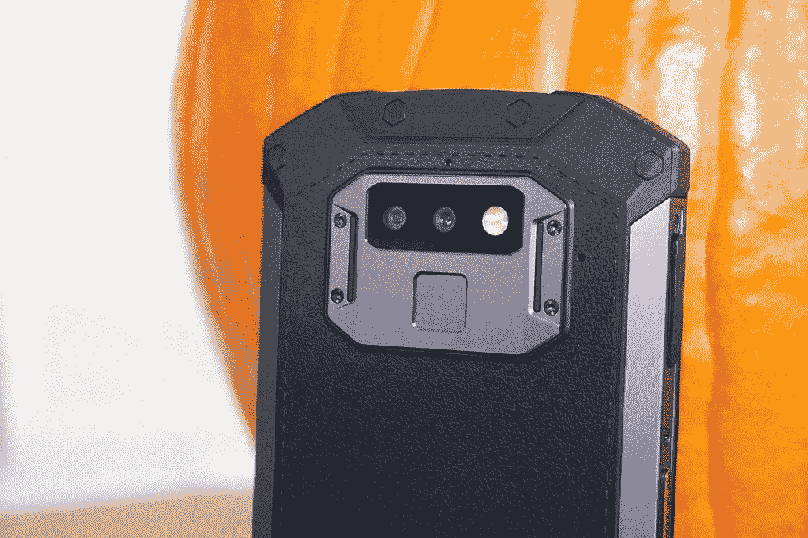
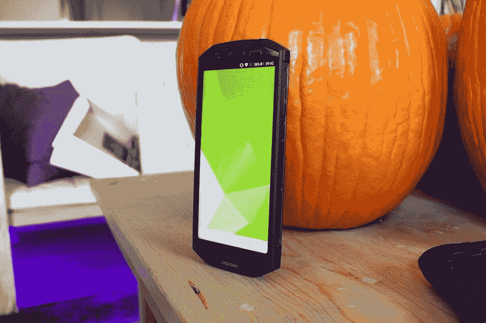
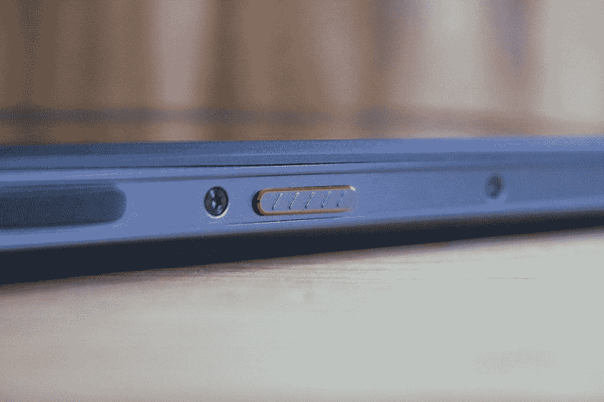

# 动手操作 DOOGEE S70

> 原文：<https://www.xda-developers.com/hands-on-with-the-doogee-s70/>

DOOGEE 向我们发送了他们即将推出的一款手机，供我们查看。这是 DOOGEE S70。这是一款游戏/加固型手机，通过 Indiegogo 的一次活动获得了资金。虽然这款手机还没有完全开发出来，但我们得到的早期版本还没有具备所有功能。我们仍然要检查相机，建造质量，显示器和其他一些东西。所以一定要看看上面的视频。

| 

DOOGEE S70 规格

 |  |
| --- | --- |
| Game Mode 丨 Gamepad | 2400 万感光单位 |
| IP68 丨 IP69K 丨 MIL-STD-810G | 1.4μm 大像素 |
| 5.99 英寸 FHD+屏幕(18:9) | 1600 万像素三星前置摄像头 |
| Helio P23 八核 2.5GHz | 5500mAh 电池 |
| 6GB+64GB 丨 Cooling Boost | 24W 闪光充电器 |
| 1250 万像素索尼 IMX363 后置摄像头 | 无线充电 |
| 双 PD 自动对焦 | 国家足球联盟 |

S70 在这款设备的制造上做了大量工作，尽可能使其坚固耐用。首先，显示屏是防碎的，并且受到手机边缘周围略微凸起的边框的保护。正如你在下面的照片中看到的，有护角。所有东西都包裹在铝合金框架中，这使得这款手机非常耐用。

IP-68 等级意味着手机防水防尘。它能在各种极端环境下生存。这对于许多在恶劣环境中工作的人来说很重要，但他们在选择坚固的手机时通常不得不牺牲性能。S70 不再是这种情况。

 <picture></picture> 

DOOGEE S70 with corner protection

对于该设备的游戏方面，有几个硬件和软件功能结合在一起，创造了一个伟大的游戏体验。DOOGEE S70 强大的规格和巨大的 5500 毫安时电池在一些最受欢迎的游戏中接受了测试。以下是你可以期待的以下应用程序的播放时间。

糖果粉碎/心石/皇家冲突/《我的世界》: **15 小时**

堡垒之夜/ PUBG Mobile: **11 小时**

口袋妖怪 Go / Ingress: **9 小时**

S70 内置的功能将使这款手机在您玩喜爱的游戏时具有高性能。但 DOOGEE 明白，为了让一部手机真正被称为“游戏手机”，你必须拥有一些新的硬件，让 Android 上的游戏变得更好。这就是 G1 出现的原因。这款游戏手柄专为 S70 设计。您可以将此配件夹在手机上，以启用游戏操纵杆控制器。查看[这段视频](https://youtu.be/nlTZvCCp2HY)来看看它的实际效果。

DOOGEE S70 拥有强大的 GPU 和 6GB 的内存。S70 在运动补偿技术、图像质量增强和暗光处理方面具有出色的兼容性。这款出色的手机实现了无阻碍的游戏性能，让您在游戏世界中自由自在。

 <picture></picture> 

DOOGEE G1

 <picture></picture> 

DOOGEE S70 with 5.99" FHD Display

 <picture></picture> 

The DOOGEE S70 has a dedicated gaming mode button

也许 DOOGEE S70 最雄心勃勃的方面是 279 美元的激进价格。这款设备的坚固特性与使其成为游戏手机的强大规格相结合，使 S70 具有难以置信的价值。

[**DOOGEE S70 Indiegogo 战役**](https://www.indiegogo.com/projects/doogee-s70-world-s-first-rugged-gaming-smartphone#/) [**DOOGEE S70 官网**](https://www.doogee.cc/sale/s70/)

###### *我们感谢 DOOGEE 赞助这篇文章。我们的赞助商帮助我们支付与运行 XDA 相关的许多费用，包括服务器成本、全职开发人员、新闻撰稿人等等。虽然您可能会在门户内容旁边看到赞助内容(这些内容将始终被标记为赞助内容),但门户团队对这些帖子不承担任何责任。赞助内容、广告和 XDA 仓库完全由一个独立的团队管理。XDA 绝不会通过接受金钱来赞扬一家公司，或以任何方式改变我们的观点或看法，从而损害其新闻诚信。我们的意见不能被收买。*