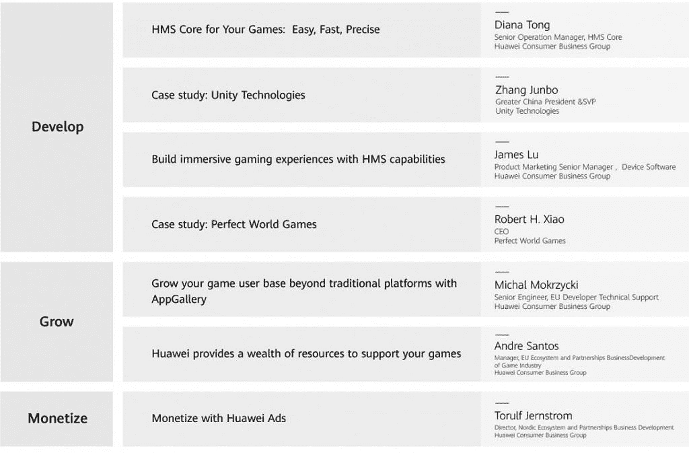

# #HDD 华为开发者日将于 4 月 30 日直播

> 原文：<https://www.xda-developers.com/hdd-huawei-developer-day-is-livestreaming-on-april-30th/>

华为开发者日(HDD)又回来了，这一次华为将专注于游戏行业——讨论最新的技术、趋势、技巧和技术。他们还将分享更多关于 HMS 核心、HMS 功能和 AppGallery Connect 的信息，以及您最关心的话题。

会议将通过直播进行，您将有机会在他们的现场问答中提问。

**如何加入:**

访问 *[此链接](https://developer.huawei.com/consumer/en/activity/detail/101587654757565514?Channelname=HuoDong6)* 点击报名按钮即可报名。

**2020 年 4 月 30 日，星期四** **12:30-14:00 UTC+1**

**关于硬盘**

华为开发者日(HDD)是华为开发者为与开发者进行深度交流而搭建的平台。它为开发者提供最新的开放能力和服务，并为他们带来移动设备的最新行业趋势。借助这个交流平台，华为和开发者将共同为亿万终端用户打造极致的智能体验。

**直播是关于什么的:**

*开发:*

-HMS 游戏核心:简单、快速、精确

-Unity 案例研究

-借助 HMS 功能打造身临其境的游戏体验

-完美世界游戏案例研究

*成长:*

-通过应用程序库发展您的游戏业务

-华为为您的游戏提供多种资源支持

-《权力的游戏》案例研究

*货币化:*

-利用华为广告赚钱

**#游戏开发者硬盘议程:**

 <picture></picture> 

Agenda for #HDD for Game Developers

###### 我们感谢华为赞助这篇文章。我们的赞助商帮助我们支付与运行 XDA 相关的许多费用，包括服务器成本、全职开发人员、新闻撰稿人等等。虽然您可能会在门户内容旁边看到赞助内容(这些内容将始终被标记为赞助内容),但门户团队对这些帖子不承担任何责任。赞助内容、广告和 XDA 仓库完全由一个独立的团队管理。XDA 绝不会通过接受金钱来赞扬一家公司，或以任何方式改变我们的观点或看法，从而损害其新闻诚信。我们的意见不能被收买。