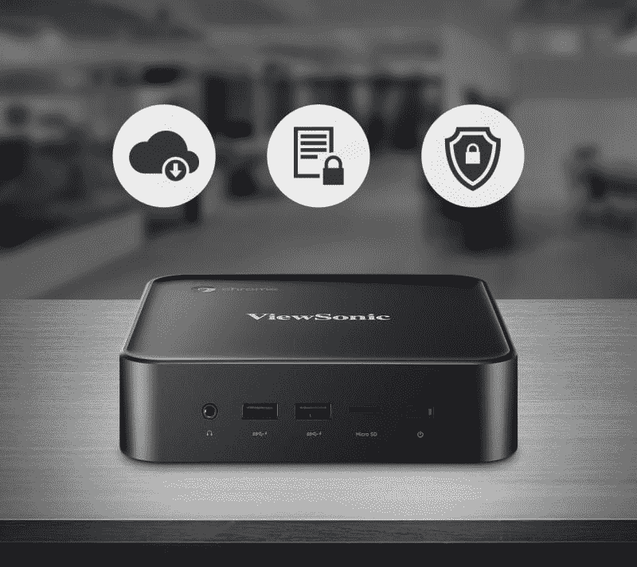

# 支持 HDMI CEC 的 Chromebox 暗示了 Chrome OS 的智能电视功能

> 原文：<https://www.xda-developers.com/hdmi-cec-enabled-chromebox/>

HDMI CEC 允许通过 HDMI (维基百科)进行基本命令和通信，因此设备可以更好地与电视集成。这项技术允许 DVD 播放器遥控器通过连接的 HDMI 电缆从每个设备发送命令来关闭电视，所以你不必摆弄遥控器。在过去的几个月里，Chrome 操作系统开发者一直在[为一个未发布的代号为“Fizz”的 Chromebox 的](https://www.reddit.com/r/chromeos/comments/8by2fw/chrome_os_to_support_hdmi_cec_meaning_youll/)[几个变种](https://chromium-review.googlesource.com/c/chromiumos/third_party/autotest/+/1055797/1/server/site_tests/display_CEC_Message/display_CEC_Message.py#29)开发 CEC 功能

承诺向连接的显示器发送 CEC 命令，并支持一整套[命令](https://chromium.googlesource.com/chromiumos/third_party/kernel/+/chromeos-4.4/drivers/media/cec/cec-adap.c)。所有这一切都相当有趣，但如果没有谷歌在客厅所做努力的更广泛背景，它的意义就失去了。 [JBL 即将推出的链接栏](https://www.xda-developers.com/jbl-link-bar-android-tv-google-assistant/)，这是一款内置安卓电视和谷歌助手的智能条形音箱，将有一些有趣的功能，将谷歌的旗舰助手连接到客厅。根据来自 [*AndroidPolice*](https://www.androidpolice.com/2018/05/08/google-hid-jbl-android-tv-sound-bars-best-feature-active-hdmi-crossover-assistant/) 的报道，链接栏将会有所谓的“主动覆盖”，它允许你在正在进行的内容之上以可视覆盖的方式召唤助手。然而，与这篇文章最相关的是，它使用 CEC 来桥接相互连接的设备。

谷歌暗示，JBL 链接栏只是许多即将推出的设备中的一个例子，这些设备将把助手和其他谷歌服务带入家庭——鉴于这份报告是在 Chrome OS 上实现 CEC 的时候发表的，这一声明具有隐藏的重量。

### 商务>休闲

链接栏确立了两件事:谷歌征服客厅的意图，以及它认为将实现这一目标的各种技术。因此，将 Chromebox Fizz 及其 CEC 功能与客厅联系起来是一个小小的飞跃。

也就是说，CEC 只是智能家居中的一个技巧。Chromebox 变成媒体播放器的最大障碍是糟糕的用户体验。Chrome OS 没有像 Android TV 那样的大屏幕用户体验，所以即使你想把你的 Chrome 设备用作剧院设备，它也将是一个笨重的鼠标和键盘。

 <picture></picture> 

While a Chromebox is great for desktop use, it doesn't have the features for a living room experience. Image source: [Viewsonic](https://www.viewsonic.com/us/nmp660.html)

虽然 Chrome 操作系统还不适合在客厅使用，但 CEC 也可以在企业和学校使用。其中一种情况是向所有受管理的信息亭显示器发送[待机]或[回放]命令，以减少手动管理。

除了对 CEC 的支持，代号为 Fizz 的 Chromeboxes 还提供了一些其他令人兴奋的前景。这是一组从低端到高端的 Kaby Lake 盒子，其中一些 SKU 具有高性能 CPU、双 LAN 和对 NVMe 的支持。虽然我们不太可能很快看到基于 Chrome 操作系统的智能电视，但至少我们可以看到当两个版本 Teemo 和 Bleemo 上架时，智能交互将出现在 Chrome 设备上。