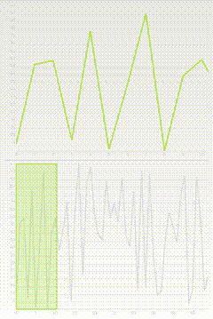
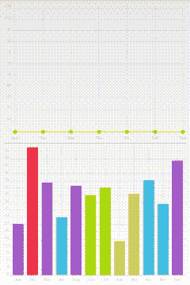

# 使用 HelloCharts 向您的应用程序添加图表

> 原文：<https://www.xda-developers.com/hellocharts-app-charts/>

图表为您提供了一种清晰简洁地表示数据的方式。这在移动设备上变得更加重要，在移动设备上，屏幕尺寸要求您以直接的方式提供数据，并且用户期望简单的表示而不是铺天盖地的表格。

已经有几个允许你在应用程序中使用图表的库，但是 XDA 论坛成员的 hello charts[lech 0](http://forum.xda-developers.com/member.php?u=4955373)是一个新的、易于使用的库，它支持几种图表类型。它还以相当多的特点使自己与众不同。如您所料，它支持折线图、柱形图、饼图以及气泡图。它还允许用户缩放、滚动和滚动图表，以关注他们感兴趣的领域。开发人员甚至可以更改图表动画，并根据自己的喜好进行定制。

 <picture></picture> 

HelloCharts Preview Chart

 <picture></picture> 

HelloCharts Charts Dependency

HelloCharts 还附带了“预览图表”(如右图所示)，这是一种在手机上使用的优秀图表类型。这种类型允许您显示图表的概览以及单独的详细视窗。完整的图表(概览)显示在底部，一个较小的详细区域显示在顶部。然后，用户可以在概览图表中轻松选择一个范围或放大到特定区域，并且只能在详细图表中看到该区域。

此外，HelloCharts 还提供组合图和依赖关系图(左边是动画)。这意味着您可以组合多个图表，可以选择将一个图表连接到另一个图表。例如，点击一个月的棒线，你就可以在屏幕上方看到周线图。

HelloCharts 与 Android 2.2 和更高版本(API 8)兼容，所以如果你想将图表集成到你的应用程序中，现在就前往 [HelloCharts 论坛主题](http://forum.xda-developers.com/tools/programming/library-hellocharts-charting-library-t2904456)开始吧！