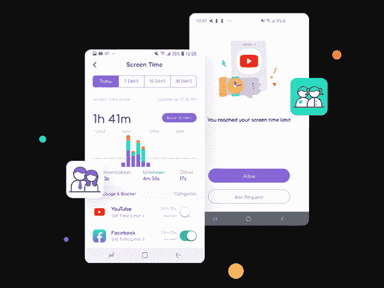
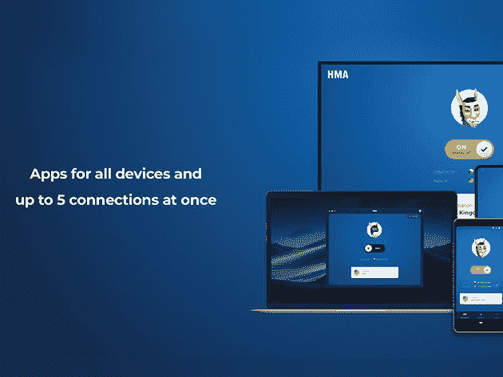
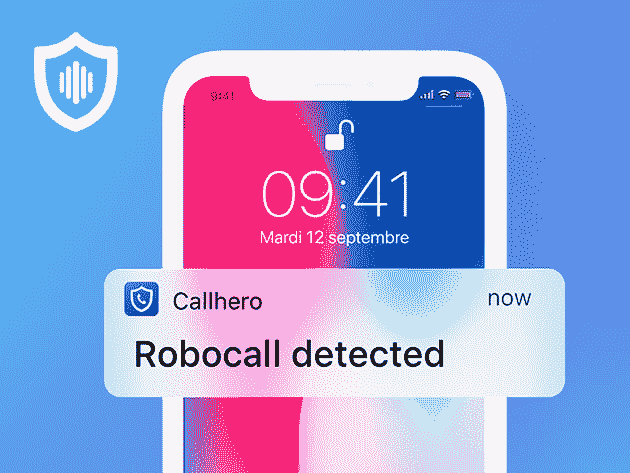

# 这里有 8 个非常棒的安全和控制应用程序，现在正在出售

> 原文：<https://www.xda-developers.com/here-are-8-great-security-and-control-apps-for-your-devices-on-sale-now/>

网络犯罪的可怕之处在于，你或你的家庭成员可能成为受害者，而你甚至没有意识到。谢天谢地，有很多方法可以保护你自己。以下是一些保护数据的最佳应用和订阅，现在在 XDA Developers Depot 可享受高达 92%的折扣。

## **Heimdal Thor Premium:一体化安全套件**

** ** 在 TrustPilot 和 Softpedia 上被评为 5 星， [ 这款多功能安全套件 ](https://depot.xda-developers.com/sales/thor-premium-home-5-year-subscription?utm_source=xda-developers.com&utm_medium=referral&utm_campaign=thor-premium-home-5-year-subscription&utm_term=scsf-416133&utm_content=a0x1P000004smzMQAQ&scsonar=1) 提供全面保护。Thor 甚至可以检测到最复杂的威胁，从勒索软件到病毒。此外，该软件修补漏洞，并阻止数据泄漏。 [ 你现在可以订购 59.99 美元 ](https://depot.xda-developers.com/sales/thor-premium-home-5-year-subscription?utm_source=xda-developers.com&utm_medium=referral&utm_campaign=thor-premium-home-5-year-subscription&utm_term=scsf-416133&utm_content=a0x1P000004smzMQAQ&scsonar=1) 获得五年服务，价值 499 美元。

## **VPNSecure:终身订阅**

****

[VPN secure](https://depot.xda-developers.com/sales/vpnsecure-lifetime-subscription-2?utm_source=xda-developers.com&utm_medium=referral&utm_campaign=vpnsecure-lifetime-subscription-2&utm_term=scsf-416394&utm_content=a0x1P000004smzMQAQ&scsonar=1)通过严格的禁止登录策略和强大的加密功能，帮助您保持匿名在线。这种高评级的 VPN 还可以保护您免受公共网络黑客的攻击，同时释放来自世界各地的精彩内容。价值 450 美元的 [终身订阅现在只需 34.99 美元](https://depot.xda-developers.com/sales/vpnsecure-lifetime-subscription-2?utm_source=xda-developers.com&utm_medium=referral&utm_campaign=vpnsecure-lifetime-subscription-2&utm_term=scsf-416394&utm_content=a0x1P000004smzMQAQ&scsonar=1) 。

## **呼叫控制高级服务:1 年期套餐**

****

如果你厌倦了僵尸程序呼叫你的电话，你需要 [呼叫控制](https://depot.xda-developers.com/sales/call-control-premium-1-year-subscription?utm_source=xda-developers.com&utm_medium=referral&utm_campaign=call-control-premium-1-year-subscription&utm_term=scsf-416395&utm_content=a0x1P000004smzMQAQ&scsonar=1) 。该应用程序由人工智能提供支持，可自动阻止机器人呼叫者、垃圾邮件发送者和骗子。该应用可在 iOS 和 Android 上使用，在两个平台上都被评为 4 星。一年期订阅现在 [33 折，19.99 美元](https://depot.xda-developers.com/sales/call-control-premium-1-year-subscription?utm_source=xda-developers.com&utm_medium=referral&utm_campaign=call-control-premium-1-year-subscription&utm_term=scsf-416395&utm_content=a0x1P000004smzMQAQ&scsonar=1) 。

## **家庭安全:3 年订阅**

作为家长， [家庭安全](https://depot.xda-developers.com/sales/wondershare-famisafe-3-year-membership?utm_source=xda-developers.com&utm_medium=referral&utm_campaign=wondershare-famisafe-3-year-membership&utm_term=scsf-416396&utm_content=a0x1P000004smzMQAQ&scsonar=1) 让您在网上保护您的孩子并控制他们的屏幕时间。该应用程序易于使用，这意味着您可以快速阻止特定的应用程序和网站，甚至无需接触您孩子的手机。它还具有定位器功能，让您更加安心。正常情况下 119 美元，三年期订阅是 [现在只要 49.99 美元](https://depot.xda-developers.com/sales/wondershare-famisafe-3-year-membership?utm_source=xda-developers.com&utm_medium=referral&utm_campaign=wondershare-famisafe-3-year-membership&utm_term=scsf-416396&utm_content=a0x1P000004smzMQAQ&scsonar=1) 。

## **AdLock 广告拦截器:终身订阅**

****

在线广告既会危及你的安全，又会侵犯你的隐私。 [AdLock](https://depot.xda-developers.com/sales/adlock-lifetime-subscription?utm_source=xda-developers.com&utm_medium=referral&utm_campaign=adlock-lifetime-subscription&utm_term=scsf-416397&utm_content=a0x1P000004smzMQAQ&scsonar=1) 屏蔽你设备上任何应用中的广告，从你的网络浏览器到免费增值游戏。除了提高安全性，这还意味着更长的电池寿命和更好的性能。目前六折，终身订阅 [只要 18.99 美元](https://depot.xda-developers.com/sales/adlock-lifetime-subscription?utm_source=xda-developers.com&utm_medium=referral&utm_campaign=adlock-lifetime-subscription&utm_term=scsf-416397&utm_content=a0x1P000004smzMQAQ&scsonar=1) 。

## **NordVPN: 2 年订阅**

****

提供基于双数据 SSL 的 2048 位加密， [NordVPN](https://depot.xda-developers.com/sales/nordvpn-2-yr-subscription-4?utm_source=xda-developers.com&utm_medium=referral&utm_campaign=nordvpn-2-yr-subscription-4&utm_term=scsf-416398&utm_content=a0x1P000004smzMQAQ&scsonar=1) 提供难以置信的在线保护。被《个人电脑杂志》和《CNET》评为 5 星，该服务还拥有严格的无日志记录政策和遍布全球的 3500 多台高速服务器。价值 286 美元，两年服务就是 [现在只要 95.99 美元](https://depot.xda-developers.com/sales/nordvpn-2-yr-subscription-4?utm_source=xda-developers.com&utm_medium=referral&utm_campaign=nordvpn-2-yr-subscription-4&utm_term=scsf-416398&utm_content=a0x1P000004smzMQAQ&scsonar=1)——也就是说打了 66 折。

## **HideMyAss！VPN: 3 年订阅**

****

专为隐私设计， [HideMyAss！VPN](https://depot.xda-developers.com/sales/hidemyass-vpn-3-year-subscription?utm_source=xda-developers.com&utm_medium=referral&utm_campaign=hidemyass-vpn-3-year-subscription&utm_term=scsf-416399&utm_content=a0x1P000004smzMQAQ&scsonar=1) 结合了强加密和全球覆盖。您可以同时保护多达五台设备，并具有强大的安全功能，如分割隧道、终止开关和 IP 洗牌。同样重要的是，没有日志记录。由于价格下降了一倍，三年期订阅费现在仅为 89.99 美元(价值 431 美元)。

## **CallHero 数字保镖&垃圾邮件拦截器:终身订阅**

****

在 App Store 上被评为 4.4 颗星， [这款智能应用](https://depot.xda-developers.com/sales/callhero-robo-call-blocker-lifetime-subscription?utm_source=xda-developers.com&utm_medium=referral&utm_campaign=callhero-robo-call-blocker-lifetime-subscription&utm_term=scsf-416400&utm_content=a0x1P000004smzMQAQ&scsonar=1) 实际上会听来电者所说的话，以确定他们是真实的还是机器人。你甚至可以设置特定的安全关键字，这样朋友和家人就可以随时通过。价值 249 美元，终身服务为 [目前仅售 49.99 美元](https://depot.xda-developers.com/sales/callhero-robo-call-blocker-lifetime-subscription?utm_source=xda-developers.com&utm_medium=referral&utm_campaign=callhero-robo-call-blocker-lifetime-subscription&utm_term=scsf-416400&utm_content=a0x1P000004smzMQAQ&scsonar=1) 。

*价格随时变化*