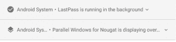

# 如何隐藏 Android Oreo 上的“应用程序正在后台运行”持续通知

> 原文：<https://www.xda-developers.com/hide-app-running-background-notification-android-oreo/>

在 Android Oreo 上，一个一直困扰用户的通知是“应用程序正在后台运行”通知。每当某些应用程序在后台运行或覆盖在屏幕上时，它就会出现，如 Facebook Messenger 或 Twilight。通知的原则是好的，但它的应用却不好。通知不能被删除也不能被禁用，所以你必须忍受它占用你的通知的屏幕空间。当然，前提是你不愿意绕过它。虽然没有 root 访问权限不可能永久禁用通知，但可以通过**有效地永久暂停通知，这样你就再也看不到它了**。

 <picture></picture> 

Annoying persistent notification in Android Oreo that we want to hide

* * *

## 在 Android Oreo 中隐藏“应用程序正在后台运行”通知

### 方法 1 -简单

一个名为 iboalali 的开发者发布了一个应用程序**,专门用于阻止这个通知。**app 也是[完全开源](https://github.com/iboalali/sysnotifsnooze)！它只在英语设备上工作，至少目前是这样，但是随着翻译的增加，开发者可能会增加对其他语言的支持。

您所需要做的就是安装应用程序，启用通知监听器权限，它将保持通知被阻止！

### 方法 2 -推荐

AutoApps 的开发者，[若奥·迪亚斯](https://plus.google.com/u/0/101282964483894346750)，通知我们他已经[发布了他的自动通知应用](https://plus.google.com/+Jo%C3%A3oDias/posts/aPx4sgrhAWB)的更新，允许你屏蔽这个(和其他)通知**而不需要 Tasker** 。此外，他已经将这个新功能变成了他的应用程序中的一个免费功能，这样你不用花一分钱就可以享受不到“应用程序正在后台运行”的通知。

你所要做的就是从谷歌 Play 商店下载自动通知。我们推荐这种方法，因为与上面的应用程序不同，这种方法适用于**所有语言**,也有助于删除**任何其他您想要删除的 Android 系统通知**,例如“在 SystemUI one 上绘图”或 USB 充电/调试通知。你只需要在标题/文本过滤器中指定你的目标关键字。

最后，观看 Dias 先生提供的这个短视频教程，它将指导您如何使用他的应用程序阻止 Android 系统通知。

### 方法 3 -硬

这个补丁是由 Marco Stornelli 开发的，他是 BaldApps 家族下许多免费 Tasker 插件的开发者。正如在[这个 Reddit 线程](https://www.reddit.com/r/tasker/comments/6vs1oo/howto_hide_app_is_running_in_background/)中发布的，并在他的许可下分享如下，这个修复需要使用 Tasker automation 应用程序以及 Marco 的 Tasker 插件之一 Notification Listener。

首先，下载这两个应用。您将需要 Tasker，因为它是通知监听器完成其工作所必需的，在本例中，它将删除后台服务的持久通知。

[app box Google play com . balda . notification listener]

接下来，您需要导入 Marco 提供的 Tasker 概要文件。在这里下载[，然后按照下面的截图学习如何导入和设置！](https://drive.google.com/file/d/0B54blAHdXRJ6QmF5d1puOEdfNmM/view)

任务导入后，您可以运行它来“暂停”通知。但是它不会在启动时运行，所以请按照下面的步骤学习如何在启动时运行此任务来自动阻止通知。

现在，当你重启你的设备时，概要文件应该在启动时运行(嗯，不确切地说是在启动时运行，因为从技术上讲，它是在 Tasker 的监控服务启动时运行的，这是在其他启动接收器运行几秒钟之后)！

如果它不起作用，有可能在任务已经运行后出现 Android 系统通知。在这种情况下，您可以在引导时手动运行该任务，但是开发人员 Marco 建议您修改查询操作以添加更长的超时，比如 3 分钟。或者，您可以在任务开始时添加一个“等待”动作，并使用类似的长超时。

如果您*只想*阻止这个特定的 Android 系统通知(而不是它可能发布的任何其他内容)，您可以改为将配置文件更改为具有“已发布”条件的“通知监听器事件”，应用程序以“Android 系统”为目标，标题匹配*background*。请注意星号的使用——这是一个通配符，匹配术语“背景”周围的任何文本，因此只有在 Android 系统是“应用程序正在后台运行”通知时才会匹配。

* * *

## 说明

没有 root，实际上没有办法*阻止* Android 系统在 Android 8.0 Oreo 中显示持续的“app 正在后台运行”通知。查看一下[ForegroundServiceController](https://android.googlesource.com/platform/frameworks/base/+/android-8.0.0_r1/packages/SystemUI/src/com/android/systemui/ForegroundServiceController.java)的源代码，它的[实现](https://android.googlesource.com/platform/frameworks/base/+/android-8.0.0_r1/packages/SystemUI/src/com/android/systemui/ForegroundServiceControllerImpl.java)，以及 [ForegroundServiceDialog](https://android.googlesource.com/platform/frameworks/base/+/android-8.0.0_r1/packages/SystemUI/src/com/android/systemui/ForegroundServicesDialog.java) 并没有真正揭示任何我们可以利用的东西。据我们所知，没有命令或系统属性编辑可以用来控制该服务是否运行。看起来“Dianne 的地牢”(可能是 Google inside 的一个笑话，指的是高级 Android 工程师 Dianne Hackborn)不是我们可以轻易逃脱的东西。

但是，使用上述任何一种方法都是解决此问题的相对简单的方法。这些方法中的每一个都查询一个“android 系统”通知，这是一个由 Android 框架应用程序(包名为“Android”)创建的持久通知。如果它存在，那么它**会长时间**监听来自安卓系统**的通知**。顺便说一下，这个修改是完全安全的，因为 Android 系统通常不提供任何其他通知。