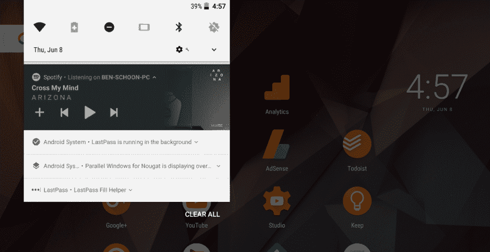

# 在 Android O 中隐藏后台应用和覆盖的持续通知

> 原文：<https://www.xda-developers.com/hide-persistent-notification-android-o/>

更新 8/25/17:这个教程现在已经过时了，因为 Google 修补了我们用来在后台隐藏持久通知的方法。然而，我们已经发现了这个问题的另一个解决方法，并且写了一个简短的教程，你可以在这里找到。

Android O 希望为我们所熟知和喜爱的 Android 操作系统带来重大改进。手机的画中画模式，通知频道，智能文本选择，自动填充服务，以及在引擎盖下的许多许多变化，以提高您的电池寿命，性能和安全性。一个应该帮助用户解决电池寿命和性能问题的功能是后台进程限制。不涉及太多细节，Android O 中的应用程序不再能够从其清单注册的隐式广播接收器中被唤醒，并且它们不再能够在不通过 JobScheduler 的情况下启动后台服务。如果一个应用程序想要启动后台服务，它必须通过发布通知来明确告诉用户它正在这样做。然而，当一个应用程序在后台运行时，Android O 现在似乎在*上添加了另一个*持续通知，告诉你有什么应用程序在运行。当一个具有 [SYSTEM_ALERT_WINDOW](https://developer.android.com/reference/android/Manifest.permission.html#SYSTEM_ALERT_WINDOW) 权限的应用程序(例如流行的 [Twilight](https://play.google.com/store/apps/details?id=com.urbandroid.lux) 应用程序)当前正在显示覆盖图时，也会发生这种情况。

 <picture></picture> 

Android O Persistent Notification for Background and Overlay Apps. Credits: Ben Schoon \\ [9to5Google](https://9to5google.com/2017/06/08/android-o-background-apps-notification/)

虽然这些通知在默认情况下是最小化的，但是用户不能取消它们，也不能在设置中永久阻止它们。这种行为让许多用户非常讨厌，我非常希望谷歌在最终的 Android O/Android 8.0 版本中给我们一个禁用这种通知的方法。然而，如果他们不这样做，还有*仍然是一种方法**永久隐藏持久的后台应用程序通知**。我将在一个分步指南中展示如何做到这一点，然后解释它是如何工作的以及重要的注意事项。*

 ** * *

## 隐藏 Android O 中的持续通知

1.  如果你用的是 Windows，为你的手机安装 USB 驱动程序(可以在这里找到)。
2.  为你的特定操作系统下载 [ADB 二进制](https://www.xda-developers.com/google-releases-separate-adb-and-fastboot-binary-downloads/)([Windows](https://dl.google.com/android/repository/platform-tools-latest-windows.zip)、 [Mac](https://dl.google.com/android/repository/platform-tools-latest-darwin.zip) 、 [Linux](https://dl.google.com/android/repository/platform-tools-latest-linux.zip) )。这些链接将始终指向二进制文件的最新版本，因此您不必在网上搜寻最新版本。
3.  将您下载的 ZIP 文件的内容提取到您电脑上一个容易访问的文件夹中(如下载文件夹中)。
4.  进入手机上的设置应用程序，点击“关于手机”选项。
5.  找到内部版本号，点击 7 次以启用开发者模式。启用后，您会看到一个弹出窗口。
6.  回到设置主菜单，进入开发者选项，这样你就可以启用 USB 调试模式。
7.  将手机插入电脑，向下滑动通知面板，将 USB 模式从“仅充电”切换到“文件传输(MTP)”模式。你的手机可能不需要这个。
8.  在您的 PC 上，浏览到您解压缩 ADB 二进制文件的目录。
9.  在这个 ADB 目录中启动命令提示符/终端。对于 Windows 用户，这可以通过 Shift+右键单击然后选择“在此打开命令提示符”选项来完成。
10.  进入命令提示符或终端环境后，输入以下命令:`adb devices`
11.  这将启动 ADB 守护程序。如果这是你第一次运行亚行，你还会在手机上看到一个提示，要求你授权连接。
12.  现在，从步骤 10 重新运行 adb devices 命令，命令提示符/终端将打印您的设备的序列号。如果是的话，那么你已经准备好继续前进了。如果没有，那么 USB 驱动程序可能没有正确安装。
13.  返回到命令提示符并输入以下命令:`adb shell`
14.  现在执行以下命令:`cmd appops set android POST_NOTIFICATION ignore`
15.  You won't get a success message or anything, but as long as you don't see an error it should have worked. Now just reboot your phone!

    是的，我意识到这些是手机屏幕的图片，而不是截图。我自己没有兼容 Android O 的设备，所以我让 TK 给我发图片。

16.  如果您想恢复该命令，请在命令提示符下输入:`cmd appops set android POST_NOTIFICATION allow`

* * *

## 它是如何工作的

使用 App Ops 的隐藏命令行接口，android 面向用户的权限管理系统，我们能够限制“Android”包的 POST_NOTIFICATION 权限。(注意:我们将它设置为“忽略”而不是“拒绝”,因为“拒绝”可能会导致一些错误。)我是通过查看 [AppOpsManager](https://github.com/android/platform_frameworks_base/blob/master/core/java/android/app/AppOpsManager.java) 的相关源代码找到这个权限的，它列出了所有可能被授予/撤销的权限，其中很多权限在 Android 设置中是无法访问的。“android”包实际上指的是“Android System”AKA framework-RES . apk，它负责我们试图摆脱的持久性通知。

从本质上撤销 Android 系统的 POST_NOTIFICATION 权限，它就不能再显示通知了！听起来很简单，对吧？不幸的是，有一个警告需要注意。“Android 系统”负责的不仅仅是这个通知，因此它可能发布的任何其他通知都将不再显示。这可以包括 USB 模式通知(仍然可以通过开发人员选项中的设置进行更改)以及其他一些东西。

虽然对我们来说这是一个非常激烈的措施，但这是目前隐藏这个通知的唯一方法，除了让你的手机扎根和修改框架本身，这显然不是很多用户愿意或能够做的事情。我真诚地希望谷歌能在 Android O 的未来版本中提供一个隐藏这个通知的方法，或者更好地完全删除这个通知。可以理解的是，谷歌希望通过在用户可能不知道的情况下通知用户某个应用程序正在后台运行来改善用户体验，但他们选择的方法对于我们这些了解我们正在使用的每个应用程序的人来说很烦人。*