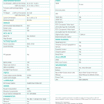
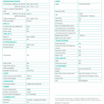
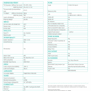
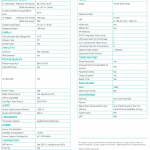

# 海信发布新的 4K ULED 65 英寸和 75 英寸安卓电视型号

> 原文：<https://www.xda-developers.com/hisense-announces-new-4k-uled-65-and-75-android-tv-models/>

我们都听说过等离子显示器(RIP)、液晶显示器和有机发光二极管显示器，但海信推出了一些许多人可能不熟悉的东西。该公司在 CES 2019 上宣布了其安卓电视阵容中的三款 4K *ULED* 显示屏。不要与有机发光二极管混淆，ULED 被定义为一种带有 LED 背光的 LCD 显示器，它也采用了[量子点](https://www.pcmag.com/encyclopedia/term/68884/quantum-dot-backlight)技术来改善其色域，并允许对显示器进行粒度控制。

海信型号由 Android 电视平台提供支持，领先于 75 英寸 U9F ULED 型号，亮度高达 2200 尼特。您还可以选择性地调暗显示屏，正如海信在其规格表中提到的:

*复杂的局部调光选项包含超过 1000 个活动背光区域，可以控制显示器的哪些区域发光，哪些区域比其他区域更暗。*

高级 U9F 型号将于今年 6 月上市，建议零售价为 3499.99 美元。

下一个 ULED 型号的对角线长度只少了 10 英寸，但在保持相同分辨率和选择性调光功能的同时，价格却少了 2500 美元。其最大亮度超过 1，000 尼特，不到 75U9F 额定最大亮度的一半。这款产品被称为 65H9F，售价仅为 999.99 美元，将于 2019 年 5 月上市，比 75U9F 早一个月。

65H8F 的价格远低于 1000 美元，为 749.99 美元，将于 2019 年 5 月与上述 65H9F 型号一起上市。它的规格表没有提到最大亮度值，但它也有 ULED 显示屏和选择性调光功能(海信称之为局部调光)。你可以看到下面画廊里描绘的模特。

75U9F 和 65H9F 型号还采用人工智能算法来动态自动调整视频和音频，以获得“最佳的视听体验”虽然 65H8F 型号也有选择性调光和 ULED 技术，但其规格表没有提到这种算法。

海信 CES 2019 Android 电视阵容中还包括一款 65 英寸，349.99 美元的 Android 电视，没有 ULED 技术。与之配套的是售价 699 美元的 55 英寸 H9F ULED 机型和售价 399.99 美元的 50 英寸 H8F ULED 机型。较小的 ULED 型号将于 2019 年 5 月上市，非 ULED 型号将于“2019 年晚些时候”上市。

### H65F 系列 4K UHD 安卓智能电视

*   4K 领导
*   运动速度 120
*   蓝牙连接
*   DTS 录音室声音
*   安卓电视和谷歌助手

 <picture></picture> 

HiSense 65H65 Specifications. Click to view.

### H8F 系列 4K UHD 安卓智能电视

*   4K ULED，广色域
*   杜比视觉 HDR
*   运动速度 240
*   安卓电视和谷歌助手

 <picture></picture> 

HiSense 65H8F Specifications. Click to expand.

### H9F 系列 4K UHD 安卓智能电视

*   4K ULED，120Hz 面板，带 Quantom 点和宽色域
*   1000 尼特显示器
*   运动速度 480
*   安卓电视和谷歌助手
*   杜比视觉 HDR

 <picture></picture> 

HiSense 65H9F Specifications. Click to expand.

### U9F 系列 4K UHD 安卓智能电视

*   4K ULED，120Hz 面板，带量子点和宽色域
*   2200 尼特显示屏，超过 1000 个“活动背光区域”
*   杜比视觉 HDR
*   安卓电视和谷歌助手

 <picture></picture> 

HiSense 75U9F Specifications. Click to view.

* * *

[**来源:海信(新闻稿)**](https://www.prnewswire.com/news-releases/hisense-redefines-premium-tv-market-with-exclusive-uled-powered-2019-product-lineup-at-ces-2019-300773982.html)