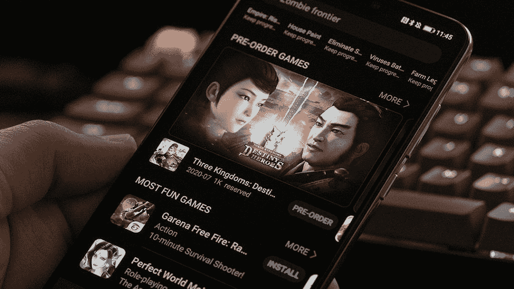

# 零售商如何利用华为的新流媒体技术在后 COVID 时代重塑购物体验

> 原文：<https://www.xda-developers.com/hms-technology-by-huawei/>

随着世界开始适应新冠肺炎塑造的新现实，在线零售商寻找机会创新他们的购物体验。华为一直在努力满足新的直播销售活动的需求，同时让每个人都更容易和更容易获得。利用华为移动服务(HMS)和其 AppGallery marketplace 的结合，华为旨在帮助公司通过直播提高销售额。

## 华为应用程序库

当前的 AppGallery 用户已经受益于他们可以使用的各种各样的工具。华为 AppGallery 在中国市场大受欢迎。它也成为许多华为手机上唯一的应用程序市场。随着市场的增长，华为现在有能力在 AppGallery 中向 4.6 亿月活跃用户展示你的应用。当这与华为的整个生态系统相结合时，你将获得浏览器、移动云、主题、音乐、视频和助手等应用的曝光率。您还有机会通过 AppGallery 横幅、礼品、闪屏等方式推广您的应用。这个互联的生态系统每月拥有超过 7 亿的活跃用户。所有这些用户都是你的应用的潜在客户。

 <picture></picture> 

Huawei AppGallery Games

 <picture></picture> 

Huawei AppGallery Featured Apps

## 华为 HMS 套件让实时电子商务变得简单

现在，华为计划推出其实时电子商务工具。这种简化的流媒体服务专注于直播产品销售，并提供观众的互动评论。现在，任何拥有智能手机的人都可以参加自己的现场销售活动。他们已经实现了大量功能强大的工具来帮助创作者拥有一个成功的流。使用他们的数字背景来显示图形或不同的场景。远程控制系统让您可以在使用多个摄像机角度的同时现场指导您的节目。在屏幕上显示您的产品规格，这样观众可以了解更多关于您所销售产品的信息。

没有高质量的稳定视频，直播就什么都不是。这就是为什么华为非常注重确保您的视频流流畅、清晰，并且具有不会丢失的高分辨率镜头。现在，任何人都有能力在没有昂贵的演播室设备的情况下，上演一场精彩的销售秀。

 <picture></picture> 

Huawei Live E-commerce with interactive comments

这个新平台利用了 HMS DVKit、相机套件、无线套件、AI 套件等。HMS 是一个不断更新的工具集，帮助开发人员在他们的应用程序中加入强大的功能。HMS 最近推出了 HMS Core 5.0，以便更多的开发者能够充分利用华为的“芯片-设备-云”能力..你可以在这里阅读更多相关信息[。](https://www.xda-developers.com/hms-core-5-0-introduces-an-ar-engine-computer-graphics-kit-accelerate-kit-and-more-improvements/)

这些新的开发套件将改变实时视频在应用中的实现方式。对于依赖 HMS 平台的开发人员来说，这使得开发过程更加容易，也更加经济实惠。华为推出新的实时电子商务解决方案将揭示这一过程如何运作的更多信息。请务必收听并观看网上研讨会，该研讨会将在互联网上免费播放。

* * *

**华为开发者网络研讨会**

*华为开发者网络研讨会|用电子商务连接生活* **[点击此处观看活动直播](http://f.huaweieco.aotimes.com/wap/#/?roomId=lm0jd5n7&channle=16)**

**2020 年 8 月 6 日**

* * *

###### *本帖由华为赞助撰写，部分内容由华为赞助。我们的赞助商帮助我们支付与运行 XDA 相关的许多费用，包括服务器成本、全职开发人员、新闻撰稿人等等。虽然您可能会在门户内容旁边看到赞助内容(这些内容将始终被标记为赞助内容),但门户团队对这些帖子不承担任何责任。赞助内容、广告和 XDA 仓库完全由一个独立的团队管理。XDA 绝不会通过接受金钱来赞扬一家公司，或以任何方式改变我们的观点或看法，从而损害其新闻诚信。我们的意见不能被收买。*