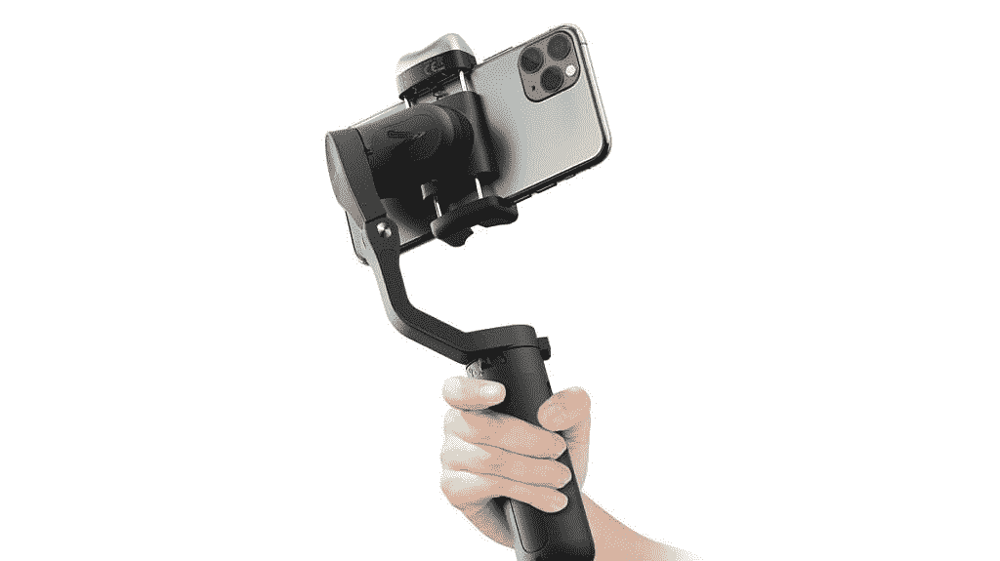

# 拥有三轴万向架和人工智能跟踪的 iSteady V2 赢得红点奖

> 原文：<https://www.xda-developers.com/hohem-isteady-v2/>

在不断提高用户拍摄更好的智能手机镜头的能力这一目标的推动下，Hohem 获得了 iSteady V2 的红点奖。iSteady V2 利用现有的最佳万向节功能的组合，创造出最终的智能手机伴侣。手机摄影师、摄像师、彩带爱好者或任何经常使用智能手机相机的人都会对来自 Hohem 的 iSteady V2 着迷。

 <picture></picture> 

iSteady V2

Hohem 在智能手机框架领域并不陌生。他们长期以来一直提供高质量的解决方案来稳定您的智能手机。对于 iSteady V2，Hohem 使用了一个 3 轴万向节和一个人工智能跟踪系统，允许万向节跟随其主体并让你保持在镜头中，而不需要配套的应用程序。没有应用程序也能工作，这为将 iSteady V2 与您喜欢的任何视频通话服务、社交媒体或相机应用程序配合使用提供了可能性。

[**得到了 V2**](https://store.hohem.com/?utm_source=xda&utm_medium=PR)

## 人工智能跟踪，保持屏幕上的行动

为了让你保持在镜头中，iSteady V2 是世界上第一个使用人工智能跟踪系统的稳定器，可以检测人脸。这是通过一个独立于任何应用程序的机载系统来完成的。因此，当你准备好拍摄下一个抖音视频时，相机会随着你在场景中移动——不需要任何摄影师！

您可以选择任何方式使用面部跟踪功能。在您进行视频通话时，让您的摄像机跟随您，在您准备晚餐时，在您的厨房里来回走动。当你从山顶捕捉风景时，你甚至可以让它跟随你进行 360 度全方位拍摄。让您的所有社交媒体视频能够捕捉流畅的镜头，而不会错过任何动作。

## 获奖设计

为了创造 iSteady V2 的获奖设计，Hohem 从仿生猫头鹰的设计中获得了灵感，该设计具有高度的人工智能识别，快速跟踪和自动跟随功能。它们包括一个环绕式补光灯，采用菱形棱镜设计，可产生三种可调的自然柔和光线。不同的灯光设置可用于不同的照明环境，确保您总能拍摄出光线充足的照片。

为了实现最流畅的视频，iSteady4.0 三轴防抖算法与深度优化的镜头视野结合使用。这为用户提供了准确的视觉识别，进一步增强了灵活性。

iSteady V2 采用双层板设计，能够提供智能拍摄体验，同时更加便携。重量为 263 克(9.27 盎司)，iSteady V2 是最终的智能手机伴侣，足够便携，可以随身携带到任何地方。

特点:

*   人工智能视觉传感器
*   手势控制
*   快速滚动开关
*   内置 LED 视频灯
*   三轴稳定
*   应急电源组
*   超轻折叠式
*   力矩模式

获得任何手机的 iSteady V2，无论品牌和型号。

[**得到了 V2**](https://store.hohem.com/?utm_source=xda&utm_medium=PR)

我们感谢 Hohem 赞助了这篇文章。我们的赞助商帮助我们支付与运行 XDA 相关的许多费用，包括服务器成本、全职开发人员、新闻撰稿人等等。虽然您可能会在门户内容旁边看到赞助内容(这些内容将始终被标记为赞助内容),但门户团队对这些帖子不承担任何责任。赞助内容、广告和 XDA 仓库完全由一个独立的团队管理。XDA 绝不会通过接受金钱来赞扬一家公司，或以任何方式改变我们的观点或看法，从而损害其新闻诚信。我们的意见不能被收买。