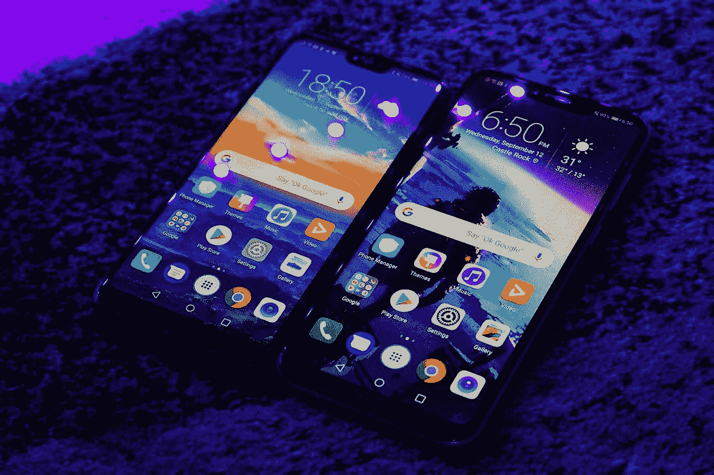
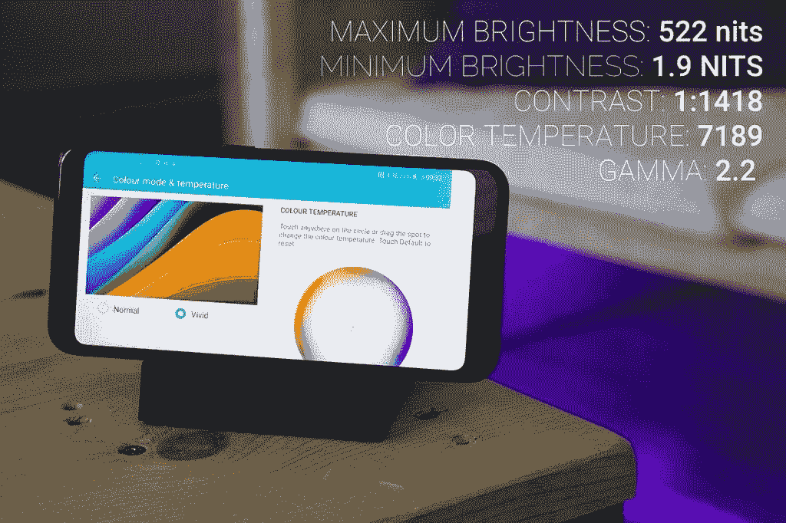
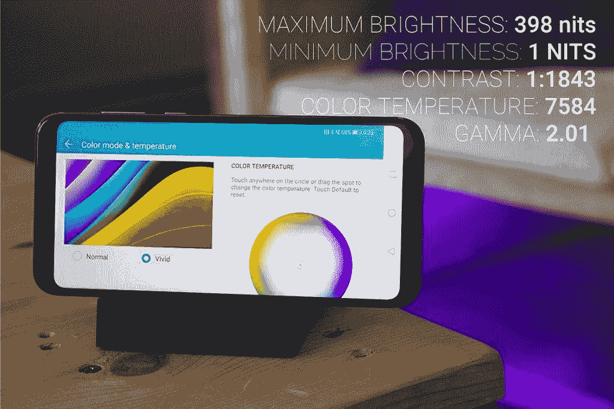
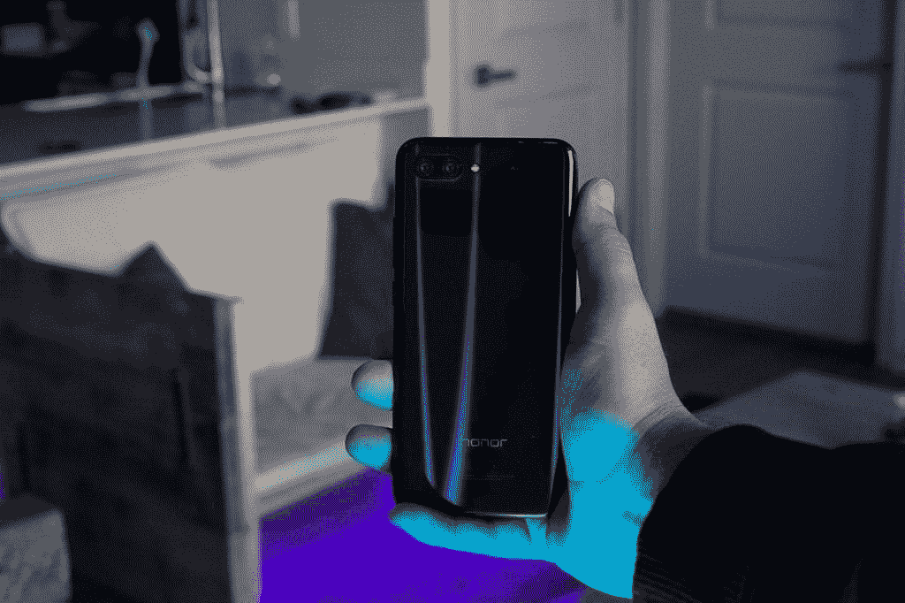
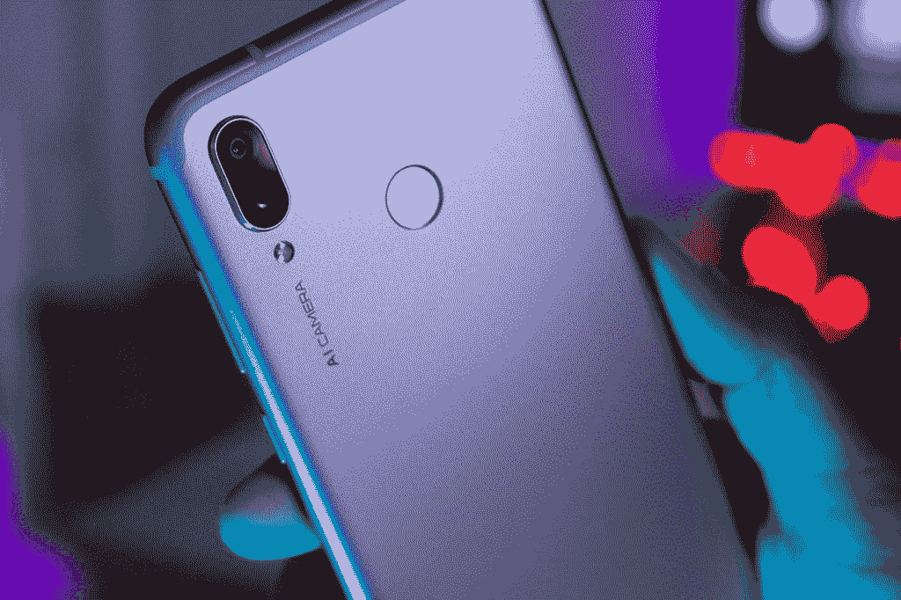
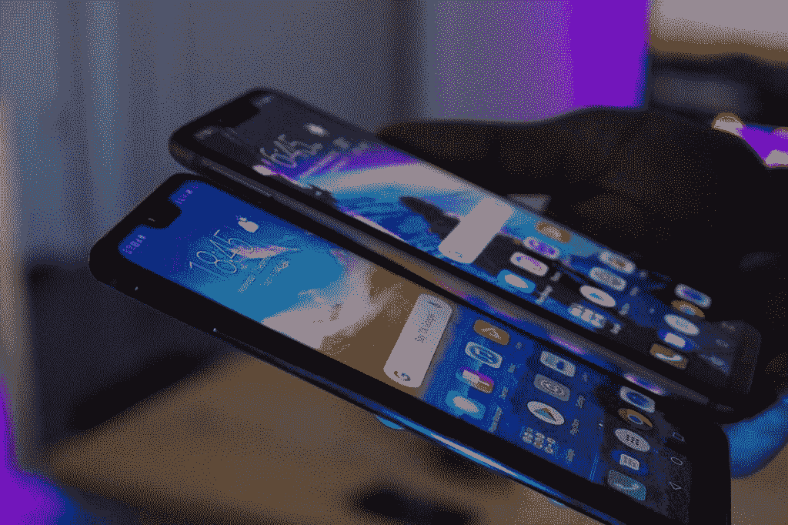
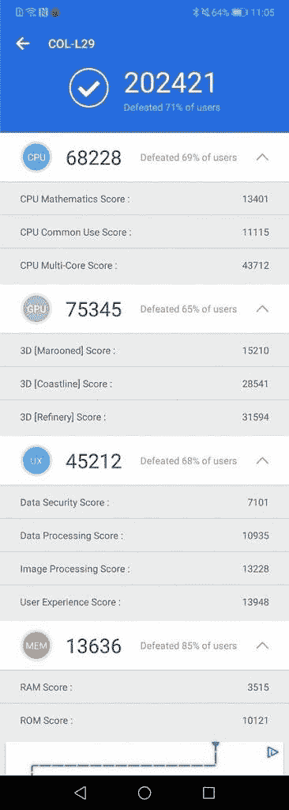
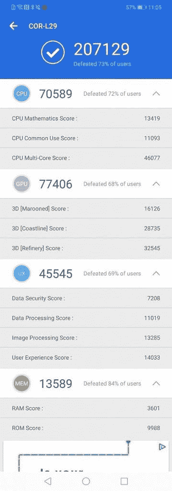
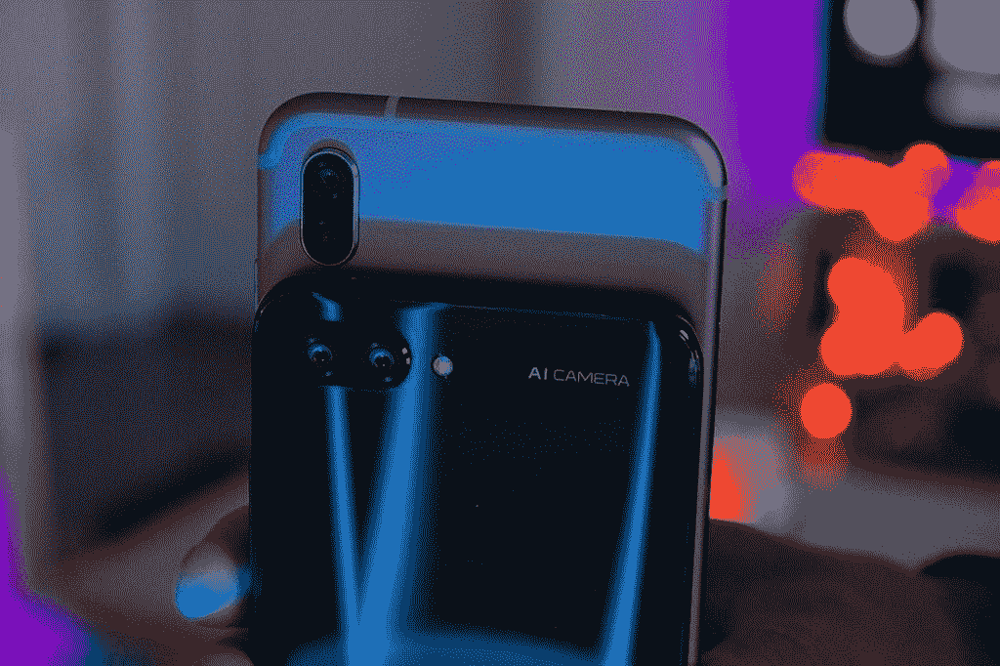

# Honor 10 Vs. Honor Play:哪款手机更超值？

> 原文：<https://www.xda-developers.com/honor-10-vs-honor-play-which-phone-is-the-better-value/>

Honor 10 是 Honor 2018 年的旗舰手机，配备了最新的麒麟 970 芯片组和 Honor 的人工智能摄像头。Honor 10 定价为₹32999.00(459 美元)，是今年最有价值的手机之一。荣誉 10 上线不久，荣誉就公布了荣誉剧。这款手机旨在成为游戏玩家的设备，注重性能，定价为₹19999.00(277 美元)。这款手机的奇怪之处在于，它的规格几乎与 Honor 10 相同，但价格却便宜了 200 多美元。

在这个比较中，我们将看到荣誉 10 是否值得你额外支付的 200 美元，或者荣誉游戏是否更有价值。

| 

荣誉 10

 | 

规范

 | 

荣誉游戏

 | 

规范

 |
| --- | --- | --- | --- |
| 芯片集 | **麒麟 970** | 芯片集 | **麒麟 970** |
| 显示 | **1080x2280p** | 显示 | **1080x2340p** |
| 随机存取存储 | **4/6/8GB** | 随机存取存储 | **4/6GB** |
| 储存；储备 | **64/128GB** | 储存；储备 | **64GB** |
| 照相机 | **16+24MP / 24MP** | 照相机 | **16+2MP / 16MP** |
| 电池 | **3400 毫安** | 电池 | 3750 毫安时 |
| 操作系统（Operating System） | **安卓 8.1 EMUI 8.1.0** | 操作系统（Operating System） | **安卓 8.1 EMUI 8.2.0** |
| 价格 | ₹32999.00(459 美元) | 国家政治保卫局。参见 OGPU | ₹19999.00(277 美元) |

# 显示

Honor 10 和 Honor play 都配备了 1080p IPS 显示屏。Honor play 的显示屏更大，为 6.3 英寸，而 Honor 10 的显示屏为 5.84 英寸。该剧也有一个更高的长宽比 19.5:9，而不是荣誉 10 的 19:9。这是一个小细节，但却有很大的不同。对于那些喜欢更大的手机的人来说，这部剧将是一个显而易见的选择。

 <picture></picture> 

Honor 10 (Left) Honor Play (Right)

说到亮度，荣誉 10 比剧更亮。这一部门两部手机都不缺，Honor 10 能达到 522 尼特，Play 能达到 398。Honor 10 在显示的各个方面都优于 Honor play，涉及到色温、对比度、伽玛等。

 <picture></picture> 

**Honor 10**/ Data source: phonearena.com

 <picture></picture> 

**Honor Play**/ Data source: phonearena.com

虽然荣誉 10 的显示在技术上比荣誉游戏更好，但我总是发现自己在参加 PUBG 会议时抓住荣誉游戏。玩游戏时，更大的显示屏更好。当并排拿着手机时，你几乎分辨不出两者的区别。喜欢更大显示器的用户不必因为选择 play 而牺牲太多质量，而不是 Honor 10。

# 构建质量

自 2017 年发布 Honor 7X 以来，Honor 一直在发布大部分采用金属一体成型的预算和中端手机，这是我们在 Honor Play 上发现的。他们保留了*极光设计，*是他们的多层玻璃结构，用于他们的旗舰手机，如 Honor 8、Honor 9 和 Honor 10。

 <picture></picture> 

Honor Play

荣誉 10 由荣誉称之为“幻影极光玻璃”的东西组成。这种多层玻璃机身是从 Honor 8 开始的长期演变的结果。这款手机捕捉光线的方式使得反射光线在你的手机上弯曲舞动。它让你的手机看起来有时会发光。全玻璃机身让握起来感觉很棒。

Honor Play 有一个光滑的金属外壳，可以作为一个整体安装在手机硬件周围。一体式设计在相机镜头和指纹传感器周围有镀铬细节，模仿了我们在许多荣誉手机中看到的相同设计。

 <picture></picture> 

Honor 10 in Midnight Black

 <picture></picture> 

Honor Play in Violet

这些手机的两种设计似乎都只能在更昂贵的设备上找到。Honor 10 显然是两款手机中更高端的一款，拥有出众的构造。对于那些重视手机外观和手感的人来说，Honor 10 是这里最好的手机。

# 表演

这就是这些手机差距缩小的地方。由于两款设备都配备了麒麟 970、4GB 内存、Mali-G72 MP12 GPU 和 Honor 的 [GPU Turbo 技术](https://www.xda-developers.com/testing-honors-gpu-turbo-update/)，它们的规格最终完全相同。

 <picture></picture> 

Honor 10 (left) Honor Play (right)

两款手机都使用了几种不同的基准应用程序进行测试，结果始终非常接近。两款手机都有 4GB 内存。

 <picture></picture> 

Honor 10 Antutu Benchmark Results

 <picture></picture> 

Honor Play Antutu Benchmark Results

不出所料，两款手机在大多数基准应用程序中获得了几乎相同的结果。大多数时候，荣誉游戏会以微弱优势胜出。在所有类别中，无论是 UX、游戏性能、网页浏览等。，这些手机是平等的。

Honor Play 的电池比 Honor 10 更大，容量为 3750mAh，而 Honor 10 的容量为 3400mAh。Honor Play 将为您提供 94 小时的续航时间，而 Honor 10 提供 74 小时的续航时间。

这个类别的赢家是荣誉游戏，因为这款手机比荣誉 10 少 200 美元。这就是 Honor Play 作为一款便宜得多的手机提供旗舰性能，可以与昂贵得多的设备竞争的地方。

# 照相机

虽然两款手机都在相机中内置了 Honor 的人工智能技术，但 Honor 10 有一对明显更好的传感器。Honor 10 具有 16MP+24MP 设置，Honor Play 具有 16MP+2MP 设置。Honor 10 有一个 24MP 自拍相机，Honor Play 有一个小得多的 16MP 自拍相机。

 <picture></picture> 

Honor 10 and Honor Play AI Cameras

麒麟 970 的人工智能技术可以帮助手机的相机检测你正在拍摄的场景类型，并适当调整设置。看看这两部手机的照片样本。你会注意到荣誉游戏更加饱和，而荣誉 10 有更多的真实生活的色彩。

 <picture></picture> 

Honor 10

 <picture></picture> 

Honor Play

 <picture></picture> 

Honor 10

 <picture></picture> 

Honor Play

 <picture></picture> 

Honor 10

 <picture></picture> 

Honor Play

 <picture></picture> 

Honor 10

 <picture></picture> 

Honor Play

 <picture></picture> 

Honor 10

 <picture></picture> 

Honor Play

 <picture></picture> 

Honor 10

 <picture></picture> 

Honor Play

Honor 10 最终拥有两款手机中更好的摄像头。

# 结论

在 Honor 10 比 Honor Play 表现更好的几个类别中，你必须问问自己，更好的功能是否值得额外的 200 美元价格。在我看来，不是。荣誉游戏显然是更好的价值在这里，其荒谬的低价格为 277 美元。事实上，你可以在一部手机上买到旗舰麒麟 970 芯片组，价格与麦当劳一元菜单上的 277 元一样...这是一笔好交易。

[**获得荣誉 10**](https://www.hihonor.com/global/products/smartphone/honor10/)

[**获得荣誉对战**](https://www.hihonor.com/global/products/smartphone/honorplay/)

###### 我们感谢 Honor 赞助了这篇文章。我们的赞助商帮助我们支付与运行 XDA 相关的许多费用，包括服务器成本、全职开发人员、新闻撰稿人等等。虽然您可能会在门户内容旁边看到赞助内容(这些内容将始终被标记为赞助内容),但门户团队对这些帖子不承担任何责任。赞助内容、广告和 XDA 仓库完全由一个独立的团队管理。XDA 绝不会通过接受金钱来赞扬一家公司，或以任何方式改变我们的观点或看法，从而损害其新闻诚信。我们的意见不能被收买。