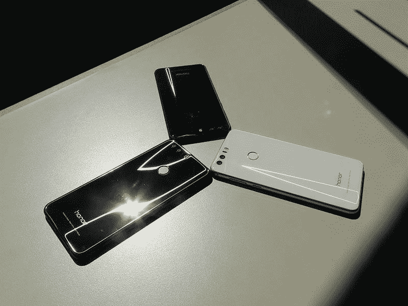
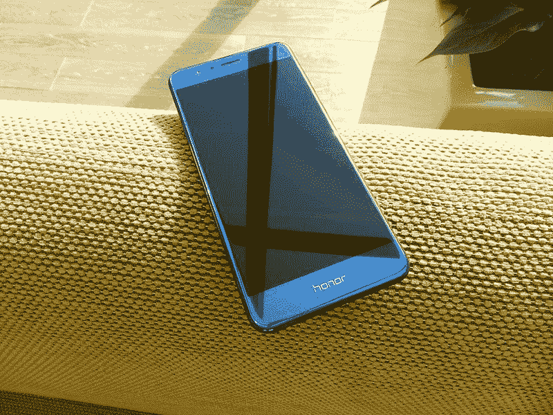
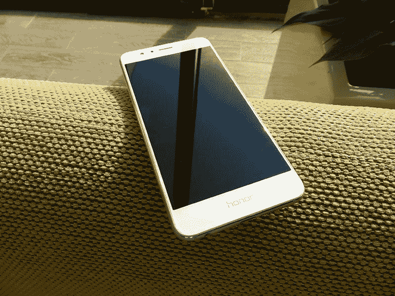

# 图片中的荣誉 8:蓝色、黑色和白色

> 原文：<https://www.xda-developers.com/honor-8-colors/>

Honor 8 有三种不同的颜色选择，可以真正改变您设备的个性。午夜黑、宝石蓝和白珍珠可供选择，我们想向您展示每个选项的一些图片，并讨论它们的区别。简单提醒一下我们与 Honor 的[合作关系，在这里，只要活跃在 XDA 的 Honor 论坛上，你就可以](http://www.xda-developers.com/xda-and-honor-kick-off-partnership/)[赢得奖品](http://www.xda-developers.com/honor-community-incentive-program/)。另外，一定要看看[荣誉 8 论坛](http://forum.xda-developers.com/honor-8)。

这些不同的颜色并不像你在许多智能手机中看到的那样应用于闪亮的塑料机身。这些有非常金属的外观，并被包裹在 15 层光捕捉材料。这使得你的设备的颜色很重要，因为它不仅改变了手机的外观，还影响了光的折射。

 <picture></picture> 

Reflections of light on the back side of the Honor 8

将 Honor 8 放在其他 Android 设备旁边，它将与来自您的手机的明显而独特的反射一起脱颖而出。

 <picture></picture> 

The Honor 8 in Midnight Black

使用午夜黑选项，反射更暗，使手机看起来类似于黑色跑车。在手机的正面，边框和屏幕之间的对比度会降低，从而形成这种黑色的高级外观。

 <picture></picture> 

The Honor 8 in Sapphire Blue

宝石蓝选项的表面具有多种个性:有时它看起来像明亮的金属蓝，如上图所示，有时它更像深蓝，让我们想起海洋。它具有一定的反射深度，使光线看起来好像穿过了手机表面，照亮了手机下面的玻璃层。这是一个非常大胆和引人注目的选择。

 <picture></picture> 

Honor 8 in White Pearl

白色是电子产品的流行颜色，因为它能最好地隐藏指纹，是确保所有技术匹配的一种方式。简洁的白边与 Honor 8 明亮生动的外观相得益彰。手机的背面看起来很漂亮，银色的金属装饰围绕着边缘，勾勒出指纹传感器的轮廓。

侧杆的颜色根据蓝色和黑色版本(分别为蓝色和黑色)的颜色进行搭配，而白色型号的侧杆为银色。

这里有更多不同选项的照片。看看哪一个最适合你。

[**购买荣誉 8**](https://store.hihonor.com/us/honor-8?utm_medium=display&utm_source=xda&utm_campaign=campaign_xdahub)

[**XDA 荣誉枢纽**](http://forum.xda-developers.com/honor-hub/)

[**荣誉 8 回顾**](http://www.xda-developers.com/honor-8-xda-review/)