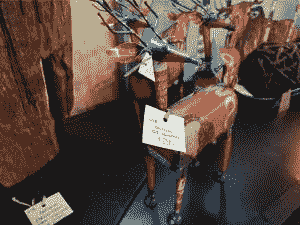
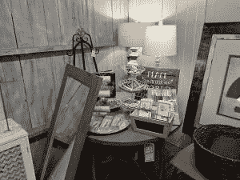
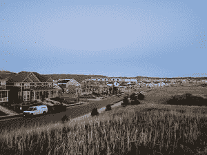
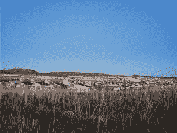
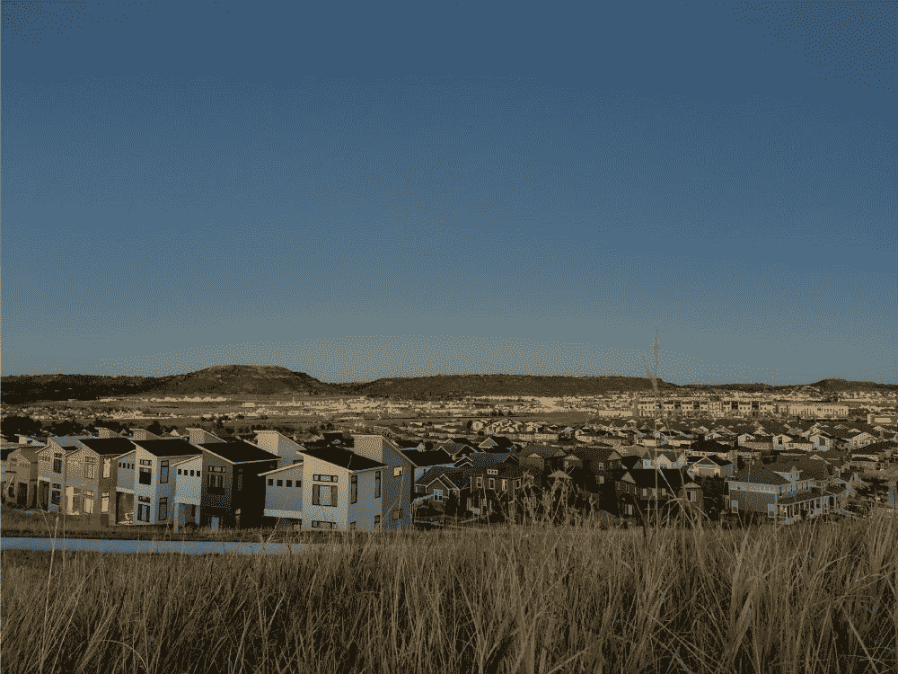
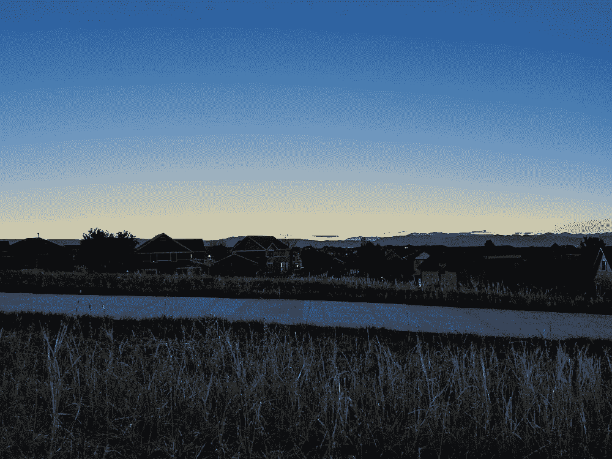
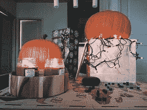
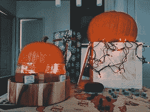
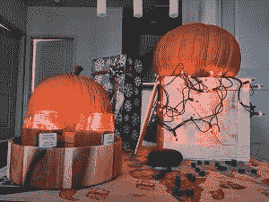

# 荣誉 8X 相机测试

> 原文：<https://www.xda-developers.com/honor-8x-camera-test/>

在这个 XDA 电视视频中，我们将荣誉 8X 进行了终极相机测试。我们将它与 Honor 最近推出的其他手机进行了比较，测试了视频功能、自拍模式、慢镜头以及你能想到的所有其他功能。

下面你会发现我们在这个视频中分析的照片样本。

| 

荣誉 8X

 | 

规范

 |
| --- | --- |
| 照片分辨率[返回] | 5120x3840 |
| 照片分辨率[正面] | 4608x3456 |
| 视频分辨率[返回] | 1920x1080 [60FPS] |
| 视频分辨率[正面] | 1920x1080 [30FPS] |
| AI 模式分辨率[返回] | 3968x2976 |
| 慢动作解析[返回] | 1280x720 [120/480FPS] |

# 室内拍摄

以下照片是在室内理想的光线条件下拍摄的。这些镜头没有启用人工智能模式。

[第四段]

 <picture></picture> 

Honor 8X Photo [Default Photo Mode]

[/第四段][第四段]

 <picture></picture> 

Honor 8X Photo [Default Photo Mode]

[/第四段][第四段]

 <picture></picture> 

Honor 8X Photo [Default Photo Mode]

[/第四段][第四段]

 <picture></picture> 

Honor 8X Photo [Default Photo Mode]

[/第四段]

# 夜间拍摄

以下样本中的前四张照片是在黄昏时用默认照片模式拍摄的。后两张照片是用夜间模式拍摄的。夜间模式拍摄需要三脚架或其他东西来保持手机在拍摄时完全静止。

[第四段]

 <picture></picture> 

Honor 8X Photo [Default Camera Mode]

[/第四段][第四段]

 <picture></picture> 

Honor 8X Photo [Default Camera Mode]

[/第四段][第四段]

 <picture></picture> 

Honor 8X Photo [Default Camera Mode]

[/第四段][第四段]

 <picture></picture> 

Honor 8X Photo [Default Camera Mode]

[/第四段]

 <picture></picture> 

Honor 8X Photo [Night Mode]

 <picture></picture> 

Honor 8X Photo [Night Mode]

# 与其他设备相比，荣誉 8 倍

为了进行比较，我将荣誉 8X 与荣誉 7X、荣誉游戏和荣誉 10 进行了对比。有人工智能功能的手机会为这些照片样本打开人工智能功能。

[第四段]

 <picture></picture> 

Honor 7X [Default Photo Mode]

[/第四段][第四段]

 <picture></picture> 

Honor 8X [AI Mode]

[/第四段][第四段]

 <picture></picture> 

Honor 10 [AI Mode]

[/第四段][第四段]

 <picture></picture> 

Honor Play [AI Mode]

[/第四段]

###### 我们感谢 Honor 赞助了这篇文章。我们的赞助商帮助我们支付与运行 XDA 相关的许多费用，包括服务器成本、全职开发人员、新闻撰稿人等等。虽然您可能会在门户内容旁边看到赞助内容(这些内容将始终被标记为赞助内容),但门户团队对这些帖子不承担任何责任。赞助内容、广告和 XDA 仓库完全由一个独立的团队管理。XDA 绝不会通过接受金钱来赞扬一家公司，或以任何方式改变我们的观点或看法，从而损害其新闻诚信。我们的意见不能被收买。