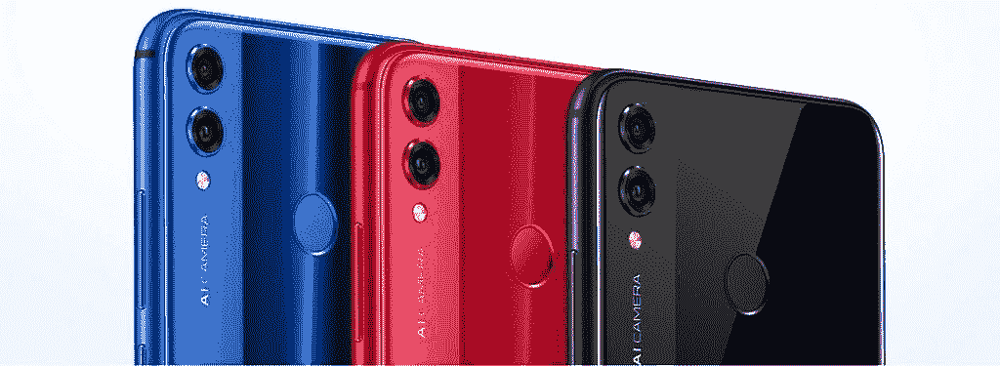

# 在中欧和东欧推出屏幕与机身比例为 91%的 Honor 8X

> 原文：<https://www.xda-developers.com/honor-8x-central-eastern-europe/>

在捷克共和国布拉格举行的一次活动中，Honor 宣布在中欧和东欧国家推出 Honor 8X 智能手机。Honor 8X 于上个月初在中国推出，随后在 T2、英国和 T4 上市，不久将在美国上市。这款设备拥有 6.5 英寸的显示屏，屏幕与机身的比例高达 91%，底部边框宽度为 4.25 毫米。就规格和价格而言，这是一款中档设备，但 Honor 希望这款手机的显示屏和过多的人工智能软件功能能够给该公司带来 Honor 10 在欧洲取得的同样成功。

Honor 是中国的顶级在线品牌，俄罗斯和印度的前 2 名品牌，西班牙的前 5 名品牌，在捷克共和国增长了 100%，在英国增长了 200%。Honor 与红牛达成了合作伙伴关系，以推广他们的产品。该公司在海外迅速发展，Honor 正在欧洲全力推广 Honor 8X。Honor 8x 在中欧和东欧的发布显示了该公司对人工智能手机的宏伟计划。

## 荣誉 8X 有黑色、蓝色和红色

 <picture></picture> 

Honor 8X in Blue, Red, and Black

## 荣誉 8X 显示屏

 <picture></picture> 

Display on the Honor 8X

Honor 以 8X 上令人难以置信的 91%的屏幕与机身比例而自豪。这是由膜上芯片( [COF](https://www.xda-developers.com/how-the-honor-8x-got-its-ultra-slim-chin/) )技术实现的，该技术使 8X 的底部边框非常薄。下面是 Honor 8X 的底部边框宽度与几款竞争旗舰智能手机的对比。

Honor 8X 是首款获得德国莱茵 TV 低蓝标准认证的智能手机。这意味着手机发出的蓝光较少，有助于保护你的眼睛。

## 遵循 8X 规格

| 

规格

 | 

荣誉 8X

 |
| --- | --- |
| 尺寸和重量 | 160.4 x 76.6 x 7.8 毫米 175 克 |
| 显示 | 6.5 英寸(2340 x 1080) 19.5:9 凹槽显示屏。16.7M 彩色，NTSC 85%。91%的屏幕与机身比例和 4.25 毫米的下边框宽度。 |
| CPU/GPU | 海思麒麟 710 配 Mali-G51 MP4 GPU |
| 随机存取存储 | 4GB |
| 储存；储备 | 64GB/128GB，最高支持 400GB microSD 卡插槽 |
| 电池 | 3750 毫安时 |
| 后置摄像头 | 20MP (f/1.8 光圈)+ 2 MP，LED 闪光灯，480fps 慢动作录制 |
| 前置摄像头 | 16MP (f/2.0 光圈)、4 合 1 像素宁滨和 AI 美颜 |
| 软件 | 安卓 8.1 奥利奥配 EMUI 8.2 |
| 连通性 | WiFi 802.11 ac (2.4 和 5GHz)，蓝牙 5，GPS，GLONASS900MHz，1800MHz，800MHz，2GHz，频段 38，频段 39，频段 40，频段 41 (2555-2575 MHZ，2575-2635 MHZ，2635-2655 MHZ)，频段 1，频段 3，1.9 GHz，I，VIII |
| 安全性 | 指纹扫描仪(背面) |

## 支持 8X 软件特性

在台上，该公司详细介绍了新智能手机中的许多人工智能相机功能:

*   AI 场景识别:Honor 8X 可以识别 22 个类别的 500 多个场景。
*   AI 超级夜拍:最高 6 秒曝光时间，夜间拍出更好的照片。
*   AI 运动镜头:捕捉快速移动物体的图片。
*   AI 超级慢动作:以 480fps 的速度捕捉 720p 分辨率的视频。
*   AI 背光人像:补偿过度曝光的正面人像拍摄，以拍摄更好的自拍。
*   AI 夜间自拍:放大曝光量拍出更亮的自拍。

除了摄像头，AI 还集成到了软件的所有部分。这款手机可以在阳光下自动提高亮度，并在需要时将亮度调至低至 2 尼特。当您失去数据连接时，内置的电梯模式可以帮助您快速重新连接到 4G，当您处于弱信号环境中时，呼叫增强功能可以显著改善呼叫音频质量。

## 在中东欧地区实现 8 倍的价格和可用性

荣誉 8X 将在中欧和东欧国家提供黑色、蓝色和红色。4GB 内存和 64GB 存储型号是€279，而 4GB 内存和 128GB 存储型号是€309。

[**荣誉 8X 产品页面(捷克)**](https://www.hihonor.com/cz/products/smartphone/honor8x/)

[**荣誉 8X 产品页面(英国)**](https://www.hihonor.com/uk/product/10044326379164.html#10044952845841)

[**加入荣誉 8X 论坛**](https://forum.xda-developers.com/honor-8x)

## 荣誉乐队 4

发布会上还公布了 Honor Band 4 智能穿戴。它有一个全彩色 0.95 英寸 AMOLED 显示屏，用于非接触式支付的 NFC 芯片，100 毫安时电池，实时心率传感器，睡眠跟踪，多种锻炼类型，防水，可以识别你如何游泳。荣誉乐队 4 将花费€59 英镑，并将于本月晚些时候推出。

* * *

###### *我们感谢 Honor 赞助这篇文章。我们的赞助商帮助我们支付与运行 XDA 相关的许多费用，包括服务器成本、全职开发人员、新闻撰稿人等等。虽然您可能会在门户内容旁边看到赞助内容(这些内容将始终被标记为赞助内容),但门户团队对这些帖子不承担任何责任。赞助内容、广告和 XDA 仓库完全由一个独立的团队管理。XDA 绝不会通过接受金钱来赞扬一家公司，或以任何方式改变我们的观点或看法，从而损害其新闻诚信。我们的意见不能被收买。*