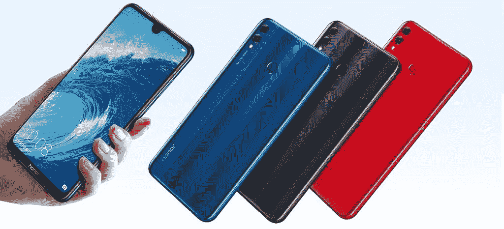

# Honor 8X 和 Honor 8X Max 在中国发布，配备大显示屏和双摄像头

> 原文：<https://www.xda-developers.com/honor-8x-honor-8x-max-specs-pricing-availability/>

今天在中国举行的一次活动上，Honor 发布了他们最新的中端智能手机:Honor 8X 和 Honor 8X Max。这些是中端智能手机，具有 2018 年设备的所有特征:凹槽、双后置摄像头和大显示屏。要吸收的信息很多，所以让我们把事情分解一下。以下是 Honor 8X 和 Honor 8X Max 的规格、定价和供货情况。

## 荣誉 8X

今天推出的这款设备及其产品页面可以在[中国荣誉网](http://www.honor.cn/)上看到。X 系列荣誉手机是他们的预算系列，每年在假期前后都会有一个新成员。Honor 8X 是第一款搭载海思麒麟 710 芯片组的 Honor 设备，能够实现我们在搭载海思麒麟 970 的 Honor 10 中看到的人工智能功能。这款手机拥有 6.5 英寸的显示屏，屏幕与机身的比例高达 91%。您可以在下表中找到完整的规格。

| 

规格

 | 

荣誉 8X

 |
| --- | --- |
| 尺寸和重量 | 160.4 x 76.6 x 7.8 毫米 175 克 |
| 显示 | 6.5 英寸(2340 x 1080) 19.5:9 凹槽显示屏。16.7M 彩色，NTSC 85%。91%的屏幕与机身比例。 |
| CPU/GPU | 海思麒麟 710 配 Mali-G51 MP4 GPU |
| 随机存取存储 | 4GB/6GB |
| 储存；储备 | 64GB/128GB |
| 电池 | 3750 毫安时 |
| 后置摄像头 | 20MP (f/1.8 光圈)+ 2 MP，LED 闪光灯，480fps 慢动作录制 |
| 前置摄像头 | 16MP (f/2.0 光圈)、4 合 1 像素宁滨和 AI 美颜 |
| 软件 | 安卓 8.1 奥利奥配 EMUI 8.2 |
| 连通性 | WiFi 802.11 ac (2.4 和 5GHz)，蓝牙 5，GPS，GLONASS900MHz，1800MHz，800MHz，2GHz，频段 38，频段 39，频段 40，频段 41 (2555-2575 MHZ，2575-2635 MHZ，2635-2655 MHZ)，频段 1，频段 3，1.9 GHz，I，VIII |
| 安全性 | 指纹扫描仪(背面) |
| 颜色；色彩；色调 | 黑色、蓝色、红色、紫色 |

Honor 8X 将在中国以 1399 美元(约 204 美元/辆)的价格发售。4GB 内存和 64GB 存储版本的价格为 14，695，而 6GB 内存和 64GB 存储版本的价格为**1599(～234 美元/Rs。6GB 内存和 128GB 存储版本的价格 **1899 英镑(～278 美元/卢比。19950)**。这款手机将于 9 月 11 日开始销售。下个月这款手机将在全球发布，我们仍在努力获取更多信息。**

如果你对这款设备感兴趣，Honor 8X 的 XDA 论坛已经开通。如果你感兴趣，那么[访问这个帖子](https://forum.xda-developers.com/honor-8x/how-to/tell-honor-x-series-smartphone-honor-8x-t3838663)因为荣誉正在举办一个竞赛来赢得一个 8 倍的荣誉。

[**加入荣誉 8X 论坛**](https://forum.xda-developers.com/honor-8x)

[**【荣誉 8X 赠品(赞助)**](https://forum.xda-developers.com/honor-8x/how-to/tell-honor-x-series-smartphone-honor-8x-t3838663)

## 荣誉最大 8 倍

另一款发布的手机是 Honor 8X Max。这是我们第一次看到 Honor X 系列推出的两款手机。Honor 8 Max 是一款巨大的 7.12 英寸手机，采用骁龙 636 芯片组，而不是麒麟 710。

 <picture></picture> 

Honor 8X Max in Black, Blue, and Red

| 

规格

 | 

荣誉最大 8 倍

 |
| --- | --- |
| 尺寸和重量 | 177.57 x 86.24 x 毫米 210 克 |
| 显示 | 7.12 英寸(2244x1080) 18.7:9 凹槽显示屏。1670 万色，NTSC 72%。 |
| CPU/GPU | 采用 Adreno 509/512 GPU 的高通骁龙 636/660 |
| 随机存取存储 | 4GB/6GB |
| 储存；储备 | 64GB/128GB，通过 microSD 可扩展至 256GB |
| 电池 | 5000 毫安时 |
| 后置摄像头 | 1600 万像素(2.0 光圈)+200 万像素(2.4 光圈)，LED 闪光灯 |
| 前置摄像头 | 800 万像素(f/2.0 光圈) |
| 软件 | 安卓 8.1 奥利奥配 EMUI 8.2 |
| 声音的 | 3.5 毫米耳机插孔，杜比全景声，360°音频 |
| 连通性 | WiFi 802.11 ac (2.4 和 5GHz)，蓝牙 4.2，GPS，GLONASSTD-LTE:B38/B39/B40/B41；LTE FDD:B1/B3/B5/B8；TD-SCDMA:B34/B39；WCDMA: B1/B5(漫游)/B8；CDMA:1X & EVDO BC0；GSM: B2(漫游)/ B3 / B8 |
| 端口/按钮 | microUSB，USB 2.0 |
| 安全性 | 指纹扫描仪(背面) |
| 颜色；色彩；色调 | 黑色、蓝色、红色 |

Honor 8X Max 在中国的售价为**1499(～219 美元/Rs。4GB 内存和 64GB 存储版本的价格为 15，745 美元，T2 的价格为 1799 美元(约 263 美元/卢比。18，900) 针对 4GB RAM 和 128GB 存储版本。这两款处理器都搭载了配备 Adreno 509 GPU 的高通骁龙 636。搭载高通骁龙 660 和 Adreno 512 GPU 的 6GB 内存和 64GB 存储版本将于下月上市。没有关于全球发行的信息。**