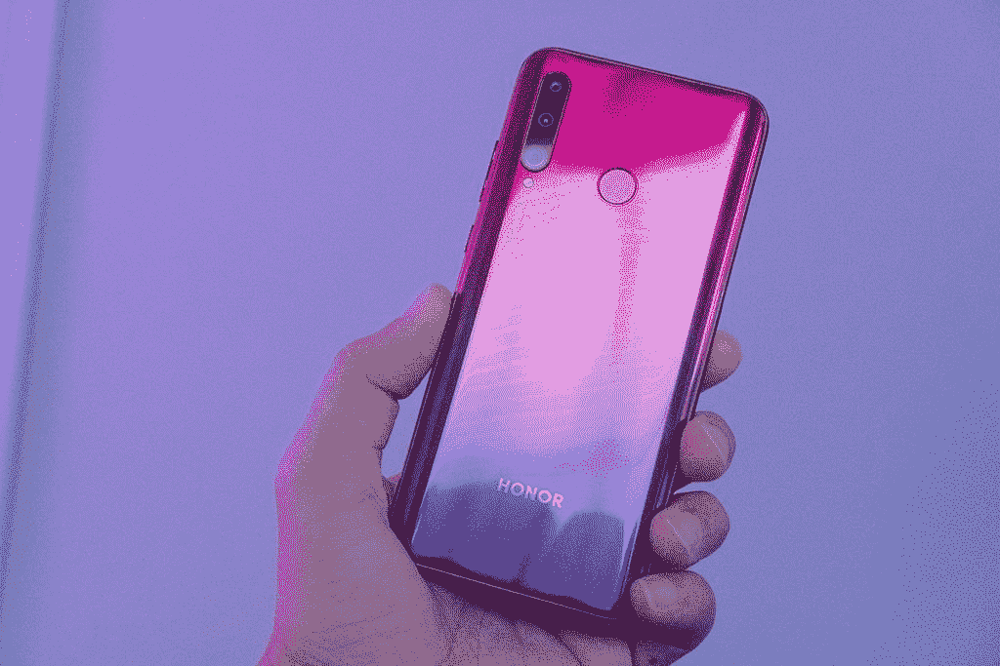
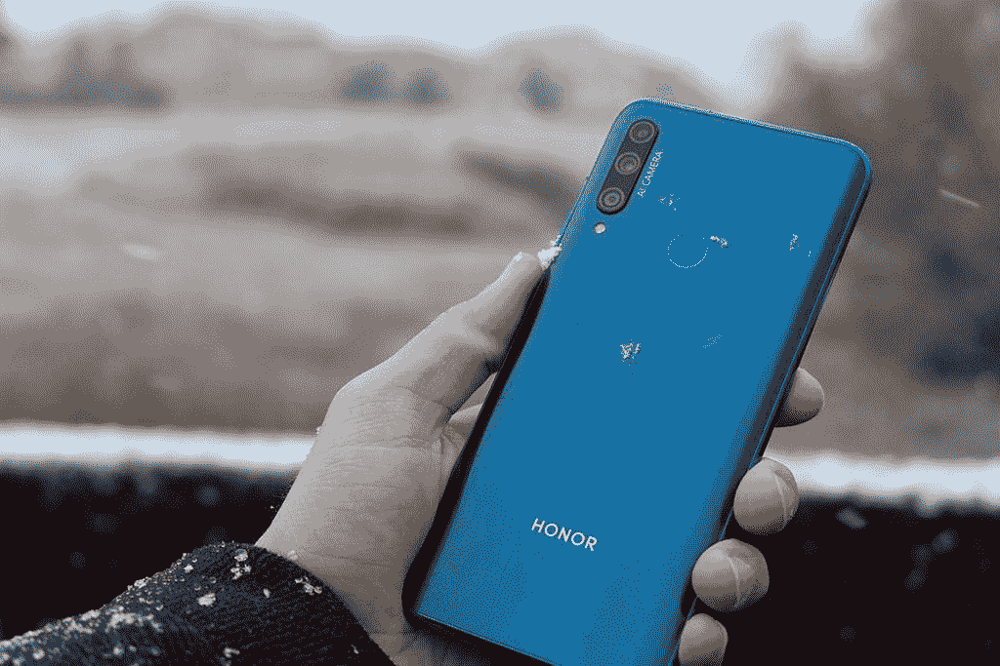
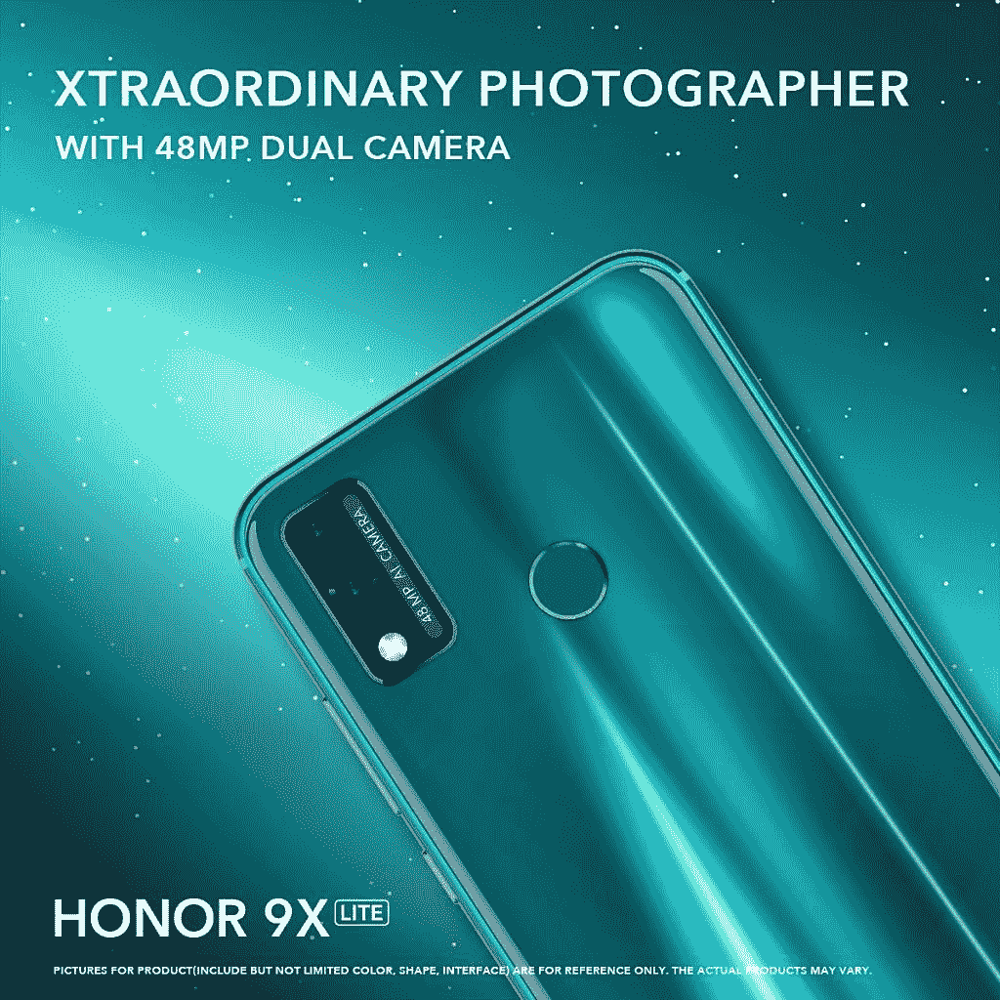
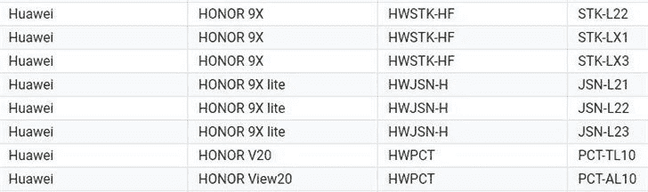

# HONOR 9X Lite 将采用 4800 万像素的双摄像头

> 原文：<https://www.xda-developers.com/honor-9x-lite-48mp-camera/>

智能手机制造商 HONOR 发布了一款新手机的预告图。这张图片展示了一款带有双摄像头的蓝绿色手机。标语“超普通摄影师”显示在顶部，而手机显示在左下角是 HONOR 9X Lite。过去几年，HONOR X 系列手机一直是市场上最便宜的手机之一。这些手机的精简版价格较低，通常会牺牲一些显示屏和摄像头质量来达到较低的价位。

 <picture></picture> 

HONOR 20 Lite

HONOR 20 Lite 是 HONOR 最近推出的一款 *Lite* 手机。作为 Honor 20 和 20 Pro 的预算版本，这款手机的规格比该系列中的其他产品低得多。虽然芯片组和内存可能较慢，但 HONOR 20 Lite 共享了一些相同的相机功能，使该系列独一无二。三镜头相机设置具有一个广角镜头和一个微距镜头。不同手机的相机设置的延续是将手机的精简版与其旗舰版联系起来的原因。了解了这些，我们就可以根据我们对 HONOR 9X 的了解，对即将到来的 HONOR 9X Lite 做一些预测了。

HONOR 9X 最显著的特点是带有弹出式自拍相机的全视角显示器。虽然目前还不清楚 HONOR 9X Lite 是否也会有这一功能，但我们可以对规格进行一些很好的猜测。

 <picture></picture> 

Honor 9X Back

 <picture></picture> 

Honor 9X Front

HONOR 9X Lite 将采用 1080p 显示屏。确切的分辨率将取决于它是否具有与上面显示的 HONOR 9X 相同的全视图显示。芯片组将是麒麟 710 或 710F，这是华为当前一代预算芯片组，在所有入门级手机中均有使用。RAM 容量可能会达到 4GB，但他们也有可能选择 6GB。HONOR 最近的“Lite”手机是 Honor 20 Lite，它配备了 128GB 的存储空间，可以肯定 HONOR 9X Lite 也将拥有这一容量。

新手机最有趣的方面将是 4800 万像素的摄像头。我们已经在廉价手机中看到了 4800 万像素的摄像头，但 Lite 系列通常价格更低，有时不到 200 美元。如果这种情况发生，这可能是最实惠的 48MP 相机手机之一。

 <picture></picture> 

Honor 9X Lite Teaser Image

除了我们可以对这款即将推出的手机的规格进行假设之外，我们还可以自信地说，这款手机将搭载谷歌服务。考虑到美国对华为的持续禁令，这令人惊讶。然而，HONOR 9X Lite 的这些条目出现在谷歌服务注册网站上。

 <picture></picture> 

HONOR 9X Lite Certified for Google services.

在这张截图中，我们可以看到新手机的型号将是 JSN-L21，JSN-L22 和 JSN-L23。我们将继续关注这款手机，并随时提供最新消息。

###### 我们感谢 HONOR 赞助了这篇文章。我们的赞助商帮助我们支付与运行 XDA 相关的许多费用，包括服务器成本、全职开发人员、新闻撰稿人等等。虽然您可能会在门户内容旁边看到赞助内容(这些内容将始终被标记为赞助内容),但门户团队对这些帖子不承担任何责任。赞助内容、广告和 XDA 仓库完全由一个独立的团队管理。XDA 绝不会通过接受金钱来赞扬一家公司，或以任何方式改变我们的观点或看法，从而损害其新闻诚信。我们的意见不能被收买。