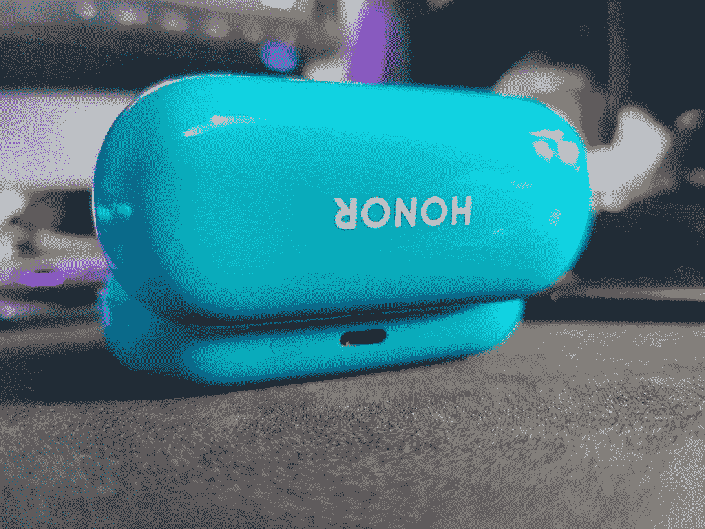
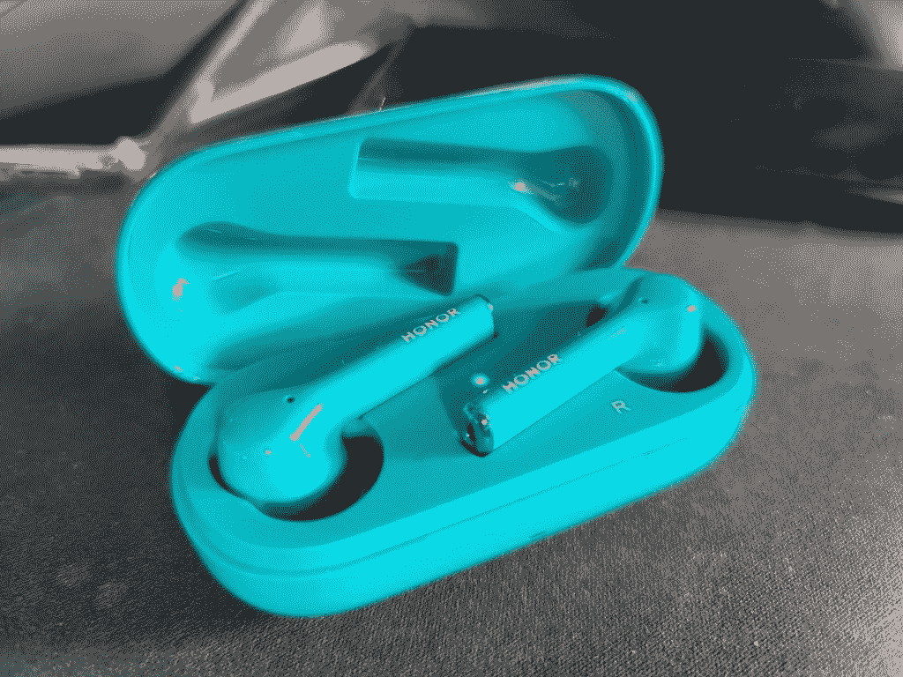

# 荣誉魔术耳塞评论-明显平均无线耳塞

> 原文：<https://www.xda-developers.com/honor-magic-earbuds-review/>

二月底，Honor 在“非 MWC”发布了 Honor Magic 耳塞。它们是该公司 11 月份与 Honor V30 系列一起发布的 Honor FlyPods 3 的西方版本，尽管它们 3 月份才在中国上市。几周前，Honor 在欧洲通过自己的 HiHonor 商店在西方推出了 Honor Magic 耳塞。这款耳塞也将于 5 月 21 日在英国上市，售价 99 英镑。我们得到了一副知更鸟蛋蓝色耳机来测试，我必须说，我有点不感兴趣。它们是真正的无线设备，这意味着就像 AirPods 一样，它们甚至不需要颈带就可以放在你的耳朵里。不过，它们不是 AirPods。

## 设计

Honor Magic 耳塞装在一个蓝色的便携充电盒中。充电盒也可以使用 USB-C 电缆充电，它足够小，当你不使用它们时，你可以把它放在口袋里。这个充电盒的背面还有一个按钮，您可以使用它将耳机同步到您的设备。为此，请将耳机留在外壳内，然后打开盖子，按住背面的 pair 按钮 3 秒钟。这个按钮有点难按，因为它在背面足够高，你也可以开始按盖子。

 <picture></picture> 

The sync button (on the left of the charging port) can be a little bit finicky to press and hold.

一旦它们进入配对模式(从白色闪烁的灯光可以明显看出)，你就可以像往常一样连接手机，然后取出耳塞。我的电视机没有说明书，因此，我花了几分钟才自己弄明白。不可否认，这不是最直观的，但如果你真的有使用手册或者有使用华为免费软件的经验，这应该不成问题。我经常更换设备，我发现配对过程相当轻松。取出耳机，放入盒中，按住按钮，连接新设备。这很简单，也很有效。

 <picture></picture> 

The white light indicates that they are in pairing mode.

耳机本身很小，附带的标准大小的耳尖完全贴合我的耳朵。我的头发是非常亮的蓝色，与我的红头发形成鲜明的对比。老实说，我更喜欢白色的一对，但知更鸟蛋蓝色耳机有自己的身份，看起来不仅仅是 AirPod 的克隆。

 <picture></picture> 

The Honor Magic Earbuds sit comfortably in the ear, though the Robin Egg Blue ones are quite bright. Also, I need a haircut.

然而，我很快意识到的一件事是缺乏高通 aptX 高清支持。实际上，除了 Honor 20 Pro，我不得不在几乎所有测试设备上手动启用“高质量音频”设置。根据 logcat 的调查，Honor 20 Pro 会在连接时自动启用 AAC(高质量模式),而在其他设备上，需要手动启用。请记住，如果你在非 Honor 或华为设备上使用这些功能，你可能需要手动启用 AAC，因为当它被禁用时，这可能会非常明显。

## 荣誉魔法耳塞音频质量

荣誉魔术耳塞承诺高品质的音频，但我发现他们最终相当平淡无奇。我不指望世界上最好的音频质量的真正无线耳塞“只”花费 99 欧元，但我仍然对音频质量相当失望。

交易是这样的——对于这个价位的真正无线、有源降噪耳机，有些东西必须放弃。遗憾的是音质是其中之一。有一种奇怪的音频技巧可以实现“强大的低音”(正如盒子所说)，其中音频频谱的低端在较高频率以上的音量得到增强。这给人一种强有力的低音的错觉，同时实际上使它听起来有些模糊和怪异，在技术上压制了较高的频率，但实际上没有提供强大的硬件来利用它，听起来很好。我有音乐制作的背景，无论如何更喜欢干净、平坦的音频，这可能会导致对低端提升的一些偏见，但我仍然忍不住感到失望。我在听 ILLENIUM 的“上帝该死”时测试了这一点，在每次踢腿时，低音听起来像是盖过了混音中的几乎所有其他东西。喜欢重低音音频的人可能会喜欢，但我绝对不会。

这并不是说音频质量一定*差* -这只是不是我喜欢的。我几乎整天都在电脑上使用一副森海塞尔 Momentum 2.0 耳机，在手机上，我使用更贵的 OPPO Enco Q1 无线耳机。就像 OPPO 耳机一样，Honor Magic 耳塞也有主动降噪功能。为了荣誉，它真的，真的很好。

说到通话，Honor Magic 耳塞的音质堪称完美。这里没有真正的抱怨，前面提到的主动噪音消除在电话中非常有用。虽然由于爱尔兰正在进行的封锁，我没有在任何繁忙的空间如火车上测试它们，但 ANC 在过滤我周围更基本的噪音方面做得很好。我想象这些耳机在火车上和飞机上会很完美——如果电池能承受的话。(我们将在下一部分讨论电池寿命。)音量变得相当大，ANC 会过滤掉你周围的声音，这样你就可以以较低的音量播放音乐。我在通话中特别注意到的一件事是，音频偶尔会在左右声道之间随机跳跃。

麦克风的音质也很好，让我印象深刻。它位于右耳机底部，可以很好地接收我的声音。有些噪音听起来就像声音一样大，所以要小心你周围的环境。例如，它在我的键盘上听到的音量与我打电话时的声音相同，但没有以相同的音量听到关门之类的事情。我认为这是因为它挑选出最有可能包含人声的频率，并将这些频率提高到其他频率之上，这就是为什么在通话中，我的键盘声音对电话另一端的人来说是非常讨厌的。

## 荣誉魔法耳塞电池寿命

Honor Magic 耳塞进行了第二次妥协，那就是在它们的电池寿命上。虽然广告称它们在使用时可以达到 2.5 小时的通话时间，但我相信这是在禁用 ANC 的情况下。开着 ANC，他们死之前我只打了 1 小时 45 分钟的电话。对于一般的听力来说，它们要好很多，但我仍然发现电池寿命相当短。由于封锁，我不能在日常通勤中再次测试它们，但在我需要把它们扔进充电盒之前，它们肯定会支持我 2 个小时的旅程。充电盒会在一个小时左右将它们从 0%充到 100%，而充电盒本身会在 1 个半小时左右充到 100%。

听音乐时，耳机在 ANC 关闭的情况下可持续使用 3 个半小时，在 ANC 打开的情况下可持续使用 3 个小时。打开 ANC，你将获得大约 2 小时的通话时间，关闭 ANC，你将获得大约 2 个半小时。我在开着 ANC 的情况下打了 1 小时 45 分钟的电话，所以离这个时间不算太远。不过，总的来说，电池续航时间很差。充电盒也不能给耳机快速充电，这令人失望，尽管这对于大约 10 小时的额外播放时间来说是好的。这些是**而不是**全天耳塞，所以你需要经常给它们充电。这些耳塞的理想使用情况是，你不会一直将它们的电量降低到 0%，相反，你会在一整天不使用它们的时候定期给它们充电。

## 荣誉魔法耳塞控制

Honor Magic 耳塞有许多不同的控制，可以通过双击或触摸并按住侧面来激活。我将左耳塞的双击手势设置为跳过曲目，而右耳塞的双击手势将暂停并播放音乐。能够通过双击暂停和播放音乐尤为重要，因为这些耳塞会在检测到其中一个耳塞离开耳朵时暂停音乐。

我经常会拔出耳塞来听我周围的声音，如果我把它插回去时音乐会自动播放就好了。Honor 说，当一个设备运行 EMUI 时，这个*会发生，但我不明白为什么这个基本功能不能在其他设备上存在。他们已经可以控制智能手机上音乐的暂停和播放状态，所以当你把耳塞放回耳朵时，发送继续播放音乐的请求应该是微不足道的。我也希望能够完全关闭这个功能，因为有时我只戴着一个耳塞听音乐。我把第二个放在我的口袋里，它会随机检测到它被放在耳朵里并被拿掉了，因此，音乐停止了。*

另一个令人沮丧的是，禁用 ANC 的唯一方法是触摸并按住侧面-这不能通过双击手势来实现。我发现，如果我侧身躺下，我经常会触摸并握住我躺着的耳塞的一边——完全是偶然的。你可以关闭这个控件，但是之后你就不能打开和关闭 ANC 了。

简而言之，控制是准确的，他们确实工作，但有一些缺陷，我感到惊讶，甚至存在。

### AI 生活 App

AI Life 应用程序是您需要从谷歌 Play 商店中获取的应用程序，用于配置和控制您的耳塞。这不是必须的，但无论如何值得下载。下面的三个截图几乎囊括了所有的特性。

## 结论

Honor Magic 耳塞佩戴舒适，音质一般，价格适中，并提供不错的主动降噪功能。然而，它们的电池寿命和缺乏控制选项*可能会*吸引你去别处看看。作为一套真正的无线耳塞，它们当然可以胜任这一工作，或许值得一试。他们不是**坏**，但我会鼓励那些考虑拿起他们权衡其他选择。

**购买 Honor Magic 耳塞:** [HiHonor 法国](https://www.hihonor.com/france/product/honor-magic-earbuds) ||| [HiHonor 荷兰](https://www.hihonor.com/nl/product/honor-magic-earbuds) ||| [HiHonor 德国](https://www.hihonor.com/germany/product/honor-magic-earbuds) ||| [HiHonor 意大利](https://www.hihonor.com/italy/product/honor-magic-earbuds)