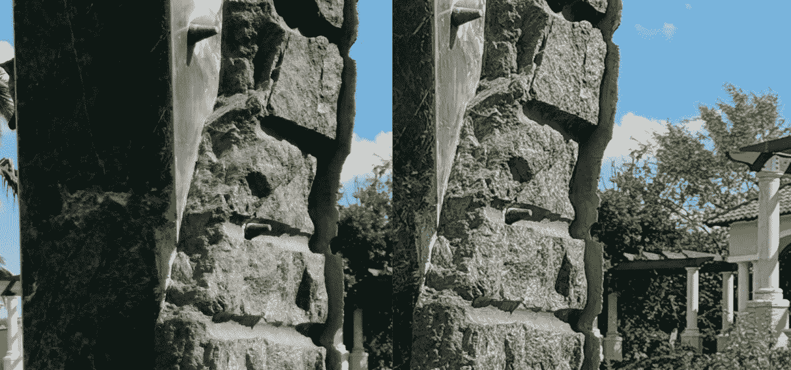

# 荣誉视图 20 相机质量审查-超出预期

> 原文：<https://www.xda-developers.com/honor-view-20-camera-review/>

在过去的几年里，Honor 品牌已经为自己赢得了很高的声誉。他们的智能手机在相机质量方面逐渐取得了进步，但随着 Honor View20 的推出，该品牌从双摄像头传感器到强大的 48MP 索尼传感器和 3D TOF 传感器实现了重大飞跃(稍后将详细介绍)。Honor View20 旨在改变人们认为你需要花费近 1000 澳元来购买一款出色的智能手机相机的看法，如果我可以提前发表我的意见，他们做得非常好。

* * *

## 荣誉视图 20 -摄像机硬件概述

首先，让我们看看荣誉观 20 到底是什么包装。Honor 没有采用华为 P20 Pro 或 LG V40 ThinQ 这样的三摄像头设置，也没有采用 OnePlus 6 或一加 6T 这样的双摄像头设置，而是坚持采用单主后置摄像头。毕竟，这仍然是一个更具预算的产品——尽管这个词在 2018 年被大大淡化了。他们决定采用的传感器是令人兴奋的 48MP [索尼 IMX586](https://www.xda-developers.com/sonys-imx586-48mp-smartphone-camera/) 1/2 英寸传感器，该传感器使用 quad-Bayer 设置和像素宁滨来输出 1200 万像素的图像，匹配到大小合适的 f/1.8 光圈镜头。手机背面还有第二个“摄像头”，但这是飞行时间(TOF)传感器，我们应该会在未来几个月的[更多设备](https://www.xda-developers.com/lg-confirms-g8-thinq-front-facing-tof-sensor/)上看到，比如 3D 拍摄、人像模式增强和面部解锁系统。

不过，回到 IMX586，你通常会看到 48MP 的小传感器，就像在 Honor View20 中发现的那样，这是一个缺点。由于传感器上百万像素的绝对数量，每个微米像素接收的光会更少。这就是为什么更大的百万像素数量并不总是更好，也是为什么智能手机上的相机传感器真的没有超过大多数设备上的 1200 万到 200 万像素数量。索尼希望在更多的预算市场上突破这道自我强加的墙；他们更突出的主流尝试之一是超高端华为 P20 Pro 上的 IMX600。IMX586 使用 quad-Bayer 排列，将输出分成每种颜色的 2x2 网格，使有效微米像素大小达到 1.6μm。现在，这不是一个简单的等式，因为 quad-Bayer 阵列不是 1:1，所以尽管索尼声称它“相当于”1.6μm，但它可能略小于 1.6 μm。这意味着，通常情况下，您将拍摄 4800 万像素的图像，并将其存储在 2x2 的区域中，以获得 12MP 的输出(12MPx4 = 48MP 万像素)，除非您选择新的 AI 清晰度模式，我们将在本次审查中测试这一模式。在正面，Honor 使用的是 25MP 索尼 IMX576 和 f/2.0 镜头，与后置传感器不同的是，它没有使用宁滨来改善弱光性能。

* * *

## 荣誉视图 20 照片对比详情

现在，让我们开始实际拍摄。为了这个比较，我真的在看 12MP 默认模式和 48MP AI 超清晰模式之间的质量差异。我确实在启用人工智能增强的 12MP 模式的情况下拍摄了每张照片，老实说，这与我喜欢的方式没有太大的差异。我还拍摄了大量以 h.265、1080p、30 帧/秒和 60 帧/秒编码的视频，以及以 30 帧/秒编码的 4K。遗憾的是，Honor View20 目前不支持该设备上 60fps 的 4K，但它在 4k@30fps 和 1080p@30fps 设置下提供了一些非常出色的图像稳定功能。为了这次评测，我带了一台 OnePlus 6，我可能会不时地提到它，但**这不是两个**之间的比较——下周晚些时候将在 [XDA 电视台](https://www.youtube.com/user/xdadevelopers)播出，请继续关注。

我们将浏览并讨论每张图像，但这里有一些要点:Honor View20 相机是我认为最出色的，它具有出色的色彩再现能力、出色的动态范围和出色的图像处理能力。这些高点被少数明显的低点所抵消。夜间模式有一点不尽人意，噪音比我通常希望看到的要大。此外，可能会有很多锐化和增亮，让更精细的细节更加突出，这在某些情况下实际上可能会分散注意力——这影响了人工智能和标准拍摄模式。在视频中，4k@60fps 的缺乏会影响一些情况，但我认为这是我见过的最好的图像稳定之一，并且没有明显的传感器裁剪。这在一定程度上被动态范围问题所抵消，动态范围问题往往会过度曝光许多细节，尤其是前置摄像头，最终用户应该可以使用曝光补偿设置来抵消这一点，并将在很大程度上纠正这一问题。

* * *

### 荣誉视图 20 照片对比#1

我们测试中的第一张图片是这种开着黄色和白色花朵的盆栽植物。这是一个非常明亮的设置，有很多颜色和背景细节，通常会分散主体的注意力。f/1.8 镜头是我感觉最适合智能手机的；它能让光线很好地进入，并且不会大到让细节成为问题。荣誉视图 20 增强了这里的一些阴影，这是手机的一个常见特征，但它不会以一种过于分散注意力的方式这样做。此图像的直方图显示了出色的色彩平衡，没有对任何颜色或级别进行剪裁。48MP 的镜头显示了这个传感器是什么，没有荣誉使用的处理。这仍然是一张非常好的照片，虽然它更真实，但对除了内心纯粹主义者之外的所有人来说，它的吸引力有所下降。正常的人工智能模式稍微调整了一下白平衡，使阴影变暗，并使黄色的花在颜色上更加逼真。总的来说，这是一个在普通和人工智能增强的 12MP 图像之间的胜负，因为它们都很出色。

* * *

### 荣誉视图 20 照片对比#2

这下一个镜头是相当棘手的，再次荣誉观 20 做了出色的工作。树木在照片的中间投下了中等的阴影，但是在右上方的树枝之间，你仍然可以看到蓝天。这与人工智能模式所做的形成了鲜明的对比，人工智能模式不恰当地平衡了镜头，炸出了天空和右侧的人行道。与第一幅图像一样，色彩再现非常逼真，整体图像非常吸引人。沿着这些路线，人工智能模式稍微控制了图像，降低了高光并调整了颜色。我对人工智能模式感到相当震惊，因为我预计它会像 LG 和三星的人工智能模式那样表现过度饱和和曝光过度。荣誉视图上的 AI 对形象有积极的影响，我真的看不出有什么理由让它失效。48MP 模式“错过”了镜头，但老实说，天空超级明亮，吹出来的人就是这样，但真实的生活并不总是最吸引人的最终结果，就像这里的情况一样。

* * *

### 荣誉视图 20 照片对比#3

下一张岩石雕像的图片再次重复了这个公式。正常拍摄模式在曝光时比人工智能模式亮 2 档。48MP 的拍摄非常不同，我想在这里强调的是细节的层次和这些细节的准确性。我经常想知道，在处理能力几乎超过原始图像硬件的现代智能手机上，更多的百万像素是否真的有益。谷歌像素。这是一个很好的例子，说明了更多的百万像素与图像处理的冲突。乍一看下面的放大和分割图像，你可能会认为 4800 万像素的图像在右边，因为你可以看到更多。然而，事实恰恰相反。左边的 4800 万像素的图像比 1200 万像素的图像更柔和，但由于有更多的原始细节，所以更真实。12MP 的镜头试图通过处理、突出边缘和锐化来弥补其较低质量的图像，以达到类似的效果——但更多的处理并不能取代更多的数据。尽管如此，12MP 默认模式和普通人工智能模式总体上提供了更有吸引力的图像，只要放大 3 倍不是你想要做的事情。

 <picture></picture> 

48MP Ultra Clarity | 12MP Standard

### 荣誉视图 20 照片比较相册

### 12MP -标准

###  12MP AI 增强版

###  48MP -超清晰

这几批图像显示了同样的事情。默认的 12MP 图像提供了更好的最终结果，这要归功于 Honor 对每张图像进行的出色且很少错位的图像处理。这并不是说 4800 万像素的图像不好——事实并非如此——在某些情况下，它们达到了其他图像所没有的真实程度。但是，当处理这么好，我们在屏幕分辨率最高约为 5MP 的设备上查看这些图像时，即使细节明显更高，良好的处理也胜过原始图像。

* * *

### 荣誉观 20 -曲棍球之夜

一天晚上，我和妻子去看了一场国家曲棍球联合会的比赛，我把荣誉观拿出来看看它能做什么。这是我更喜欢 48MP 图像的地方，因为它们看起来更逼真，即使 12MP 处理的图像可能对一些人更有吸引力。我觉得舞台对面的人和天花板上增强的阴影会分散注意力。对我来说，真正突出的是 Honor 在拍摄这些 4800 万像素图像时处理运动的方式。遗憾的是，AI Ultra Clarity 模式需要 5 秒钟来拍摄照片，在这段时间内，你需要保持稳定，但当冰上有运动时，这些都不会影响拍摄。这些图像也非常平衡，看起来非常棒，尤其是当你放大的时候。这些照片以接近 1:1 的比例再现了我在比赛中从座位上看到的色彩、全面曝光和细节。虽然标准的 12MP 镜头在户外拍摄，但我觉得这些镜头将青睐带回了 48MP AI 超清晰模式。

* * *

### 荣誉视图 20 -肖像和人物

肖像模式在荣誉视图上非常好，可能是因为它的 TOF 传感器，在我的三次测试拍摄中几乎没有边缘问题。我对第一张图片褪色的外观有点失望，但这是你可以通过后期制作编辑很容易解决的问题，即使是在你的手机上。我也真的很喜欢荣誉视角对人们的处理，这可以从我的孩子在这本相册中的几张非肖像模式照片中看出。我并不经常这么说，但它们几乎是完美的，正是我想拍的那种照片，当我拿出手机拍几张照片的时候。

* * *

如果我们要谈论荣誉观 20 的致命弱点，那将是我们大多数人所期望的，低光照片。这并不是说 Honor View20 在弱光下做得不好，它只是必须通过提高 ISO 和通过软化降噪处理图像来减少噪声来弥补可用光的减少。在我经常做的阅读信件测试中，Honor View20 在色彩还原和曝光方面做得很好，但由于前面提到的处理，它有点软。其他照片拍得非常好，4800 万像素的照片没有很好地处理桌子上的花。48MP 模式真的不是为了这个目的，所以很难批评它。我还注意到，虽然正常的 AI 超清晰模式需要 5 秒钟拍摄，但时钟的照片需要 3 秒钟(显示屏上有倒计时)，它的大小要小得多，所以看起来不是所有 4800 万像素的照片都是一样的。

* * *

### 荣誉观 20 夜镜头&巴黎

在这些由巴黎的 TK Bay 和 Mishaal Rahman 提供的夜间照片中，Honor View20 努力在曝光良好的照片和手机硬件之间取得平衡。我希望 View20 能把曝光时间拉低几档，去掉那些你能看到的从边缘进入一些照片的近乎紫色的噪点。如果整体曝光度降低，几乎所有这些照片都会更好，更具戏剧性。

这些是 TK 和米莎尔在巴黎时拍摄的一些精彩照片。在室内，荣誉观 20 真的闪闪发光，并提出了一些非常难忘的照片。我特别喜欢画廊里的第一幅图像；你可能会认为这是一张宣传照片，但事实并非如此。

* * *

### 荣誉视图 20 -前置摄像头

那么前置摄像头怎么样，它对得起后置摄像头设置的标准吗？总的来说，我不得不说是的。我并不擅长自拍，但我用荣誉视角拍摄的照片超出了我的预期。由于分辨率高，图像清晰，非常详细，看起来一点也不像前置相机的照片。如果我对相机有意见，那就是显示屏上的左调整孔使用起来很烦人，因为你想直视手机，而不是离开左边缘，当你在风景中拍摄时，你必须看着手机的左下方。当然，这需要一些时间来适应。

* * *

### 荣誉视图 20 -视频模式

最后，我们有视频质量。正如我在介绍中提到的，由[麒麟 980](https://www.xda-developers.com/hisilicon-kirin-980-honor-magic-2-huawei-mate-20-pro/) 驱动的 Honor View20 不支持以 60fps 的速度录制 4K 分辨率的视频，而这个价位的许多其他设备目前都提供这种功能。不过，这通常会对其他设备造成损害，因为它们会失去电子图像稳定功能，在许多情况下还会关闭光学图像稳定功能，从而以相当高的成本带来相当糟糕的体验。相反，Honor View20 在 4K 和 1080p 设置下都保持了出色的图像稳定，但它似乎在 1080p60 时关闭了它，我可能会建议不要以 30fps 以外的任何速度拍摄。我也强烈建议不要在 h.265 HEVC 上录制 Honor View20，因为我在个人电脑上播放它时遇到了一些问题，没有程序可以正常播放，尽管他们可以很好地处理其他设备上的 HEVC(包括 VLC 媒体播放器)。我的戴尔 XPS 可以很好地播放它们，我认为这是因为它是更新的第八代英特尔酷睿 CPU，并且我的台式机本身不支持 HEVC。如果在 PC 上回放对你来说是一件事，那就暂时坚持 h.264 吧。也就是说，他们可以上传到 Google Drive 或 YouTube，并分享到社交媒体上。

* * *

## 荣誉视图 20 摄像机质量-结论

那么，我对 Honor View20 相机质量的评价是什么？嗯，正如我之前所说，Honor View20 和它的 48MP 索尼传感器提供了出色的拍照体验，Honor 的图像处理非常准确。照片是明亮的，并在吸引力和真实性之间取得了明确的平衡，这是许多手机难以做到的。然而，正如我们所料，当光线变暗时，Honor View20 努力保持它在阳光充足和明亮的图像中设置的高标准，平衡曝光比在更好的照明环境中更差。Honor——毫无疑问来自华为——很好地实现了图像处理，虽然我通常认为华为和 Honor 设备过度显示图像，旨在使事情看起来如丝般平滑和完美，但我在这里没有这个问题。肤色令人愉快且平衡，在谷歌像素及其超逼真效果和 LG 设备柔软泥泞的效果之间找到了一个很好的中间点。我也不知道它是人工智能支持，飞行时间传感器，荣誉图像处理，还是三者的某种组合，但当你的镜头中有一个人时，荣誉视图 20 就知道主要对象是什么，并提供一个特殊的照片。如果你的预算不允许购买华为 P20 Pro、iPhone XS Max、谷歌 Pixel 3 或即将推出的[三星 Galaxy S10](https://www.xda-developers.com/samsung-galaxy-s10-rumors-leaks-specs-features/) ，但你仍然想要一台顶级相机，那么很难忽视 Honor View20。事实上，即使你的预算不允许这些设备之一，它仍然很难忽视这款手机，它只是一个最好的和最可靠的射手。

从我们的 YouTube 频道查看 TK Bay 对 Honor View20 相机的视频评论:

* * *

## 荣誉视图 20 定价和可用性

要了解我们对整体荣誉观的更多想法，请查看我们的[动手写作文章](https://www.xda-developers.com/honor-view-20-hands-on-first-impressions-review/)或[视频评论](https://www.xda-developers.com/honor-view20-review/)。如果你有兴趣购买这款设备，你可以在下面的 HiHonor.com 的[上找到该产品在一些国家上市的链接。Honor View20 的发布活动已经在](https://www.hihonor.com)[中国](https://www.xda-developers.com/honor-view20-launches-48mp-rear-camera-display-hole/)、[印度](https://www.xda-developers.com/honor-view20-india-launch/)和[法国](https://www.xda-developers.com/honor-view20-europe-specs-features-pricing-availability/)举行，但这款智能手机还将在英国、德国、意大利、西班牙、俄罗斯、波兰、捷克共和国、芬兰、埃及、沙特阿拉伯、新加坡、葡萄牙、阿联酋、比利时、马来西亚和荷兰销售。荣誉观 20 将出售午夜黑，宝石蓝，幻影红，或幻影蓝。前两个是 6GB RAM + 128GB 存储型号，后两个是特殊的 Moschino 型号，配有 8GB RAM + 256GB 存储。6/128 型号花费 499/₹37,999€569 英镑，而 8/256 型号花费 579/₹45,999.€649 英镑不幸的是，我们不知道这款设备何时在美国销售，也不知道价格。

[**【印度】购买荣誉视图 20**](https://www.hihonor.com/in/product/10091695175327.html#10091130805343) [**【英国】购买荣誉视图 20**](https://www.hihonor.com/uk/product/10044772364810.html#10044428163099) [**【法国】购买荣誉视图 20**](https://www.hihonor.com/fr/product/10033383590394.html#10033764354355) [**【德国】购买荣誉视图 20**](https://www.hihonor.com/de/product/10049830047391.html) [**【意大利】购买荣誉视图 20**](https://www.hihonor.com/it/product/10039663711746.html) [**【西班牙】购买荣誉视图 20**](https://www.hihonor.com/es/product/10034686478378.html)

有关荣誉视图 20 的更多信息，我们建议您订阅 XDA 论坛，在那里您可以与其他车主讨论最佳提示、技巧、改装、配件等。

[**荣誉观 20 论坛**](https://forum.xda-developers.com/honor-view-20)

**注意:华为已经停止为其设备提供官方 bootloader 解锁代码。所以 Honor View20 的 bootloader 无法解锁，也就是说用户无法 root 或安装自定义 rom。**