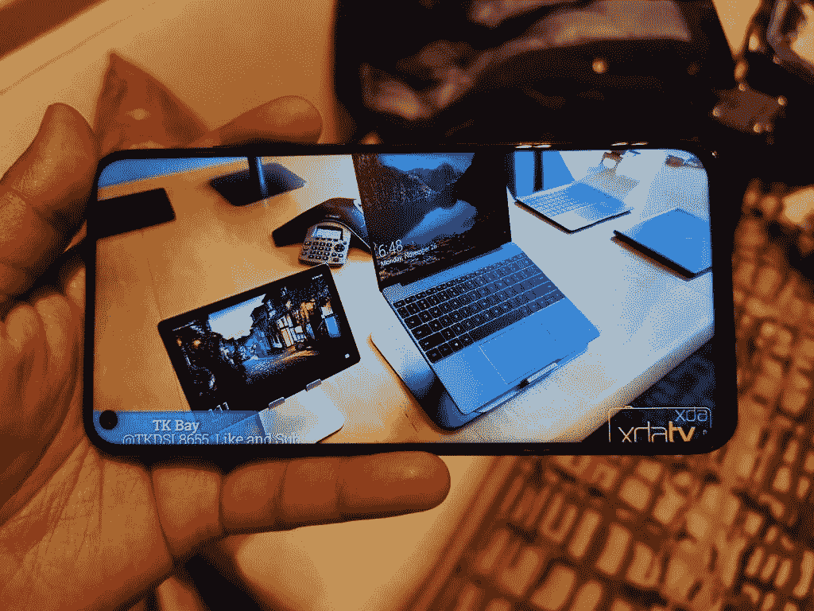
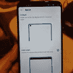

# 荣誉观 20 动手:搭载麒麟 980 和 48MP 摄像头的安卓手机

> 原文：<https://www.xda-developers.com/honor-view-20-hands-on-first-impressions-review/>

2018 年，[近 3100 台](https://www.xda-developers.com/3100-android-devices-google-play-support-2018/)安卓设备获得谷歌认证。由于市场上有如此多的新 Android 智能手机，设备制造商越来越难以将其产品与竞争对手区分开来。我们已经看到该行业通过合并显示器切口(凹口)转向无边框显示器，但在 2018 年底附近，我们看到一些公司在尝试滑块机制和显示器内摄像头。例如，华为在线销售产品的子品牌 Honor 在 10 月底推出了 Magic 2，在 12 月底推出了 View 20。Honor Magic 2 是该公司最新的实验性、几乎无边框的智能手机，配有滑动摄像头机制，而 Honor View 20 有一个打孔的显示摄像头。与 Magic 2 不同，Honor View 20 将在中国以外销售。在全球发布之前，我们有机会在 CES 2019 上查看 View 20。以下是我们对 Honor 的 View 20 旗舰 Android 智能手机的看法。

## Honor View 20 规格、价格和可用性

| 

种类

 | 

规格

 |
| 设计 | 屏幕内摄像头(显示孔)，V 形彩色边缘，带极光效果的纳米纹理 |
| 显示 | 由 AUO、BOE、CTC 或 LG*制造的 6.4 英寸 19.25:9 IPS LCD；2310x1080 (398ppi)，4.5 毫米显示孔 91.82%屏幕与机身比例 |
| 后置摄像头 | 4800 万像素索尼 IMX586，f/1.8 镜头，1/2 英寸 CMOS 尺寸，0.8 米，四拜耳像素宁滨，78 度角索尼 IMX316* 3D 飞行时间(TOF)传感器 LED 闪光灯视频录制:2160p@30fps，2160p @ 30fps 慢速运动:720p@960fps |
| 前置摄像头 | 25MP 索尼 IMX576*，f/2.0，25MP 视频录制:1080p@30fps |
| 游动式平台 | CPU: 7nm 海思麒麟 980 (2x ARM Cortex-A76 @ 2.6GHz，2x ARM Cortex-A76 @ 1.92 GHz，4x ARM Cortex-A55 @ 1.8 GHz)GPU:Mali-G76 MP10 |
| 随机存取存储 | 6/8GB LPDDR4X @ 2133MHz |
| 储存；储备 | 128/256GB，可通过专有纳米内存卡进行扩展 |
| 港口 | USB Type-C (3.1)，3.5 毫米耳机插孔 |
| 连通性 | 双 SIM，双 4G VoLTE，1.4Gbps Cat。21 LTE，蓝牙 5.0，双频 Wi-Fi 802.11 a/b/g/n/ac，A-GPS/GLONASS，NFCLink Turbo，IR blaster |
| 安全性 | 后置指纹扫描仪 |
| 电池 | 4，000mAh，4.5V/5A 快速充电(22W 超级充电 1.0) |
| 软件 | 荣誉魔法 UI 2.0.1(安卓 9 派) |
| 定价 | 6GB 内存+ 128GB 内存:CNY 2999 美元(约 443 美元，€387 美元，印度 31209 卢比)，8GB 内存+ 256GB 内存:CNY 3499 美元(约 517 美元，€451 美元，印度 34426 卢比) |
| 颜色；色彩；色调 | 6GB 内存+ 128GB 存储:午夜黑或宝石蓝 8GB 内存+ 256GB 存储:幻影红或幻影蓝 |
| 有效性 | 中国:[2018 年 12 月 26 日公布](https://www.xda-developers.com/honor-view20-launches-48mp-rear-camera-display-hole/)。特价出售。欧洲:[2019 年 1 月 22 日](https://www.xda-developers.com/possible-honor-view-20-event-expected-on-january-22/)发布。印度:[2019 年 1 月 29 日](https://www.xda-developers.com/honor-view-20-smartphone-48mp-camera-india/)发布。 |

*分析 Honor View 20 的[内核源代码](https://www.xda-developers.com/huawei-kernel-source-code-kirin-980-kirin-970-android-pie/)获得的信息。

## 荣誉视图 20 设计

View 20 在两个方面真正脱颖而出:显示屏和玻璃背板。View 20 是 Honor 的第一款带有显示孔的智能手机，因此我们有很多东西可以谈论。拥有玻璃背面并不能让 View 20 独一无二，但他们应用的表面处理已经产生了一个设备，我会犹豫要不要在它上面放一个盒子。

### 穿孔显示

现在，Honor View 20 几乎不是唯一一款带有打孔显示屏的智能手机。市场上第一款采用这种显示技术的智能手机是采用三星 [Infinity-O 显示屏](https://www.xda-developers.com/samsung-notch-infinity-display/)的[三星 Galaxy A8s](https://www.xda-developers.com/samsung-galaxy-a8s-official-infinity-o/) 。[华为 Nova 4](https://www.xda-developers.com/huawei-nova-4-48mp-rear-camera-display-hole/) 是第二款带打孔显示屏的智能手机。就连海信也在利用 [U30](https://www.xda-developers.com/hisense-u30-snapdragon-675-samsung-48mp-camera-o-infinity-display/) 参与展示相机行动。然而，从我们迄今为止看到的 Galaxy A8s 和 U30 来看，View 20 和 Nova 4 的显示屏似乎更胜一筹。海信仍然需要解决 U30 上的光出血问题，而三星的穿孔相当大。Honor 声称 View 20 的显示孔直径为 4.5 毫米；相比之下，Honor 声明 Galaxy A8s 的洞直径在 6mm 以上。(据传，三星即将推出的 Galaxy S10 的显示屏摄像头孔要比 Galaxy A8s 小。)

当带显示凹槽的智能手机开始出现时，我花了几次迭代才真正适应它们。OnePlus 6 是第一款我能容忍其缺陷的智能手机；一加 6T 是第一款我真正喜欢的智能手机。Honor View 20 上的显示孔大约是我在一加 6T 和华为 Mate 20 X 上看到的较小水滴凹槽的大小，只是它的位置被移到了左边。与 waterdrop notch 相比，它有两个主要优势:状态栏是连续的，因此应该可以看到更多的通知图标，而且在玩游戏或观看视频时，它们不会太打扰人。偏离中心的显示孔一开始可能看起来很尴尬，但你会发现它不像中心凹口那样碍事。

 <picture></picture> 

Watching a YouTube video on the Honor View 20.

然而，View 20 的显示孔方法有一个缺点:缺乏容纳更多传感器的空间。Honor View 2 有一个 25MP 的索尼 IMX576 前置摄像头。非常薄的顶部挡板容纳了耳机扬声器和用于通知的 LED(这是一个受欢迎的附加功能！)顶部挡板上没有空间来放置额外的扬声器或辅助前置摄像头。(庞大的华为 Mate 20 X 设法将一个扬声器*和*一个 3.5 毫米耳机插孔都放在顶部，但这款设备属于自己的尺寸类别。)因此，Pixel 3 上没有广角摄像头，单个底部发射扬声器也无法产生非常响亮的音频，我们 XDA YouTube 频道的 TK Bay 表示。

我们赞扬 Honor 保留 3.5 毫米耳机插孔的决定。虽然该公司删除了 Honor Magic 2 上的插孔，但他们决定保留 View 10 的继任者上的插孔。Honor View 20 也是为数不多的带有红外发射器的智能手机之一。通常只有华为和 Honor 旗舰才有 IR blaster，所以我们在 View 20 上看到它并不奇怪，但我们很高兴它仍然存在。最后，LED 闪光灯的出现对我来说是一个很好的惊喜，因为我在一加 6T 上没有一个。

### 斜垫面

虽然一些营销图像可能会使 View 20 看起来好像不存在边框，但实际上，它的底部边框非常薄。不过，它真的很“T2”。我怀疑 Honor 在制造 Honor 8X 时使用了同样的[覆晶技术](https://www.xda-developers.com/how-the-honor-8x-got-its-ultra-slim-chin/)，尽管我没有得到任何证实。无论他们做了什么，结果都是 91.82%的屏幕与身体比例。观看视频时，几乎整个显示屏都用来显示内容。这不像在荣誉魔法 2 上看视频那样身临其境，但也很接近了。

### 玻璃背面

最后，我们来谈谈玻璃背面。在 View 20 发布之前，一位消息人士告诉我，这款智能手机将拥有“非常酷的新玻璃设计”和“闪亮的颜色”。你瞧，View 20 在中国发布时呈现了一个有趣的 V 形图案，当光线以一定角度照射在背面时就会出现这种图案。当我第一次从我的消息来源听到这个信息，并看到官方渲染，我低估了如何“闪烁”的颜色真的会在人。我期待像一加 6 和一加 6T 的 S 形微光线。我得到的是*远*更惊人。

*根据 Honor 的说法，View 20 的背面设计是通过“第四代纳米真空涂层和隐形极光纹理工艺创造出生动、动态的 V 形色彩渐变，具有闪闪发光的效果。”*

你不需要整天盯着景色看微光效果——它真的很容易看到*。在举行预简报的酒店套房里，我能从几英尺外看到 V 形微光。效果一点也不微妙，这很好，因为它很美。这是为数不多的几款我不愿意在上面放保护套的智能手机之一——一加 6T 雷霆紫是另一款这样的设备。事后看来，在看到华为 P20 的渐变颜色和华为 Mate 20 Pro/Mate 20 X 的“超光学图案”玻璃纹理后，我不应该低估华为和 Honor 的设计能力。*

## 荣誉观 20 相机

就拍照而言，荣誉视图 20 是对荣誉视图 10 的实质性改进。Honor 在设备背面安装了一个 48MP 索尼 IMX586 传感器——第一个这样做的设备——以及一个索尼 IMX316 3D 飞行时间相机。单个前置摄像头是 25MP 索尼 IMX576，与华为 P20、P20 Pro、Mate 20 和 Mate 20 X 上使用的摄像头相同。虽然前置摄像头并不太特别(只是因为华为和 Honor 已经设定了如此高的标准)，但后置摄像头的设置让 View 20 即使与华为 P20 Pro 和华为 Mate 20 Pro 相比也很突出。

### “AI 超清晰”4800 万像素摄像头

对于 Honor 的母品牌华为来说，高像素并不是什么新鲜事。毕竟华为 P20 Pro，华为 Mate 20 Pro，华为 Mate 20 X 都有 40MP 索尼 IMX600 初级后置摄像头传感器。(我通过查看 P20 Pro、Mate 20 Pro 和 Mate 20 X 的内核源代码来验证 IMX600 的信息。)当你启用 40MP 模式时，这些智能手机会产生美丽的高分辨率图片，那么 View 20 的 48MP 摄像头会提供多少改进？我们还没有机会做一个全面的比较，但有一件事我们想看看是荣誉的“人工智能超清晰”模式。在 P20 Pro、Mate 20 Pro 或 Mate 20 X 上没有类似的功能。当启用 48MP AI Ultra Clarity 模式时，View 20 可以在 5 秒内拍摄多张 48MP 照片，处理图像，整理照片，最终创建一张真正清晰的 48MP 照片。因此，在 Honor View 20 上，您可以选择使用 AI Ultra Clarity 模式拍摄基本无延迟的单个 4800 万像素照片或更高质量的 4800 万像素照片。

*我们在 Honor View 20 上拍摄的带和不带 AI Ultra Clarity 的样本 4800 万像素照片的预览图像。左:48MP 无 AI 超清。右图:48MP，AI 超清晰。未压缩的照片可以在这里查看[。](https://drive.google.com/drive/folders/13L_6pzdMdgO1ZXNgt5jszi7kJjRSyMhC?usp=sharing)*

如果你想看看有和没有 AI 超清晰模式的 48MP 相机样本，你可以在[这个 Google Drive 文件夹](https://drive.google.com/drive/folders/13L_6pzdMdgO1ZXNgt5jszi7kJjRSyMhC?usp=sharing)中查看它们。这些照片是 TK Bay 在他的评论单元上拍摄的。作为 AI Ultra Clarity 模式质量的一个例子，在样本照片中的“AI Vision”一词旁边有一点灰尘，只有放大才能看到。我们选择不在本文中嵌入原始分辨率的照片，因为它们太大了，会大大增加文章的加载时间，所以我们建议您在 Drive 文件夹中查看未压缩的照片。

在我们继续之前，关于 View 20 的 4800 万像素摄像头，有一点我们必须注意。最近，小米[宣布](https://www.xda-developers.com/redmi-note-7-launch-specifications-pricing-availability/)采用 ISOCELL Bright [三星 GM1](https://www.xda-developers.com/samsung-32mp-48mp-isocell-camera-sensors/) 传感器的 Redmi Note 7。Redmi Note 7 的高通骁龙 660 实际上无法在零快门延迟或 ZSL 的情况下处理 48MP。相反，在白天，手机使用超分辨率输出 0.8μm 像素的 4800 万张照片。荣誉视图 20 的情况并非如此。View 20 采用旗舰海思麒麟 980 移动平台，不同于红米 Note 7 和中端骁龙 660。(即将推出的[红米 Note 7 Pro](https://www.xda-developers.com/redmi-note-7-pro-48mp-sony-imx586/) 将和 View 20 一样使用索尼 IMX586，但目前来看，View 20 拍摄的 48MP 图片应该优于红米 Note 7 拍摄的图片。)

你可以通过[访问这篇文章](https://www.xda-developers.com/sample-photos-show-off-the-honor-view20s-48mp-camera/)看到更多从荣誉视角 20 拍摄的 4800 万像素相机样本。但是，请注意这些图片是由 Honor 自己提供的。

### AI 超级夜拍

在我们的 2018 年顶级智能手机[文章中，我称赞谷歌 Pixel 3 的](https://www.xda-developers.com/top-smartphones-of-2018/)[夜视](https://www.xda-developers.com/google-pixel-night-sight-google-camera-review/)模式是迄今为止智能手机上手持长曝光的最佳实现。然而，即使谷歌的是最令人印象深刻的，华为的实现是第一个真正做得很好的。在 P20 Pro 上推出的华为夜间拍摄模式收集光线长达 5 秒，华为称之为人工图像稳定(AIS)以减少手抖动的影响，以及计算摄影技术以产生更好的曝光图像。我没能在 View 20 上测试 AI 超级夜拍模式，但如果它和 Mate 20 X 上的一样(我愿意打赌它是)，那么它肯定会留下深刻印象。

### 显像记录

在我们与高通高管的各种 [采访](https://www.xda-developers.com/qualcomm-travis-lanier-snapdragon-855-kryo-485-cpu-hexagon-690-dsp/)中，我们广泛谈论了“AI”和“NPU”这两个术语的过度使用，但华为对麒麟 970 和[麒麟 980](https://www.xda-developers.com/hisilicon-kirin-980-honor-magic-2-huawei-mate-20-pro/)NPU 的营销无疑已经在消费者的脑海中扎根。在这方面，华为相对于高通的一个优势是，他们能够直接将其移动平台的人工智能功能用于智能手机的软件功能。虽然高通在人工智能计算方面取得了令人印象深刻的进展，但他们只能向我们展示他们的合作伙伴所做的工作——这些功能可能会也可能不会出现在未来基于骁龙 855 的智能手机上。与此同时，华为实际上已经推出了令人印象深刻的软件功能，如视频中的实时物体识别。例如，在华为 Mate 20 Pro 和 Mate 20 X 上，你可以激活视频模式，以模糊背景或在实时视频录制中将其变成黑白。([下面是](https://youtu.be/ZvhS_1ATCkY?t=209)Mate 20 Pro 上“AI color”模式的一个例子。)与荣誉魔术 2 不同，荣誉视图 20 支持这些视频特征。

### 三维 ToF 传感器

飞行时间传感器通过基于光传播所需的时间来解析 ToF 传感器和物体之间的距离来测量深度。ToF 相机传感器用于实现远距离 3D 映射，最常见的是用于面部识别目的，如 Mate 20 Pro、iPhone X 和小米 8 探索版。然而，与这些设备不同的是，Honor View 20 的 ToF 传感器位于设备的*后部*。这意味着它不能用于面部识别 View 20 使用基于软件的解决方案，由单个前置摄像头提供成像数据——但有一种方法来纪念 Honor 的疯狂。Honor 正在将 3D ToF 传感器用于 3 个功能:3D 塑形、3D 运动控制游戏和人工智能卡路里计数。3D 塑形和 3D 运动控制游戏可以在我们的审查单元和 CES 上展示的单元上使用，而 AI 卡路里计数据说将在未来的更新中到来。

#### 3D 整形

3D 塑形基本上是美容模式，但适用于你的整个身体。当您在使用后置摄像头时切换到肖像模式时，它可用。它可以用来使某人看起来更瘦。ToF 传感器提供的 3D 映射数据有助于该功能保持背景看起来正常，即使改变前面人的比例。(我不得不承认，由于 TK 当时正在录制一个直播流，所以我没有得到这个特性的很好的样本，但是在我们的完整评论中，我们会有更好的演示。)

### 3D 运动控制游戏

Honor View 20 基本上可以像微软 Kinect 一样工作，因为在玩某些游戏时，ToF 相机可以用来检测你的身体运动。如果这听起来像噱头，那是因为它确实如此。虽然玩起来肯定很有趣，但我非常怀疑许多游戏会利用 View 20 的 3D 摄像头。

要使用 3D 摄像头进行动作控制游戏，你必须使用 Miracast、USB Type-C 转 HDMI 适配器或 Honor 制造的特殊坞站将手机连接到显示器。我很高兴 Honor 没有在他们的 dock 后面加入这个功能，但是，我还是没有看到很多游戏利用这个功能。

说到游戏，Honor state 的 View 20 有一个“9 液体冷却系统”，应该可以使设备温度提高 5 摄氏度。不过，我们在这款设备上玩游戏的时间还不够长，无法告诉你这些说法是否属实。

### 荣誉视图 20 中未启用的功能

如果你想知道 Link Turbo 或 AI 卡路里计数，我们很抱歉地说，这两个功能在我们的设备上都不可用。Link Turbo 允许同时使用 Wi-Fi 和 LTE 来加快连接速度。该软件智能地决定哪个连接用于哪个目的。热量计算[已经存在于 Mate 20 系列和 Magic 2 的 HiVision 中](https://www.xda-developers.com/honor-magic-2-update-calorie-weight-detection-foods-hivision/),但实际上非常糟糕。一旦 3D ToF 传感器投入使用，我们将不得不拭目以待。最后，目前还没有消息表明 [Mate 20 Pro 的 3D 扫描应用](https://www.xda-developers.com/huawei-mate-20-pro-3d-scanning-app-live/)是否会用于 Honor View 20。我们试图安装它，但它不会工作。

## 荣誉视图 20 软件

荣誉观 20 运行基于 Android 9 派的 Magic UI 2.0.1。截至目前，Magic UI 2.0 只是 EMUI 9 的[更名](https://www.xda-developers.com/honor-magic-2-update-magic-ui-2-0-november-security-patches/)，功能变化很少。我在 Honor Magic 2 和华为 Mate 20 X 上大量使用过 EMUI 9，我觉得还可以忍受。以下是我对 EMUI 9 的一些想法:

*   我喜欢的:
    *   **内置的主题引擎**惊人的强大，甚至可以让你定制框架和系统界面元素。当然可以自定义字体、图标包、壁纸等。
    *   华为的**单手模式**效果真的很好，激活也挺简单的。只需从左向右滑动(在导航栏上)或从底部对角滑动(启用手势。)
    *   华为提供了多个选项来代替导航栏。除了手势，你还可以启用一个可以在屏幕上任意移动的导航 dock。
    *   **简易投影**非常棒，因为您可以使用任何 USB 3.1 Type-C 转 HDMI 适配器来实现类似桌面的界面，用于基本的文档编辑、网页浏览等。在旅途中。你甚至可以在 EMUI 9 上通过 Miracast 无线使用 Easy Projection。[这里有一个 Mate 20 X 上的有线轻松投影的演示](https://www.youtube.com/watch?v=4yhNZflTuuc)，但它在 View 20 上也一样。
    *   您可以使用内置设置**隐藏凹槽**。<picture></picture>

        隐藏荣誉视图上的缺口 20。

    *   **数字平衡**，华为版本的谷歌数字福利，让你管理你的智能手机使用。你可以让它控制你的孩子使用手机的频率，这是 Digital Wellbeing 不允许你指定的。您也可以设定一个 PIN，这样设置就不会被修改。当谷歌向你展示一个饼状图时，华为以一种更友好的方式显示你的屏幕时间。
    *   EMUI 9 支持桥接你与其他设备的 Wi-Fi 连接，这是谷歌 Pixel 智能手机最近才开始支持的。(很多小米手机也支持这个。)
    *   华为提供了几个**有用的手势**，比如拿起手机时自动降低通话音量，当手机举到耳边时接听电话，或者翻转手机使来电/闹钟静音。唯一的缺点是你必须训练自己使用它们。还有名为 FingerSense 的指关节手势，由 [Qeexo](https://www.xda-developers.com/qeexo-stmicroelectronics-partner-smart-touch-gestures-smartphones/) 驱动，但我个人觉得激活它们很烦人，所以我禁用了它们。
    *   如果你融入了谷歌生态系统，那么 EMUI 9 启动器中的 HiBoard 可能不是你的那杯茶。如果你[通过 ADB](https://www.xda-developers.com/uninstall-carrier-oem-bloatware-without-root-access/) 禁用 HiBoard，华为实际上默认回使用谷歌发现/馈送。即使是一加发射器也不能做到这一点！
*   我不喜欢的是:
    *   **boot loader[无法解锁](https://www.xda-developers.com/xda-huawei-decision-stop-bootloader-unlocking/)** 。至少，不是正式的。
    *   **如果你不禁用其[激进的电池优化服务](https://www.xda-developers.com/phone-software-killing-apps-background/)，EMUI 9 将会杀死你的应用**。在我进入手机管理器并切换正确的设置之前，我没有在 Mate 20 X 上收到任何来自 Slack 或 Discord 的通知。荣誉视图 20 也是如此。
    *   **全屏手势需要一些工作**。我喜欢华为在设计手势时想到了屏幕锁定和单手模式，而其他 OEM 厂商的手势解决方案只是禁用了屏幕锁定等功能。让我恼火的是，没有快速切换手势可以转到上一个应用程序——你必须向上滑动并按住，放开，然后点击上一个应用程序的卡片。我还对从屏幕两侧激活后退按钮手势感到恼火——这经常干扰应用程序侧栏，甚至华为自己的启动器应用程序抽屉！
    *   HiVision 没用了**需要换成谷歌镜头**。
    *   Emy 语音助手毫无用处，**需要被谷歌助手**完全取代。
    *   **华为的发射器有些怪癖。**正如我刚才提到的，启动器的应用程序抽屉确实不能很好地配合手势。你必须记住从底部向上滑动退出应用程序抽屉，而不是从侧面滑动返回。主屏幕不能旋转。
    *   随着许多 OEM 厂商增加向上滑动手势来显示应用抽屉，华为只提供应用抽屉按钮作为选项，这感觉很过时。
    *   App Twin(克隆一个应用程序以使用第二个帐户)被任意限制在少数几个应用程序中。我知道他们克隆任何应用程序在技术上都是可能的，因为我已经在 EMUI 5 上克隆过了。
    *   **默认没有黑暗主题。**其实有，只是在某些华为和 Honor 设备上被任意禁用了。华为 Mate 20 Pro 和 Mate 20 X 有，而 Honor Magic 2 和 Honor View 20 没有。幸运的是，EMUI 有一个内置的主题引擎，所以你可以通过这种方式[安装第三方黑暗主题](https://www.xda-developers.com/deep-black-dark-theme-emui-9-huawei-honor/)。
    *   EMUI 9 的中文版[不能使用第三方启动器](https://www.xda-developers.com/huawei-confirms-blocking-third-party-launchers-chinese-emui-9/)，所以如果你决定从中国进口该设备，请警惕这一点。
    *   锁屏通知还是一团乱。您不能完全展开它们来选择在解锁设备后立即执行的操作。

## 荣誉观看 20 个视频实践

看看 XDA YouTube 频道上 TK Bay 的这个视频。他花了一些时间在幻影蓝和红的荣誉观 20。

如果你对 View 20 上的另一个视图感兴趣(没有双关的意思)，那么看看我们的姐妹网站 *PocketNow* 上的[对设备](https://www.youtube.com/watch?v=3yf9EeZy17E)的第一印象。

## 结论

总的来说，我真的被 Honor View 20 所提供的东西打动了，并期待着得到一个完整的评论。根据其价格，它可能会在欧洲和印度等地大受欢迎，分别于 1 月 22 日和 29 日上市。麒麟 980 是一个伟大的芯片，EMUI 比我上次日常驾驶它(EMUI 5)改进了很多，设计是恒星，相机真的很有前途。EMUI 9 仍然有其(可修复的)烦恼，我宁愿选择 Pixel 的软件或 OxygenOS，但最近我越来越喜欢它。我更喜欢这款设备有一个显示指纹扫描仪和 40W 快速有线充电，但必须在某些地方做出妥协，以保持价格低廉。

荣誉视图 20 将是一个伟大的选择，除非缺乏引导加载解锁是一个交易断路器。然而，不仅仅是我这么说，因为这款设备赢得了参加 CES 2019 的出版物的多个奖项。

 <picture></picture> 

Pictured: Android Central, Tech Advisor, Gear Dairy, Techradar, Mashable, Geek spin, Android Headlines, Ubergizmo, T3.

## 荣誉视图 20 论坛，有机会亲自查看视图 20

如果你有兴趣获得这款设备，请务必使用 XDA 实验室的应用程序订阅我们的 Honor View 20 论坛。在这里，您可以找到围绕新闻、提示、指南、应用程序、主题和配件的关于该设备的讨论。可悲的是，不要期望太多的定制 ROM 或内核开发。

[**加入荣誉观 20 论坛**](https://forum.xda-developers.com/honor-view-20)

如果你住在洛杉矶，你有机会亲眼看到这种设备。太平洋标准时间 1 月 12 日周六下午 2:00 至 4:00，TK Bay 将举办一场活动，让人们提前看到这款设备。更多细节可以在下面的链接中找到。

如果你住在洛杉矶，你有机会亲眼看到这种设备。太平洋标准时间 1 月 12 日周六下午 2:00 至 4:00，TK Bay 将举办一场活动，让人们提前看到这款设备。更多细节可以在下面的链接中找到。

[**退房荣誉观 20 月 12 日洛杉矶**](https://forum.xda-developers.com/honor-view-20/how-to/near-los-angeles-check-honor-view20-t3882454)

[**退房荣誉观 20 日洛杉矶 1 月 12 日**](https://forum.xda-developers.com/honor-view-20/how-to/near-los-angeles-check-honor-view20-t3882454)