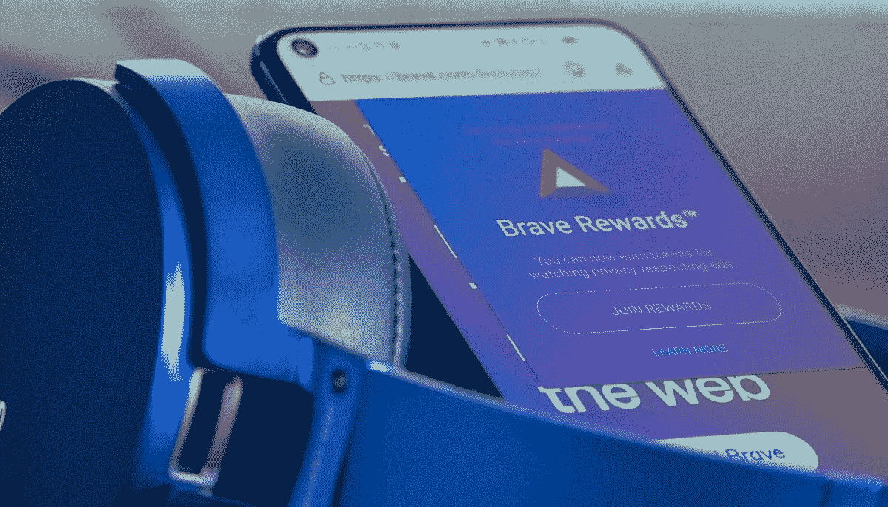

# 勇敢的浏览器如何让你免费支持 XDA

> 原文：<https://www.xda-developers.com/how-brave-browser-supports-xda/>

当你访问你最喜欢的网站时，你通过浏览网站上的广告来支持他们。这些广告为网站带来收入，并有助于支付任何特定网站的托管费和其他相关费用。这是一个很好的方法来确保网站可以免费使用，同时仍然可以获得收入。不利的一面是，广告会大大降低你的浏览体验。勇敢的浏览器禁用默认广告，这使它成为最快的浏览器之一。现在他们有了一个解决方案，可以让你浏览所有你喜欢的网站(比如 XDA ),没有广告，但仍然支持我们，这样我们就可以支付账单。

当你使用勇敢浏览器时，你开始收集基本注意力令牌(BAT)。这种数字货币可以用几种不同的方式来支持 XDA 和其他网站。

### 自动投稿

勇敢的浏览器的自动贡献功能将让您设置一个重复捐赠的蝙蝠令牌到您最喜爱的网站。

### 技巧

小费功能让你当场捐款。您可以将您的 BAT 令牌快速发送给您喜欢的发行商和开发商。

### 广告(ad 的复数)

Brave 帮助支持出版商的最新解决方案是查看可选广告。通过查看这些广告，您将获得蝙蝠代币奖励。这些广告是根据你的浏览活动与你匹配的。隐私是勇敢浏览器背后的最大动机之一，他们确保你的浏览历史不会离开你的设备。它不与任何人分享，甚至不与勇敢的办公室的人分享。

这些个性化和高度相关的广告是用本地机器学习技术匹配给你的。要选择加入，只需按地址栏右侧的勇敢奖励图标。

 <picture></picture> 

Brave Rewards

您可以在奖励面板中跟踪您的预计收入和收到的广告通知总数。支付日期是您能够领取奖励的日期。一旦你收集了你的 BAT 代币，你就可以开始支持你最常访问的网站。

由于观看广告是完全可选的，你可以选择每小时想看多少广告。你可以选择少至每小时一个广告，或多达五个。一切都取决于你。

下载勇敢的浏览器，开始浏览更快，更安全。

[**【下载勇者(PC 和移动)**](https://forum.xda-developers.com/getbrave)

###### 我们感谢 Brave 与 XDA 的合作。我们的合作伙伴和赞助商帮助我们支付与运行 XDA 相关的许多成本，包括服务器成本、全职开发人员、新闻撰稿人等等。虽然您可能会在门户内容旁边看到赞助内容(这些内容将始终被标记为赞助内容),但门户团队对这些帖子不承担任何责任。赞助内容、广告和 XDA 仓库完全由一个独立的团队管理。XDA 绝不会通过接受金钱来赞扬一家公司，或以任何方式改变我们的观点或看法，从而损害其新闻诚信。我们的意见不能被收买。