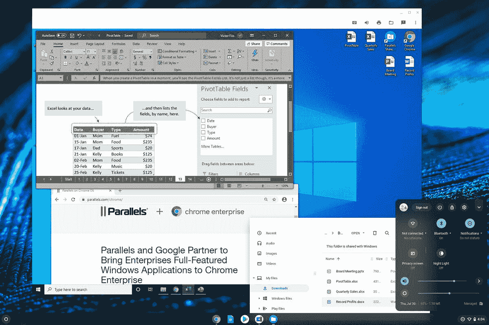

# 以下是谷歌将 Windows 应用程序引入 Chromebooks 的方式

> 原文：<https://www.xda-developers.com/how-google-bringing-windows-apps-chromebooks/>

今年早些时候，谷歌透露，高端企业 Chromebooks 将获得运行完整 Windows 应用程序的支持。在与 *[The Verge](https://www.theverge.com/2020/7/31/21348963/google-chrome-os-windows-apps-chromebooks-features-interview)* 的新采访中，谷歌终于提供了一切将如何工作的更多细节。

Chrome OS 产品组经理 Cyrus Mistry 表示， [Parallels](https://www.anrdoezrs.net/links/100122946/type/dlg/sid/UUxdaUeUpU29269/https://www.parallels.com/) 将启动 Windows 的完整版本，这样你就可以与 Chrome OS 并行运行该操作系统。Chrome OS 还可以将支持的 Windows 文件类型重定向到 Parallels Desktop 实例，使事情变得更加无缝。然而，Mistry 说，在未来，用户不必运行整个 Windows 桌面，而是只运行你需要的应用程序。

 <picture></picture> 

Windows apps running on Chrome OS thanks to Parallels Desktop. Source: Google. Via: [The Verge.](https://www.theverge.com/2020/7/31/21348963/google-chrome-os-windows-apps-chromebooks-features-interview)

该功能有望利用 Parallels 的 Coherence 功能。在 Mac 上，该模式允许用户运行 Windows 应用程序，就好像它们是为苹果生态系统开发的原生应用程序一样。“我们与 Parallels 合作，因为他们以前真的这么做过，”Mistry 解释道。“他们理解在另一个操作系统中运行完全独立的操作系统的概念。他们在 Mac 和 Linux 上都做到了。”Mistry 表示，谷歌[确实研究过 Chromebooks 的 Windows 双引导选项](https://www.xda-developers.com/chromebooks-chrome-os-windows-10-dual-boot-apple-boot-camp-campfire/),但最终决定放弃，因为担心与引导过程有关的安全问题。Mistry 说，Parallels 提供了“两个世界的精华”，它为用户提供了无缝的体验，用户可以快速进入和退出。

没有透露价格或发布日期，但谷歌表示，Parallels Desktop 将于今年晚些时候面向企业推出。已经建立了一个页面，供感兴趣的人与谷歌联系。据 *The Verge* 报道，经销商可以将 Parallels Desktop 与企业版 Chrome book 捆绑销售，而 IT 管理员可以访问在 [Chrome Enterprise Upgrade](https://services.google.com/fh/files/misc/chrome_enterprise_upgrade_one_pager.pdf) 注册的 Parallels for Chromebooks 警告)。感兴趣的各方还需要相对较新的 Chromebooks 来运行 Parallels Desktop，尽管 Mistry 没有透露确切的规格要求。相反，他说用户将需要“耗电”的 Chromebooks。预计这意味着需要一台配备英特尔酷睿 i5 或 i7 处理器和至少 8GB 内存的 Chromebook。

谷歌希望增加对 Windows 应用程序的支持将吸引新的客户，同时增长其企业野心。随着商用 chrome book[的单位销量同比增长 155%](https://cloud.google.com/blog/products/chrome-enterprise/the-remote-work-revolution#jump-content:~:text=Case%20in%20point%2C%20we%20have%20seen,benefits%20and%20simplicity%20of%20deploying%20Chromebooks),对 Windows 应用程序的支持来得正是时候。

* * *

*特色图片:三星 Galaxy Chromebook*