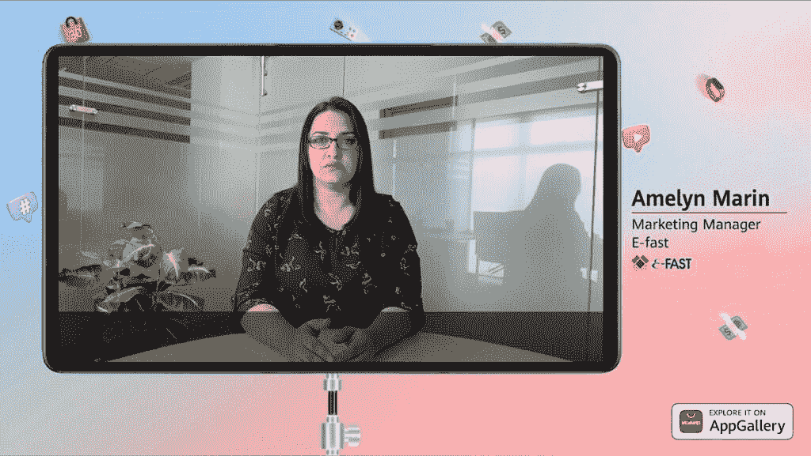
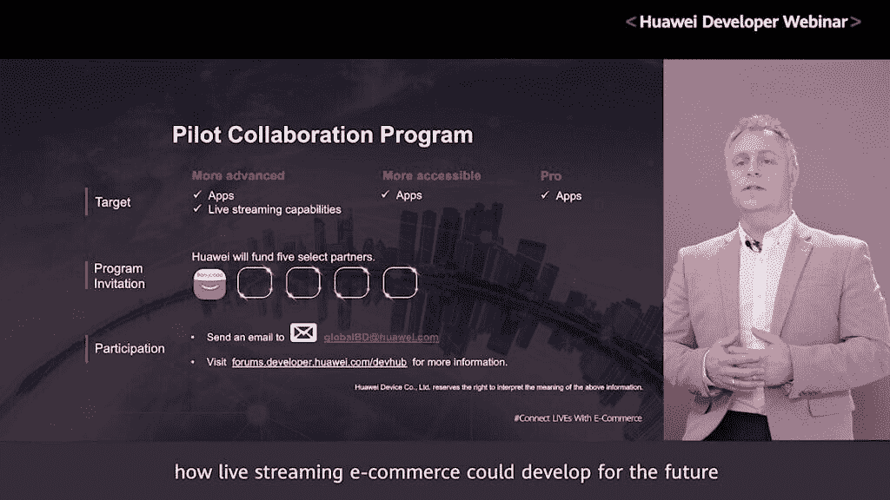

# 华为如何改善实时电子商务:网络研讨会亮点

> 原文：<https://www.xda-developers.com/how-huawei-is-improving-live-e-commerce-webinar-highlights/>

2020 年 8 月 6 日，华为举办了华为开发者网络研讨会，重点介绍他们新的电子商务相关服务。这场名为“*将生活与电子商务联系起来”*的网络研讨会长达一小时，在网上免费播放。如果您错过了直播，您可以使用下面的链接观看重播。在他们的文章中，我们将回顾该流中所有最激动人心的点。

**[点击](https://www.twitch.tv/videos/702057708)** 观看华为开发者网络研讨会

## 全球合作伙伴分享他们的实时电子商务体验

华为邀请了来自电子商务领域的全球知名人士在本次网络研讨会上分享他们的经验。这些专家能够分享他们对越来越受欢迎的电子商务直播解决方案的想法。在新冠肺炎疫情期间，公司一直在寻找新的方法来成功举办在线零售活动。增长最快的领域之一是应用内直播。在网络研讨会期间，我们听取了以下专家的意见:

 <picture></picture> 

Roosevelt Nascimento [Head of Product and Business Intelligence for Dafiti]

我们需要利用华为的合作伙伴关系来提供无缝和更好的体验。华为拥有高标准的优质设备，使用高质量图像等技术进行图像搜索，甚至将 HiAI 作为助手来找到合适的产品。

 <picture></picture> 

Andres Cooper O. [CEO and Co-Founder of Chilaeutos]

直播让我们接触到更多的用户，定位我们的品牌，并加强我们与社区的联系。直播创造娱乐和关于我们行业的有用信息。

 <picture></picture> 

Amelyn Marin [Marketing Manager for E-fast]

影响电子商务业务的一个关键因素是人们用来购买产品的平台的用户友好性。新冠肺炎已经迫使许多商店关门数周。因此，他们中的许多人依靠在线广播来联系潜在客户，而不需要实际的场所。

 <picture></picture> 

Larry Lin [VP, Head of Marketing for Zaful]

这一功能为直播市场带来了巨大的利润潜力。与中国的卖家不同，其他国家的卖家不熟悉直播技术...很多玩家还在进入这个行业。Zaful 就是其中之一。

 <picture></picture> 

Roland Ros [CEO and Founder of Kumu]

它不只是像家庭购物网。基本上，你实际上是在向你的朋友和家人销售产品，就像他们在你自己家里一样。这是我们和电子商务非常感兴趣的事情。

每位客人都解释了新冠肺炎如何影响了他们的业务，同时他们也看到了在线销售的增长。他们与华为的合作伙伴关系使他们能够利用新的直播技术发展这个市场。

## 直播电子商务的新趋势

直播电子商务已成为电子商务行业的热门增长领域。这一领域在 2020 年增长最快，因为它成为全球消费者和投资者获得资本的有力手段。现场电子商务体验远比传统的在线零售更具互动性。参与与当前流媒体内容相关的实时问答。消费者发现这种互动体验更加令人兴奋，总体上使网上购物更加有趣。

如果你观察多个行业的零售趋势，我们会发现，与传统零售相比，那些使用实时电子商务的人看到了不断增长的转化率。研究当前的电子商务趋势，你可以有把握地预测，这将继续是一个不断增长的在线零售市场。许多公司将继续投资于这一新趋势，以获得这类内容的显著优势。

 <picture></picture> 

E-commerce sales growth

华为分享了与典型零售销售相比，在线电子商务增长的信息。华为表示，他们个人在这一领域经历了巨大的增长，在几个不同的国家推出了 25 家新的电子商务商店。他们在 2020 年的收入也增长了 200%以上。

为了跟上这种变化，公司需要发展与客户互动的方式。枯燥的文字描述和产品评论视频的日子已经一去不复返了。现在，超级互动直播内容可以用来促进产品销售。

华为接着详细介绍了使用实时电子商务销售的不同类型产品的成功之处。观看直播回放，更深入地了解所有这些细节。

## 直播电子商务新技术

随着网上研讨会的继续，我们了解了与实时电子商务相关的 HMS 套件的具体功能。这些套件的总体目标是使直播过程更简单、更快、更具成本效益、更具沉浸感。下一代直播工作室可以由一部手机和一个外置摄像头组成。这是您开始使用多摄像头直播所需的全部内容。

数字背景将是另一个可以取代昂贵的布景和场地的特征。数字背景易于使用，可以根据您的具体情况进行更改。主持人还将能够展示产品的内部细节和参数。这些信息将作为覆盖图直观地显示在直播流上。

他们讨论的最后一个特点是更流畅的流媒体体验。在线流媒体的最大挑战之一是在整个节目中保持高质量的流。由于这是推动销售的一个如此重要的功能，华为付出了很大的努力来更容易地保持您的流质量，即使是对于较慢的连接。您的手机将能够实时检测您的连接质量，然后相应地调整流质量。

华为接着展示了其中一些功能的演示视频:

目前采用华为多功能手机拍摄功能的平台有:

*   LiveMe
*   Likee
*   华为 MeeTime

这些相机功能目前兼容:

*   漂移动作摄像机
*   AIcidae AI 全景摄像机

这仅仅是一个开始，华为表示在不久的将来会有更多的服务和更兼容的硬件出现。

## 协作试点计划

在直播的最后部分，Peter Gauden[华为消费者业务集团 WEU 生态发展营销负责人]谈到了他们的合作试点项目。该长期计划旨在支持下一代创新应用和服务的创建。这个程序对所有开发者开放。华为希望帮助那些希望在其平台上实施直播解决方案的合作伙伴。

Banggood 是首批加入该计划的大公司之一。华为正在寻求总共资助五家精选合作伙伴。如果你是一名开发者，并且你有兴趣加入这个项目，你可以发电子邮件到华为 GlobalBD@huawei.com。

 <picture></picture> 

Pilot Collaboration Program

华为承诺，他们将长期留在这里，目标是看到最好的想法变成现实。

###### *本文由华为赞助并撰写。我们的赞助商帮助我们支付与运行 XDA 相关的许多费用，包括服务器成本、全职开发人员、新闻撰稿人等等。虽然您可能会在门户内容旁边看到赞助内容(这些内容将始终被标记为赞助内容),但门户团队对这些帖子不承担任何责任。赞助内容、广告和 XDA 仓库完全由一个独立的团队管理。XDA 绝不会通过接受金钱来赞扬一家公司，或以任何方式改变我们的观点或看法，从而损害其新闻诚信。我们的意见不能被收买。*