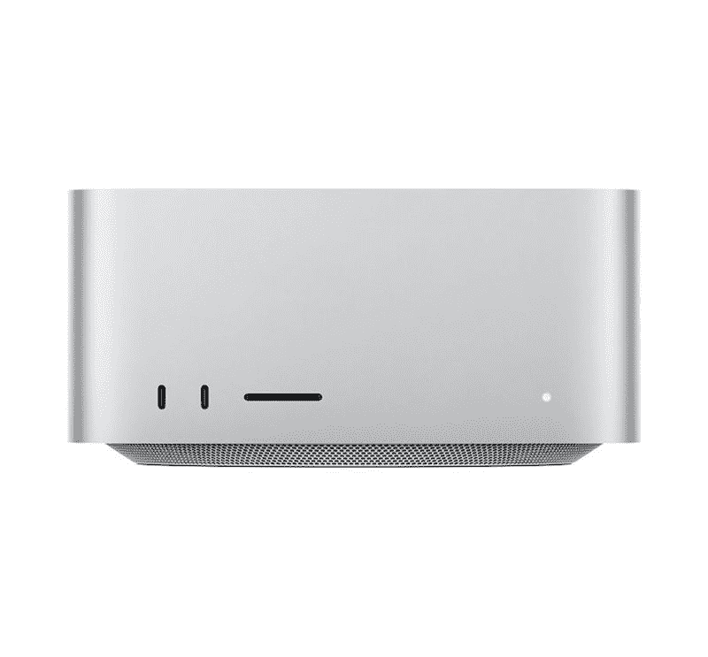

# Mac Studio 支持多少台显示器？

> 原文：<https://www.xda-developers.com/how-many-monitors-mac-studio/>

# Mac Studio 支持多少台显示器？

Mac Studio 没有内建显示器，因此您必须自己连接。以下是您需要了解的关于显示器及其支持的内容。

苹果早在 2020 年就首次展示了其 M1 芯片。自那以后，该公司一直在抛弃英特尔处理器，转而依赖自己的处理器。因此，如果你买了一台 Mac 电脑，它很可能会包含一个 M1 芯片——因为它们现在为大多数 Mac 产品系列提供动力。此外，开发者一直在为苹果芯片优化他们的[应用，以确保更流畅的性能。效率也变成了制度层面的。这是因为苹果提供了软件和硬件——这使得](https://www.xda-developers.com/best-apps-apple-silicon/) [macOS Monterey](https://www.xda-developers.com/macos-monterey) 成为最好的操作系统之一。除了开发新的芯片，该公司还发布了新的电脑，如 Mac Studio。如果你打算买一台，你一定想知道:Mac Studio 支持多少台显示器？以下是你需要知道的。

## Mac Studio 支持多少台显示器？

在其 Peek Performance 虚拟活动中，该公司透露，Mac Studio 最多支持四个 Pro Display XDRs，此外还有一个 4K 显示器，总共支持五个显示器。这个设置的总像素大约是 9000 万像素！这使得 Mac Studio 成为那些经常进行多任务处理和处理复杂数据的人的完美电脑。您可以在处理另一个文档时查看参考文件，也可以在联机工作会议期间查看参考文件，因为您可以在单独的显示器上了解新闻和向同事发送短信。可能性是无限的！

Mac Studio 是该公司最近发布的一款全新 Mac 电脑。它看起来像两个堆叠的 Mac Minis，拥有 M1 Max 或 M1 Ultra 芯片。后者是苹果公司 M1 家族的最新成员，该家族现在包括 M1、M1 Pro、M1 Max 和 M1 Ultra 芯片。

 <picture></picture> 

Apple Mac Studio

##### 苹果 Mac 工作室

Mac Studio 由苹果 M1 Max 或全新的 M1 Ultra 芯片驱动。它只有银色可选，起价 1999 美元。

您计划将多少台显示器连接到 Mac Studio？请在下面的评论区告诉我们。