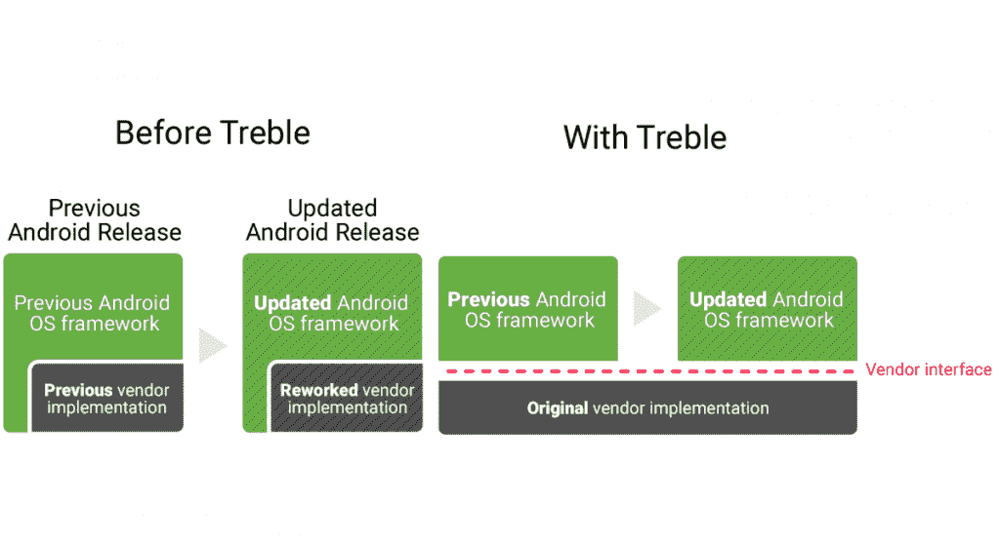
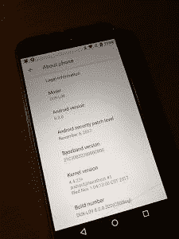

# 定制 rom 的革命:Treble 项目如何让移植 Android Oreo 成为一日工作

> 原文：<https://www.xda-developers.com/how-project-treble-revolutionizes-custom-roms-android-oreo/>

多年来，XDA 论坛一直是定制 ROM 开发的中心聚会。多亏了我们论坛上开发人员的辛勤工作，许多旧的 Android 智能手机在被设备制造商抛弃多年后，仍能通过定制 ROMS 存活下来。虽然现在大多数制造商都发布了引导加载程序解锁方法，但内核源代码发布的频繁延迟抑制了许多智能手机上的定制 ROM 开发。然而，这种情况可能很快就会改变，这要归功于 Android Oreo 发布前宣布的一项名为“ [Project Treble](https://www.xda-developers.com/googles-project-treble-modularize-android-so-oems-can-update-devices-faster/) ”的计划。多亏了 Project Treble，将 AOSP ROM 移植到设备上的时间不再需要几周或几个月——相反**只需要几天**。

对于那些多年来一直关注自定义 ROM 场景的人来说，你可能已经意识到这个消息的重要性。XDA 认可的开发者 [OldDroid](https://forum.xda-developers.com/member.php?u=4960686) 称这一发现为定制 AOSP ROM 开发中的**突破**。例如，由于 Project Treble 的支持，[我能够在华为 Mate 9 上启动](https://www.xda-developers.com/stock-android-oreo-huawei-mate-9-project-treble/)一个**几乎全功能的 Android 8.0 Oreo ROM 这款设备到目前为止甚至没有见过一个 AOSP *Android 牛轧糖* ROM。**

由于 XDA 资深会员 phhusson 在这方面的初步开发努力，我们可能很快就会看到定制 ROM 开发的一场革命。经过 20 个小时的研究、开发和调试，phhusson 创建了一个系统映像，可以在来自不同制造商的多种设备上使用完全不同的 SOC 进行**引导。例如，我在自己的华为 Mate 9 上启动的相同系统映像也可以在 Honor 8 Pro、Honor 9、索尼 Xperia XZ1 Compact 和 Essential Phone 上启动。也就是说 *3 个不同的 OEM 厂商*(华为/Honor、索尼、Essential)和 *2 个不同的 SOC*(海思麒麟 960 和高通骁龙 835)，这个单一系统镜像可以成功引导。**

在未来，我们可能会看到一个单一的系统映像可以在几十种不同的 Android 智能手机上运行，就像微软 Windows 可以在几乎任何计算机硬件上运行一样。为了鼓励这方面的更多发展，我们已经开放了一个专门针对支持三重功能的设备的新论坛。这个论坛目前是面向开发者的，所以请不要开始一个新的话题，除非你对开发有兴趣。如果您希望帮助测试 Treble 兼容的系统图像，请随时在现有线程上留下评论。

[**加入项目三宝发展论坛**](https://forum.xda-developers.com/project-treble)

考虑到这一发展的重要性和主题的复杂性，我想我会以不同于其他文章的方式来处理这篇文章。我将列出一个要点列表，解释人们可能会有的一些常见问题，并指出关于这一最新发展的关键事实。

* * *

## 什么是高音项目？

 <picture></picture> 

Credits: [Google](https://android-developers.googleblog.com/2017/05/here-comes-treble-modular-base-for.html)

Project Treble 通常被描述为 Google 模块化 Android 操作系统框架以分离供应商特定代码的尝试。让我们再细分一下:

*   为设备带来新的 Android 版本的完整更新过程是一个漫长而复杂的话题，但索尼在这张概述基本步骤的信息图中做得很好。
*   “供应商”通常是指硅制造商，如高通，但也可以指设备中任何其他专有硬件的制造商。“设备制造商”或“OEM”通常需要等待供应商更新他们的代码，以便专有硬件在新版本的 Android 中与 Android OS 框架一起工作。
*   然而，Project Treble 正在发生的事情是，谷歌要求任何**供应商特定的代码从 Android OS 框架**中分离出来，而是存在于自己的供应商实现中。通常这意味着现在在支持三重功能的智能手机上有一个单独的/供应商分区，其中包含一堆 HALs(硬件抽象层)。
*   此外，供应商必须实现让 Android OS 框架以标准化的方式与 HALs 通信的代码。这是通过 **HIDL** (HAL 接口定义语言)完成的。有了这一点，OEM 就可以进行 Android 更新，而不必等待供应商更新他们的 Hal。从理论上讲，这种**应该会加快整个 Android 更新过程**，因为供应商可以随时更新他们的代码[，例如通过 Play Store](https://www.xda-developers.com/project-treble-google-pixel-2-graphics-drivers/) 。
*   为了帮助理解什么是 HAL 以及它与 Android 的关系，让我们考虑一个类比。想象一辆车。方向盘和刹车是 HAL，而驱动是 Android OS 框架。驾驶员(Android)移动方向盘并踩下刹车(HAL)以控制汽车(硬件)的运动。
*   现在想象一下，如果我们生活在一个世界里，每个汽车制造商都决定以完全不同的方式设计他们的方向盘或重新安排他们的刹车。如果你让一名司机驾驶一辆新车，他可能会对最初如何驾驶车辆感到困惑。但多亏了标准，每个司机都应该熟悉如何操作几乎所有汽车的方向盘和刹车。此外，驾驶学校教所有的司机如何正确驾驶车辆。在这个类比中，车辆标准是 Project Treble，驾校是 HIDL。

* * *

 <picture></picture> 

Android Oreo on the Honor 8 Pro. Credits: XDA Recognized Developer OldDroid

## 哪些设备将获得 Project Treble 支持？

*   所有**推出的搭载安卓 8.0 奥利奥**或以上**的设备必须全面支持** Project Treble。
*   所有**升级到 Android 8.0 Oreo** 的设备都**不需要**完全支持 Project Treble。
*   有 Android 8.0 Oreo 更新(正式版或封闭测试版)并支持 Treble 的设备包括:
*   通过定制 ROM 开发，任何设备都不太可能非正式地获得 Project Treble 支持。HALs 毕竟不是开源的。

* * *

## 为什么高音项目对 AOSP 罗姆如此重要？

*   为了确保供应商代码以 Project Treble 要求的方式从 Android OS 框架中正确分离，谷歌建立了一个供应商测试套件(VTS)，设备必须通过该套件才能获得谷歌的认证。谷歌认证非常重要，因为没有它，设备就不能预装 Google Play 应用和服务。
*   VTS 中的一个要求是启用高音的设备**必须能够引导**原始的、通用的 AOSP 版本。由于这一要求，原始设备制造商不得不发运能够顺利启动 AOSP 的设备。
*   尽管谷歌为 VTS 使用并与原始设备制造商共享的确切 ROM 并不公开，但 XDA 的高级成员 phhusson 能够找出如何从来源重新创建这个 ROM。
*   因此，我们现在有了一个工作的 AOSP ROM，它保证可以在 Project Treble 设备上引导。大部分工作已经由原始设备制造商和供应商完成，所以我们论坛上的独立开发者不再需要[摆弄内核源代码或 HAL hackery](https://www.xda-developers.com/cameras-custom-roms-developers-make-hardware-work-without-source-code/) 。理论上，AOSP 只读存储器应该“正常工作”,我们已经在我们测试的设备上证明了这一点。
*   目前，兼容性是[不是 100%](https://forum.xda-developers.com/showpost.php?p=74622436&postcount=3) 与所有设备的系统镜像可以启动。还有一些[竞争条件](https://forum.xda-developers.com/showpost.php?p=74622542&postcount=4)需要弄清楚。然而，Project Treble **大大减少了将 AOSP rom 移植到非谷歌设备上所需的开发工作量。在我们的[项目 Treble forum](https://forum.xda-developers.com/project-treble) 中，随着更多开发者的合作，我们期望看到 Treble 设备开发走得更远。**

* * *

## 现在如何在我的设备上试用 Android Oreo？

如果你真的很有冒险精神，想现在就在你的手机上尝试这些项目 Treble builds 中的一个，phhusson 有你需要的系统图像，可以在我们的项目 Treble 论坛的[他的帖子上下载。不过，有几件事你需要记住:](https://forum.xda-developers.com/project-treble/trebleenabled-device-development/experimental-phh-treble-t3709659)

*   你需要一个**解锁的引导程序**，并且需要熟悉使用**快速引导命令**来刷新镜像。
*   你的设备必须已经运行 Android Oreo。这些系统映像不会“升级”您的设备。如果你运行的是本文中提到的华为/Honor 设备，你可以在我们的论坛上寻找指导，或者使用 [FunkyHuawei.club 服务](https://www.reddit.com/r/FunkyHuawei/comments/7f88h5/updating_android_n_huawei_devices_to_android_o/)非正式地将你的手机更新到一个封闭的奥利奥测试版。
*   你必须愿意在测试时**丢失数据或刷新工厂图像**。确保此引导的最佳方式是擦除 userdata 分区，包括擦除内部存储上的所有内容。当然，你可以做备份，并在完成后将它们转移过来。
*   这些 AOSP 目前不是作为日常车手使用的。它们非常简单，不提供许多预装的功能或应用。你必须自己刷新谷歌应用程序。你必须手动输入运营商的 APN 设置才能使用移动数据(如果可以的话)。在投入更多的开发努力之前，事情会变得不顺利。

* * *

## 结论

当谷歌说 Project Treble 可能是 Android 工作方式有史以来最大的变化之一时，他们不是在开玩笑。我们可以亲眼目睹，此时此地，它能产生多大的影响。Treble 可能是开发社区振兴定制 ROM 场景所需要的推动力。在华为 Mate 9 上，不到一天的时间就启动了一个几乎功能齐全的 AOSP ROM。我很高兴看到将为其他高音设备所做的工作。