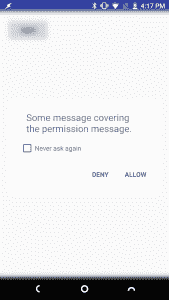
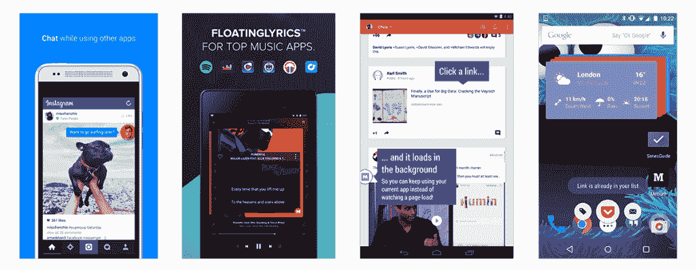
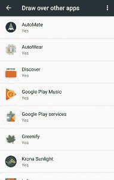
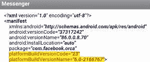
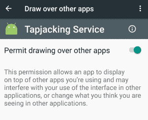

# Tapjacking 在 Android 棉花糖中取得了回报，没有人注意到

> 原文：<https://www.xda-developers.com/how-tapjacking-made-a-return-with-android-marshmallow-and-nobody-noticed/>

虽然我们许多人都对新发布的用于 Nexus 设备的 Android 牛轧糖垂涎三尺，但绝大多数用户仍在使用 Android 棉花糖。自[以来就有记录的一个漏洞至少在 2015 年中期](https://android-review.googlesource.com/#/c/157670/)仍在影响许多现代 Android 设备。

恶意应用程序能够**将你的动作插入**到**中，授予它们你从未明确授予的权限。**这是漏洞利用的工作原理。

* * *

**顶锤返回**

想象一下，你打开 Instagram，试着分享一张你最近度假时拍的照片。当您选择浏览图库中的图片时，Instagram 会要求您授予它访问您的存储空间的权限。但是当你点击“是”时，你会看到一个错误信息。

你不能授予 Instagram 的存储权限，因为你启用了活动屏幕覆盖——在这种情况下，这是众多给你的屏幕着色的应用程序之一，因此可以在晚上使用你的手机而不会弄瞎你。这是一个 Android 权限系统**按照预期**工作的例子:为了授予应用程序一个敏感的权限，你需要禁用你设备上的任何屏幕覆盖。

 <picture></picture> 

Marshmallow Permission Tapjacking. Tapping "Allow" will show all of my contacts.

能够在你的屏幕上绘图的应用程序可能会欺骗你输入敏感数据。例如，一个屏幕覆盖可以在一个真实的登录屏幕上放置一个虚假的密码输入，以收集您的密码。像这样的漏洞被称为**‘tap jacking’**，多年来已经在各种 Android 版本上弹出并被修补，其中[是最糟糕的例子之一，一直持续到 Android 4.0.3](https://commonsware.com/Android/previews/tapjacking) 。但是最近，随着[安卓棉花糖的运行时许可模式](https://developer.android.com/training/permissions/requesting.html)，这个漏洞又回来了。

一个名叫[Iwo Banaú](https://android-review.googlesource.com/#/q/owner:%22Iwo+Bana%25C5%259B%22+status:open)的开发者创建了一个[应用](https://github.com/iwo/marshmallow-tapjacking)来演示这个漏洞。它的工作方式相当简单——当应用程序显示许可对话框时，您安装的恶意应用程序将显示一个系统覆盖图，用它想要的任何文本来覆盖许可对话框的文本块。一个不知情的用户点击权限对话框上的“允许”将被欺骗授予他们被请求的权限——但是用户看不到请求。这样的利用彻底挫败了 Android 棉花糖许可系统的目的，因为新模型**的引入是为了确保用户只许可他们明确同意的**。

我知道你在想什么。如果 Android 检测到系统覆盖，阻止我授予 Instagram 存储权限，难道不会阻止这种漏洞利用的发生吗？**答案是否定的**，在我的测试中，似乎在某些设备上，在许可对话框的顶部显示一个文本覆盖图不会触发安全机制。概念验证 tapjacking 应用程序的开发人员表示，该漏洞是有效的，因为它依赖于用户安装针对 API 级别 22 及以下(棉花糖之前)的二级恶意应用程序。这是由于在 Android Marshmallow 之前，所有应用程序在安装时都被授予了权限。

好吧，所以如果你在棉花糖上，你需要做的就是避免安装任何你不信任的应用程序，这些程序会请求许可来绘制覆盖图，对吗？如果 Android 的许可模式像最初设计的那样工作，你可能是对的。但是自从发现这个漏洞以来，**即使是针对 API 级别 23** (棉花糖)的应用程序请求覆盖权限也是一个潜在的风险。

* * *

**权限模型的缺口？**

 <picture></picture> 

*Typical Apps using Overlays. Via: [Medium](https://medium.com/@rotxed/drawing-over-other-apps-marshmallow-edition-987eff9f99a9#.itr2oah1y)*

如果你是数百万使用 Facebook Messenger 与朋友聊天的人中的一员，那么你已经遇到了 Android 最好的功能之一——应用程序可以在其他屏幕上绘图。你可以在你最喜欢的脸书群聊中畅游，在用户打开的任何应用程序上关注他们，这有多酷？虽然脸书的 Messenger 将“浮动应用”的想法带入了主流，但这个概念在 Android 中已经存在了一段时间。由于 Android 的 WindowManager 中存在 [TYPE_SYSTEM_OVERLAY](https://developer.android.com/reference/android/view/WindowManager.LayoutParams.html#TYPE_SYSTEM_OVERLAY) ，应用程序已经能够在你的应用程序上创建覆盖层一段时间了。

 <picture></picture> 

"Draw over other apps" Permission Menu

在 Android Marshmallow 之前，应用程序需要在安装期间请求一个名为 [SYSTEM_ALERT_WINDOW](https://developer.android.com/reference/android/Manifest.permission.html#SYSTEM_ALERT_WINDOW) 的权限，然后才能在屏幕上显示覆盖图。但是随着 6.0 的细粒度运行时权限模型的引入，这种情况发生了变化。用户现在必须在实际运行应用程序时授予应用程序权限，这有望刺激普通用户保护自己的私人数据，防止可疑的应用程序请求看似功能无关的权限。

但是，SYSTEM_ALERT_WINDOW 不同于其他权限。开发人员不能显示一个对话框，以编程方式请求最终用户授予权限，就像任何针对 Marshmallow 的应用程序上的大多数其他权限一样。相反，您必须手动导航到设置屏幕并自己启用权限。当然，一些应用程序如 Facebook Messenger 会在这个过程中帮助你。

谷歌要求开发者这样做，因为他们认为这种许可是特别敏感的。

***特殊权限***

有几个权限的行为不像正常的和危险的权限。SYSTEM_ALERT_WINDOW 和 WRITE_SETTINGS 特别敏感，大部分 app 不要用。如果一个应用程序需要这些权限之一，它必须在清单中声明该权限，并发送一个请求用户授权的意向。系统通过向用户显示详细的管理屏幕来响应该意图。

考虑到我们上面所知道的关于偷东西的知识，这是有道理的。但问题是。谷歌甚至不遵循自己的规则。上面我给你看的 Facebook Messenger 指导你授予它 SYSTEM_ALERT_WINDOW 权限的截图？只有在谷歌 Play 商店之外安装 APK 时才会出现这种情况。如果您从谷歌 Play 商店安装应用程序， **[SYSTEM_ALERT_WINDOW 权限会自动授予](https://stackoverflow.com/questions/36016369/system-alert-window-how-to-get-this-permission-automatically-on-android-6-0-an)。**

 <picture></picture> 

Facebook Messenger's Manifest File. The app is automatically granted the overlay permission despite targeting API level 23.

* * *

**谷歌为了方便牺牲了安全**

在安卓棉花糖之前很长一段时间，SYSTEM_ALERT_WINDOW 都被认为是一个“[危险](https://developer.android.com/guide/topics/manifest/permission-element.html)权限。在 Android Marshmallow 6.0 中，权限被更改为*签名|系统|应用*，这是最初要求开发人员引导用户到设置屏幕来授予权限的内容。但是在 Android 6 . 0 . 1 版本中，[的 SYSTEM_ALERT_WINDOW 被修改](https://github.com/android/platform_frameworks_base/commit/01af6a42a6a008d4b208a92510537791b261168c)，这样谷歌 Play 商店[就可以自动授予权限](https://github.com/android/platform_frameworks_base/commit/4ff3b614ab73539763343e0981869c7ab5ee9979) **而无需通知用户。我们不清楚谷歌为什么做出这种改变。谷歌自己也没有站出来说明他们为什么做出这样的改变，考虑到他们的网页上仍然存在 SYSTEM_ALERT_WINDOW 的语言，这是非常奇怪的。**

可能有足够多的开发人员被最初对 SYSTEM_ALERT_WINDOW 的修改激怒了，这些修改要求用户手动授予权限，而谷歌默默地屈服了，只是将其授予任何请求它的应用程序。但是这样做，谷歌**为了方便**牺牲了安全。长久以来，谷歌自己认为这种许可是危险的，这是有原因的，因为确实如此。棉花糖权限 tapjacking 漏洞的存在足以证明自动授予任何应用程序此权限的内在危险。

这种 tapjacking 漏洞直到最近才引起我们的注意，尽管它已经存在了好几个月了。在我们对 XDA 门户网站团队的设备进行内部测试时，我们已经确认**该漏洞可以在许多运行 Android Marshmallow** 的现代设备上运行。下面是我们对每个设备的最新可用软件版本进行测试的设备的快速运行，以及 tapjacking 漏洞利用是否有效。标记为“易受攻击”的设备容易受到窃听攻击，而标记为“不易受攻击”的设备能够检测到显示覆盖图的应用程序，并要求您在继续操作之前将其禁用。

*   next bit Robin-Android 6 . 0 . 1 6 月安全补丁- **易受攻击**
*   Moto X Pure - Android 6.0 带 5 月安全补丁- **易受攻击**
*   Honor 8 - Android 6.0.1 带 7 月安全补丁- **易受攻击**
*   摩托罗拉 G4 -安卓 6.0.1 五月安全补丁- **易受攻击**
*   OnePlus 2 - Android 6.0.1，带 6 月安全补丁- **不易受攻击**
*   三星 Galaxy Note 7-Android 6 . 0 . 1 7 月安全补丁- **不易受攻击**
*   谷歌 Nexus 6 - Android 6.0.1 带 8 月安全补丁- **不易受攻击**
*   谷歌 Nexus 6P - Android 7.0 安装了 8 月安全补丁- **不容易受到攻击**

到目前为止，这些都是我能让团队测试的设备。我找不到安全补丁版本和漏洞之间的任何关联。正如你可以从我们关于 Android 安全更新的[最新讨论](http://www.xda-developers.com/what-android-security-patch-are-you-on-right-now-and-does-it-really-affectbother-you/)中了解到的，许多人无论如何都没有运行最新的安全补丁，因此可能容易受到这个漏洞以及其他在 [Android 安全公告](https://source.android.com/security/bulletin/)中概述的漏洞的攻击。

* * *

**向前移动**

 <picture></picture> 

Tapjacking Service Granted the Overlay Permission

**我们建议您亲自在您的设备上测试这一漏洞，看看您是否容易受到攻击**。我们已经从上面链接的[源代码中编译了 apk(你也可以自己做)，并且已经将它们上传到 AndroidFileHost。为了测试这个漏洞，你需要安装](https://github.com/iwo/marshmallow-tapjacking)[主 tapjacking 应用程序](https://www.androidfilehost.com/?fid=24651430732237150)以及它的[助手服务](https://www.androidfilehost.com/?fid=24651430732237151)。然后，只需运行主应用程序并单击“测试”按钮。如果一个文本框浮动在权限对话框的顶部，当你点击“允许”时，你的设备的联系人列表就会显示出来，那么你的设备很容易被点击劫持。不要担心浮动文本框不会完全覆盖权限对话框，这个概念验证应用程序并不打算完美地演示如何巧妙地劫持权限对话框，而是证明这确实是可能的。

我们希望推出一个补丁，在所有棉花糖设备上修补这一漏洞，并希望原始设备制造商将其所有设备更新到最新的安全补丁。因为现实情况是，大多数承诺的设备需要好几个月才能获得牛轧糖，所以大多数用户远离伤害的唯一方法是要么安装最新的安全补丁，要么自己获取 monitor app 权限。但随着谷歌决定自动授予潜在危险的 SYSTEM_ALERT_WINDOW 权限，许多用户在不知不觉中运行着可能会劫持他们手机的应用程序，以授予越来越危险的权限。